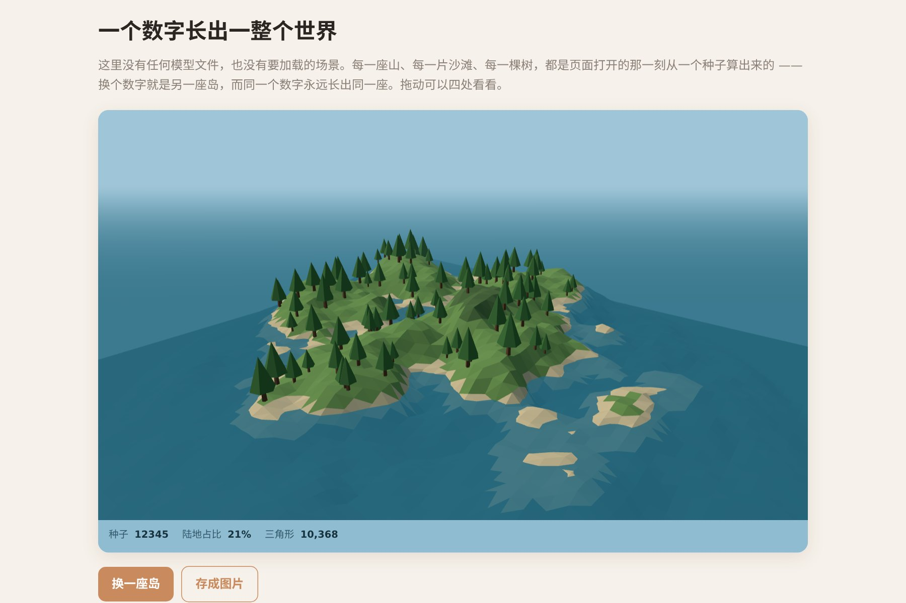

# 让 AI 做出一座会生长的小岛

上面这个东西里**没有任何模型文件，也没有一张图片**。每一座山、每一片沙滩、每一棵树，都是页面打开的那一刻从一个数字算出来的。换个数字就是另一座岛，同一个数字永远长出同一座。

这篇讲的是**你怎么让 AI 把它做出来**——不是原理课，是一句一句该怎么说。你不用会写代码，也不用在电脑上装任何东西。

▶ **[直接查看成品](https://view.tybbtech.com/p/pmsqrjt1l713o/)**

---

## 开始之前

- **要花多久**：顺利的话半小时，想调细一点可以花上一下午
- **要装什么**：什么都不用。[打开造物台](https://coder.tybbtech.com)，注册送 50 积分，够做出第一个作品
- **要会什么**：会打字就行
- **怎么用这篇**：**一步一句，说完看一眼再说下一句**。一口气把十件事都说了，AI 容易顾此失彼，你也不知道是哪句让它变歪的

---

## 第 1 步 · 先要一个能转的岛

第一句别贪心，先拿到一个能跑起来、能看见东西的版本。

> **这么说：**
> 做一个 3D 的低多边形小岛。用 three.js，不要任何模型文件和贴图，全部用代码生成。
> 岛的形状用噪声算出来，按高度分成海床、沙滩、草地、岩石、雪几个色带。
> 鼠标可以拖动着四处看。页面上放一个「换一座岛」的按钮。

> ### ⚠️ 如果打开是一片空白，别慌，这很正常
> 3D 作品第一版跑不起来是常事——AI 记混了某个函数名，页面就整个白掉。**这不是你说错了话。**
> 造物台会自己发现这类报错并动手修（我们实测过：几秒钟就改对了）。你要做的只是**等它修完，或者跟它说一句「页面是空白的」**。
> 顺带一提，自动修这件事只对登录用户生效——这也是为什么值得先登录再开始。

---

## 第 2 步 · 让它真的有棱有面

这是全篇最关键的一步，也是最容易被糊弄过去的一步。

很多人以为低多边形风格是"三角形少"。不是的——这座岛有一万多个三角形。真正让它有棱有面的是**一个三角形只用一个颜色**。

如果按顶点上色，颜色会在顶点之间平滑过渡，整座岛看着像一块揉皱的绸子，一个三角形都看不出来。

> **这么说（这一整段都要说，少了后半句就白做）：**
> 现在颜色是糊在一起的，看不出三角形。
> 请先把几何体转成非索引的（`toNonIndexed`）——因为默认相邻三角形共用顶点，共用的顶点没办法各自上色。
> 转完之后再按面上色：取每个三角形三个顶点的平均高度决定颜色，三个顶点共用这一个颜色。材质用平面着色（flatShading）。

> **🧪 这一句我们真的拿 AI 跑过**
> 只说前半句「每个三角形只用一个颜色」，AI 会照做，画面**却一点没变**——然后它会告诉你"现在应该能清楚看到三角形了"。
> 因为它漏了 `toNonIndexed` 这个前提，而它自己发现不了。**补上后半句，一次就对。**
> 这是这篇教程里最值钱的一句话。

---

## 第 3 步 · 让它成为一座岛，而不是一片没边的地形

噪声算出来的地形是**无边无际**的，它没有理由在某个地方停下来。要让它变成一座岛，只需要乘一个从中心往边缘渐变到零的遮罩。

> **这么说：**
> 地形整体乘上一个衰减遮罩：`1 减去 (到中心的距离 ÷ 半径) 的 2.2 次方`，中心是 1，边缘是 0。

**2.2 这个指数就是海岸线的手感所在**：
- 小了 → 岛边缘一路缓降，像摊开的煎饼
- 大了 → 边缘陡然切断，像被刀削过
- **2.2 附近会自然出现一个"肩部"**，海岸线于是有了进进出出的形状，而不是一个圆

---

## 第 4 步 · 让地形有大起伏也有小细节

只用一层噪声，出来像一团滚动的雾——有起伏，没细节。

> **这么说：**
> 噪声叠四层，每往上一层频率翻倍、振幅减半，最后除以总振幅归一化。

第一层给大陆架级别的大起伏，第四层给石头缝级别的小颗粒。三层细节不太够，五层往上肉眼已经看不出差别。

---

## 第 5 步 · 让树长在该长的地方

直接随机撒树，会出现**树长在沙滩上、长在雪线以上、长在悬崖侧面**。而如果只加筛选条件不加重试，又会走到另一个极端：**说要 90 棵，最后只活下来几棵**。

> **这么说：**
> 树用"撒了再筛"的办法：随机撒点，太低的（沙滩）丢掉，太高的（岩石带）丢掉，坡度太陡的丢掉。
> **丢掉之后要继续撒，直到种够为止**，同时给尝试次数设一个上限（目标棵数的十几倍），试满了就停。
> 坡度就用这个点往 x 和 z 各挪一格的高度差之和来估。

**"继续撒直到种够"和"设尝试上限"这两句必须一起说**：
- 少了前一句 → 树稀稀拉拉，画面空一半
- 少了后一句 → 水位一调高，岛上没有合格位置，程序会一直找下去，**页面直接卡死**

---

## 第 6 步 · 让海看不到边

**症状**：远处能看见海的边缘，一条直线，外面是天空。整个画面立刻从"海中的一座岛"变成"一块浮着的板子"。

> **这么说：**
> 海面要铺得比岛大很多倍（至少十倍），再给场景加一层和天空同色的雾，让海在自己的边缘之前很久就淡进天色里。

雾在这里干的是**地平线**的活——有了它，海不用铺到无穷大，你也永远看不到尽头。

> **🧪 这一句实测有效**，一次就改对。

---

## 第 7 步 · 同一个数字，永远长出同一座岛

这一步是整个作品的灵魂。没有它，「换一座岛」只是随机刷新，**你刷到一座好看的岛就再也找不回来了**。

> **这么说：**
> 不要用 `Math.random`。自己写一个带种子的随机数发生器（线性同余就行），噪声、树的位置、树的大小，**所有随机的地方都从它取数**。
> 页面上显示当前的种子，「换一座岛」就是换一个种子号。

有了它，你才能把一个数字发给朋友，他打开看到的是**同一座岛**。

---

## 第 8 步 · 加几个能调的滑块

> **这么说：**
> 加四个滑块：水位、崎岖度、山高、树的数量。
> **拖动的过程中只更新旁边显示的数字，松开手才真正重建地形。**

**后面那句不能省。** 一万个三角形，滑块每挪一像素就重算一遍，会卡得像坏了。拆成两半之后，你感觉是跟手的，机器只干了一次活。

---

## 第 9 步 · 收尾的几句

这几句都不难，但每一句都实实在在改变画面。

> **镜头压近一点**：让岛占满画面，别让它在中间缩成一小坨。相机大概放在岛半径的一半左右高、斜着看下来，并且限制镜头不能钻到海面以下。

> **只用两盏灯，不要开阴影**：一盏暖色的太阳斜上方打过来，一盏冷色的天光从上往下。在全平面着色的场景里，棱面自己就把形体交代清楚了，阴影加的信息很少却很吃性能——关掉，手机和老笔记本才跑得动。

> **让海轻轻动一下**：海面上下起伏一点点就够，够让人认出那是水，别做大浪。

> **加一个「存成图片」按钮**：把当前画面导出成 png，文件名带上种子号。

> **调色带**：如果山顶白花花一片、草地只剩边缘一圈，说明雪线定太低了，把雪和岩石的阈值往上抬。

---

## 第 10 步 · 改成你自己的

| 你想要 | 就这么说 |
|---|---|
| 火山岛 | 把中间的山改成火山口，山顶做一个凹陷，加上熔岩的颜色 |
| 雪国 | 把雪线降下来，草地换成冻土色，天空改成灰蓝 |
| 群岛 | 遮罩改成好几个中心，让它长出一串小岛 |
| 昼夜 | 加一个滑块控制太阳的角度和颜色，天空跟着变 |
| 加水鸟 | 天上飞几只低多边形的鸟，绕着岛盘旋 |

还是那句：**一次只提一个改动，看到结果再提下一个。**

---

## 关键的那些数

| 参数 | 值 | 为什么是这个 |
|---|---|---|
| 网格分辨率 | 72 × 72 | 约一万个三角形。再高，弱一点的机器就开始掉帧 |
| 噪声层数 | 4 层 | 三层细节不够，五层往上看不出差别 |
| 遮罩指数 | 2.2 | 决定海岸线是"煎饼边"还是"刀削边" |
| 树的高度窗口 | 0.5 ～ 6 | 下限躲开沙滩，上限躲开岩石带 |
| 坡度上限 | 1.6 | 再大树就长在悬崖上了 |
| 撒树尝试上限 | 目标棵数 × 12 | 防止水位太高时找不到位置，页面卡死 |
| 海面尺寸 | 岛的 9 倍以上 | 少了会看见海的边，整座岛就"浮"起来 |
| 雾的范围 | 岛宽的 0.8 ～ 2.4 倍 | 太近糊成一片，太远起不到地平线的作用 |

---

## 这个作品免费拿走

不用从头做——**这座岛直接送你，拿走就是你的**，可以在它的基础上改成你想要的样子。

打开下面的链接，页面右下角有「🎨 改造这个作品」，点一下就复制出一份完全属于你的副本。想换成火山岛、想让海真的会动、想加昼夜循环，接着跟它说话就行，不用自己写一行代码。

👉 **[免费拿走这个作品](https://view.tybbtech.com/p/pmsqrjt1l713o/)**

改完就是一个链接，直接发给别人，对方在手机上就能打开。

---

**这篇是怎么写出来的**：方法来自一个真的在线上跑着的成品，源码逐行读过，上面那些数字都是它实际在用的值。其中第 2 步和第 6 步的措辞我们另外拿 AI 实跑验证过——包括第 2 步那次**失败的措辞**，那次失败才是这篇最有用的部分。
