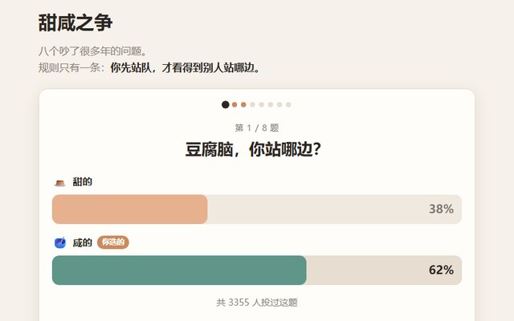

# 让 AI 做出一个「投完才给看结果」的投票器

八道二选一：豆腐脑、粽子、香菜、豆浆……**你必须先投票，才看得到别人怎么投的**。八题答完，告诉你跟大多数人有多像。

这个作品全部的劲儿就在那一句「投完才给看」。少了它，它就只是一张统计图；有了它，你会一路点到最后。

▶ **[直接查看成品](https://view.tybbtech.com/p/pmssbljz0todv/)**

---

## 开始之前

- **要花多久**：二十分钟出雏形
- **要装什么**：什么都不用。[打开造物台](https://coder.tybbtech.com)，注册送 50 积分
- **为什么值得做**：这是**最容易被转发**的一类作品。成本极低，改一改题目就是全新的一个——同学录、团建二选一、产品 A/B 测试都是它

---

## 第 1 步 · 先做出「一题一屏」的骨架

> **这么说：**
> 做一个二选一投票页。一次只显示一道题，占满一屏：上面是题面，下面两个大按钮（每个按钮有一个 emoji 和一行字）。
> 顶上放一排小圆点表示进度，答过的点亮。答完一题出现「下一题」按钮。

先别急着接票数，把这个流程点通了再说。

---

## 第 2 步 · 加上那句灵魂设定

这一步只有一句话，但它是整个作品的价值所在。

> **这么说：**
> 没投票之前，绝对不能显示任何票数或百分比。两个选项下面写一行小字「—— 投完才看得到结果 ——」。
> 投完之后才把两条对比条亮出来。

**别让 AI 把票数提前显示出来"方便用户参考"**——那是好心办坏事，一旦先看到结果，人就懒得投了，也没有转发的冲动。

---

## 第 3 步 · 接上真的票数（不用登录，不用后端）

这一步是很多人卡住的地方：做一个能统计所有人投票的页面，是不是得有服务器、得注册账号？

**不用。** 造物台给每个作品注入了一个免登录的计数器。

> **这么说：**
> 票数用平台的计数器：`AIHEY.count(名字, 1)` 给某个计数加一，**它是原子操作**，很多人同时投也不会丢票，返回加完之后的新值；`AIHEY.countGet(名字)` 只读不加。两个都不需要用户登录。
> 每道题存两个计数：一个 a 边一个 b 边。用户投票时**只给自己那边加一**，另一边用 countGet 读回来，一次就能画出对比条。

> **为什么用计数器而不用榜单**：投票只需要"多少人选了 A"这一个数字，不需要知道每个人是谁。计数器是原子加，没有条数上限，也不占榜单配额。**存错了地方，投票多了就会撞上限。**

---

## 第 4 步 · 给票数起对名字（改题目的人一定会踩这里）

> **这么说：**
> 计数器的名字用「版本号 + 题目 id + 哪一边」拼出来，版本号单独放在最上面的 CONFIG 里。
> 本机投过什么存 localStorage，**键名也要把版本号拼进去**。

**为什么非要有个版本号**：这个作品最常见的改法就是换题目。如果票数的名字里没有版本号，你换了题面、但计数器名字没变——**新题目会直接继承旧题目的票**，一上来就几百票，而且是错的。

所以要在代码最上面留一句显眼的提醒：**改题目 = 必须改版本号**。

---

## 第 5 步 · 让结果条真的"涨"起来

投完票，两条对比条应该从 0 涨到最终比例——这个动作本身就是奖励。

但这里有个坑，AI 大概率会踩：

> **这么说：**
> 结果条的动画这么做：先把宽度设成 0%，**读一下元素的 offsetWidth 强制浏览器排一次版**，然后再设成目标宽度，这样 CSS transition 才会真的跑起来。
> **不要用 requestAnimationFrame 来做这个延迟。**

**为什么不能用 rAF**：页面在后台标签页里、或者被截图工具打开时，`requestAnimationFrame` 可能一直不触发——那条就永远停在 0%，看着像没数据。而封面截图、分享预览恰恰都是这种环境。

---

## 第 6 步 · 想好"第一个人"看到什么

**每个刚做好的投票页，第一天都是零票。** 这个状态必须单独设计，否则第一个访客看到的是两条空条和 0%，像坏了。

> **这么说：**
> 票数总和为 0 时，不要显示「共 0 人投过」，改成显示「**你是第一个投的人**」。

一句话的事，但它把"这页面没人用"变成了"我抢到了第一"。

---

## 第 7 步 · 最后给一个身份

八题答完，光说"你答完了"太平淡。要给一个**可以说出口的结论**。

> **这么说：**
> 最后一屏统计我的选择和多数派重合了几题，算出一个百分比，按高低给四档评语（从「标准的大多数派」到「坚定的少数派」）。
> 下面列出每道题：题目、我选了什么、多少百分比的人跟我一样。

那个百分比和那句评语，就是用户会截图发出去的东西。**整个作品的传播力都压在这一屏上。**

---

## 第 8 步 · 改成你自己的

这个作品换题目就是换作品，成本几乎为零：

| 你想要 | 就改这里 |
|---|---|
| 同学录 / 班级二选一 | 把八道题换成班里的梗 |
| 团建投票 | 换成聚餐地点、活动方案 |
| 产品 A/B | 换成两版设计，让用户选 |
| 情侣默契测试 | 换成生活习惯题 |

**每次换题目，记得把版本号一起改掉**（见第 4 步）。

---

## 关键的那些数

| 参数 | 值 | 为什么 |
|---|---|---|
| 题目数量 | 8 道 | 少于 5 道没有"测出个结果"的感觉，多于 10 道会有人中途退出 |
| 计数器命名 | `版本号_题目id_边` | 少了版本号，改题就会继承旧票 |
| 投票时的写入 | 只写自己那边 +1 | 另一边用只读接口拿，省一次写 |
| 防连点 | 投出去后立刻禁用两个按钮 | 不然网络慢的时候能连投好几票 |

---

## 这个作品免费拿走

不用从头做——**这个投票器直接送你，拿走就是你的**，换掉题目就是一个全新的作品。

打开下面的链接，页面右下角有「🎨 改造这个作品」，点一下就复制出一份完全属于你的副本。跟它说「把题目换成我们班的梗」就行。

👉 **[免费拿走这个作品](https://view.tybbtech.com/p/pmssbljz0todv/)**

改完就是一个链接，直接发到群里，谁点开都能投。

---

**这篇是怎么写出来的**：方法来自一个真的在线上跑着的成品，源码逐行读过，上面那些做法和坑都是它实际在用的。
