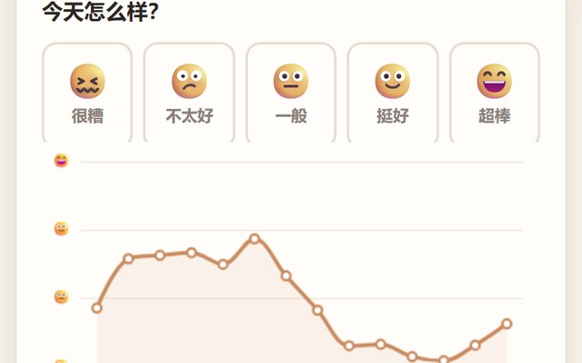

# 让 AI 做出一个会自己长出时间线的心情墙

一人一天记一格心情，画成两张图：今天大家都什么状态，最近两周的走势。**同一天可以随时改自己那格，换一天就是新的一格**——数据于是自然长成一条时间线，而不是永远只有一行。

▶ **[直接查看成品](https://view.tybbtech.com/p/pmssbljz001vf/)**

---

## 开始之前

- **要花多久**：半小时左右
- **要装什么**：什么都不用。[打开造物台](https://coder.tybbtech.com)，注册送 50 积分
- **这个作品的关键**：全部藏在**一个去重键**里（第 3 步）。别的都是常规活儿，那一句是它区别于"又一个投票页"的地方

---

## 第 1 步 · 先做出记录这一半

> **这么说：**
> 做一个记心情的页面。五个大按钮：很糟 / 不太好 / 一般 / 挺好 / 超棒，每个配一个表情和一种颜色，颜色从灰冷渐变到暖橙。
> 选完之后展开两个输入框：名字（选填）和一句话（选填，限 24 字），底下一个「记下今天」的按钮。

---

## 第 2 步 · 给这台设备一个身份（不用注册）

要认出"哪一格是我记的"，但又不想让用户注册。

> **这么说：**
> 第一次打开时生成一串随机码存进 localStorage 当作本设备的身份，之后一直用它。**这串码不含任何个人信息**，只是用来认出自己那一格。

---

## 第 3 步 · 这个作品的灵魂：去重键 = 设备 + 日期

这一步是全篇最重要的。

平台的榜单接口 `AIHEY.board.add(榜名, 数据, 去重键)` 里，**第三个参数是去重键：同一个键再写一次是覆盖，不是追加**。

> **这么说：**
> 存数据用平台的榜单：`AIHEY.board.add('心情', 记录, 去重键)`。
> **去重键用「设备身份 + @ + 今天的日期」拼出来。**
> 这样同一天再记就是覆盖自己那一格，换一天就是新增一格。

**为什么这一句这么关键**，看看写错会怎样：

| 去重键怎么写 | 结果 |
|---|---|
| 只用设备身份 | 每个人永远只有一格，**改一次覆盖一次，时间线根本长不出来** |
| 不传去重键 | 每点一次保存就多一条，一个人一天能刷十几条，图全歪 |
| **设备 + 日期** ✅ | 同天改是修正，换天是新增，数据自然长成时间线 |

---

## 第 4 步 · 日期一定要用本地时区

> **这么说：**
> 日期一律用本地时区自己拼 `年-月-日`，**不要用 `toISOString()`**。

`toISOString()` 给的是 UTC 时间。国内用户在晚上 8 点之后记的心情，会被算成第二天——**跨天的那一格会串位**，而且这种 bug 只在晚上出现，白天怎么测都测不出来。

---

## 第 5 步 · 画两张图

> **这么说：**
> 用 ECharts 画两张：
> 一张横向条形图，是今天五档各多少人；一张折线图，是最近 14 天的平均分。
> 折线的 y 轴刻度不要写数字，直接显示那一档的表情。

> **⚠️ 顺带说一句：0 人的那一档，也要在条子末尾写个「0」。**
> 不写的话那一行就只剩一个光秃秃的表情，看着像图没画出来。

---

## 第 6 步 · 认真设计"一个人都没有"的样子

**这是最容易被跳过、又最该做的一步。**

你自己测的时候数据是满的，看着挺好。但**每一个刚被 fork 出去的作品，第一天都是空的**——那才是新用户看到的第一眼。

> **这么说：**
> 一条数据都没有的时候，不要画空坐标轴。把图表区换成一个虚线框，里面写一句「**还没有人记过 —— 记下第一格，这条线就从今天开始画。**」
> 今天没人记的时候，那句平均分改成「今天还没有人记 —— 你可以是第一个」。
> 另外，某一天没人记时那天的值要留空、不要当成 0 分，折线跨过去连起来就行。

空坐标轴看着像坏了，一句话就把它变成了邀请。

---

## 第 7 步 · 🔴 别人写的字，一律用 textContent

这一条是安全底线，而且**因为这是个会被反复 fork 的作品，写错一次会被复制到每一个衍生版本里**。

> **这么说：**
> 留言墙上的名字和留言内容，**一律用 `textContent` 渲染，绝对不要拼进 HTML 字符串**。

榜单是谁都能写的。拼字符串等于把页面交给最后一个写入的人。

---

## 第 8 步 · 收尾两句

> **手机转屏要手动重排**：窗口尺寸变化时喊一声让两张图重新计算大小，ECharts 不会自己做。

> **一次拉多少**：读榜单时按时间倒序拉，限制在几百条以内。榜单单个名字有条数上限，别一次全拉。

---

## 第 9 步 · 改成你自己的

把五档的说法一换，它就是另一个作品：

| 你想要 | 就改这里 |
|---|---|
| 团队效率墙 | 五档换成「今天效率如何」 |
| 打卡累计 | 五档换成运动强度，趋势线就是训练曲线 |
| 班级晴雨表 | 五档换成学习状态，老师看走势 |
| 产品体验回收 | 五档换成满意度，留言就是反馈 |

**换主题时记得把榜单的名字也换掉**——换个名字等于开一份全新的数据，老数据不会混进来。

---

## 关键的那些数

| 参数 | 值 | 为什么 |
|---|---|---|
| 去重键 | `设备身份@日期` | 这个作品的全部设计都在这一行 |
| 档位数 | 5 档 | 3 档太粗看不出变化，7 档以上人会犹豫 |
| 趋势天数 | 14 天 | 够看出周中周末的规律，又不至于把手机屏挤满 |
| 留言长度 | 24 字 | 够说一句话，不至于把墙撑爆 |
| 一次拉取 | 几百条 | 榜单有条数上限，别一次全拉 |

---

## 这个作品免费拿走

不用从头做——**这个心情墙直接送你，拿走就是你的**，换掉五档的说法就是一个全新的作品。

打开下面的链接，页面右下角有「🎨 改造这个作品」，点一下就复制出一份完全属于你的副本。跟它说「把心情换成今天的运动强度」就行。

👉 **[免费拿走这个作品](https://view.tybbtech.com/p/pmssbljz001vf/)**

改完就是一个链接，发到群里，每个人每天点一下就行。

---

**这篇是怎么写出来的**：方法来自一个真的在线上跑着的成品，源码逐行读过，上面那些做法和坑都是它实际在用的。
