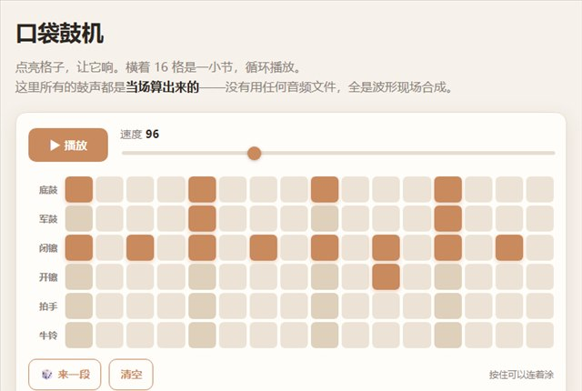

# 让 AI 做出一台没有一个音频文件的鼓机

16 格 × 6 轨的步进音序器，点格子编节奏。**六个鼓的声音全是当场用波形算出来的**——整个作品里没有一个音频文件。

这个限制反而成了它的特点：打开就响，不用等任何东西下载。

▶ **[直接查看成品](https://view.tybbtech.com/p/pmsrm4xmbu2s3/)**

---

## 开始之前

- **要花多久**：一个小时左右，调音色可以调很久
- **要装什么**：什么都不用。[打开造物台](https://coder.tybbtech.com)，注册送 50 积分
- **难点在哪**：不是画格子，是**节奏不能抖**。第 3 步那一条是全篇的命门

---

## 第 1 步 · 先把格子和播放做出来

> **这么说：**
> 做一个步进音序器：6 行 × 16 列的格子，每行左边是鼓的名字。点格子切换亮/灭。
> 上面放播放/停止、速度滑块（60～180）、清空、随机四个按钮。
> 每 4 格是一拍，那一列颜色深一点，方便数拍子。

---

## 第 2 步 · 六个鼓，全用波形合出来

打击乐的本质很简单：**一条陡峭的音量包络 + 一点点波形**。声音在两三毫秒内冲到最大，然后指数式衰减下去。

> **这么说：**
> 用 Web Audio 合成六个鼓，都不要音频文件：
> - **底鼓**：一个正弦波，频率从 150Hz 在 0.1 秒内滑到 46Hz，音量 0.42 秒衰减完
> - **军鼓**：两层叠——白噪声过 1400Hz 高通（鼓皮的沙沙），加一个三角波从 190Hz 滑到 150Hz（鼓腔的音高）
> - **闭镲**：白噪声过 8000Hz 高通，衰减极短（0.045 秒），短到只剩"呲"的一下
> - **开镲**：同样的料，衰减放长到 0.34 秒，能听见尾巴
> - **拍手**：三下极短的噪声，错开 11 毫秒和 23 毫秒，过 1600Hz 带通
> - **牛铃**：540Hz 和 800Hz 两个方波叠在一起，过 2600Hz 带通
>
> 白噪声只生成一次循环复用，别每次发声都重新生成。
> 总输出挂一个压限器，六个鼓一起响的时候不会破音。

> **拍手为什么要错开**：一群人拍手本来就不齐。三下完全对齐反而不像拍手，像一记闷响。

---

## 第 3 步 · 🔴 节奏不能抖：前瞻调度

**这是整个作品最关键的一条，也是 AI 最容易做错的一条。**

直觉的做法是：用 `setInterval` 或 `setTimeout` 每隔一段时间触发一次发声。**这个做法一定会抖**——JS 主线程被任何东西卡一下（画面重绘、垃圾回收、后台标签），声音就跟着晚了，听感上非常明显。

> **这么说：**
> 播放不要用 setTimeout 触发发声。用**前瞻调度**：
> 每 25 毫秒醒一次，把「未来 100 毫秒内」该响的音符，按精确时刻**提前排进音频时钟**（`ctx.currentTime` 加偏移）。
> 这样即使 JS 卡顿一下，已经排好的音符照样准时响。

**画面可以晚，声音不能晚。** 播放头的高亮用普通的延迟触发就行——声音早就排在音频时钟上了，画面晚一两帧没人听得出来。

---

## 第 4 步 · 加一点摇摆，它才像音乐

死板的等分格子听着像节拍器。真正让它有律动的是 swing。

> **这么说：**
> 加一个摇摆参数：偶数格的时长拉长一点，奇数格等量缩短，**每两格的总时长保持不变**。
> 默认给 0.14 左右。

从"哒哒哒哒"变成"哒—哒 哒—哒"，就这一个数的事。0 是死板机器拍，0.35 已经很夸张了。

---

## 第 5 步 · 别让人打开看见一片空格子

**空网格是最劝退的开场**——用户不知道该点哪儿，也不知道点了会怎样。

> **这么说：**
> 页面打开时预置一段能听的节奏：底鼓落在 1/5/9/13 格，军鼓落在 5 和 13，闭镲每隔一格铺满，开镲在第 11 格点一下。
> 「随机」按钮也不要纯随机——**带着规则随**：底鼓大概率落重拍，闭镲隔格铺底，军鼓压二四拍，其余低概率点缀。

纯随机出来的东西百分之九十不能听，用户点两下就走了。带规则的随机，随出来的基本都能听。

---

## 第 6 步 · 手机上要能"涂"，不能只能"点"

16×6 = 96 个格子，在手机上一个个点太痛苦。

> **这么说：**
> 支持按住拖动连续开关格子：按下时根据这一格当前状态决定这一笔是"开"还是"关"，拖过的格子全部设成这个值。
> **按下的时候要主动释放指针捕获**（`releasePointerCapture`），否则触摸屏上浏览器会把后续事件全锁在第一个按钮上，你拖不到隔壁格。

那个指针捕获的坑不说的话，桌面上测着好好的，一上手机就只能点一格。

---

## 第 7 步 · 让节奏能被带走

> **这么说：**
> 把谱面编码成一串短代码：每一轨 16 格就是 16 个 0/1，转成一个 4 位十六进制数，六轨拼成 24 个字符，后面跟上速度，比如 `8888a0a0…​.96`。
> 这串码既用来上榜，也能塞进网址后面分享，别人打开就是你这段。

**能分享的作品才会被分享。** 一段节奏如果只能截图，那它就传不出去。

---

## 第 8 步 · 接上榜单

> **这么说：**
> 用平台的榜单 `AIHEY.board`（不用登录）：提交时存名字、节奏码和速度，**去重键用本设备的随机身份**——这样一台设备只占榜上一行，再传是覆盖自己上一段，不会刷屏。
> 读榜按时间倒序取最近二三十条。榜上每一行有个小播放按钮，点了就把那段节奏装进格子里放出来。

> **🔴 榜上的名字一律用 `textContent` 渲染，绝不要拼进 HTML 字符串。** 这张榜谁都能写，拼字符串等于把页面交给最后一个写入的人。

> **空榜要单独写一句**：「还没有人上榜 —— 你可以是第一个。」每个刚 fork 出去的作品第一天都是空的。

---

## 第 9 步 · 一个必踩的浏览器规矩

> **这么说：**
> 音频上下文要在用户第一次点击之后才创建或恢复（`resume`）。

浏览器不允许页面自动出声，必须有用户手势。不处理的话，用户点播放却什么都没听见——而控制台连报错都没有。

---

## 第 10 步 · 改成你自己的

| 你想要 | 就这么说 |
|---|---|
| 换音色 | 改底鼓的起止频率、改镲的高通截止点，音色立刻就变 |
| 换格数 | 改成 32 格做两小节，或者 12 格做三拍子 |
| 加一轨 | 加个"拍腿"：低频段的短噪声 |
| 变成合成器 | 把鼓换成音阶，格子的行变成音高 |

---

## 关键的那些数

| 参数 | 值 | 为什么 |
|---|---|---|
| 前瞻窗口 | 100 毫秒 | 短了扛不住卡顿，长了改速度反应迟钝 |
| 调度周期 | 25 毫秒 | 比前瞻窗口小得多就行 |
| 摇摆 | 0.14 | 0 是机器拍，0.35 已经很夸张 |
| 底鼓 | 150 → 46 Hz | 滑得越快听着越闷越"顶" |
| 闭镲衰减 | 0.045 秒 | 再长就变成开镲了 |
| 拍手错开 | 11 / 23 毫秒 | 对齐了就不像拍手 |
| 默认速度 | 96 拍 | 大部分节奏型在这个速度上都成立 |

---

## 这个作品免费拿走

不用从头做——**这台鼓机直接送你，拿走就是你的**，改改频率就是全新的音色。

打开下面的链接，页面右下角有「🎨 改造这个作品」，点一下就复制出一份完全属于你的副本。跟它说「把格子改成 32 格」或者「加一轨拍腿」就行。

👉 **[免费拿走这个作品](https://view.tybbtech.com/p/pmsrm4xmbu2s3/)**

改完就是一个链接，发给别人，手机上点开就能听。

---

**这篇是怎么写出来的**：方法来自一个真的在线上跑着的成品，源码逐行读过，上面那些频率、时长和坑都是它实际在用的值。
