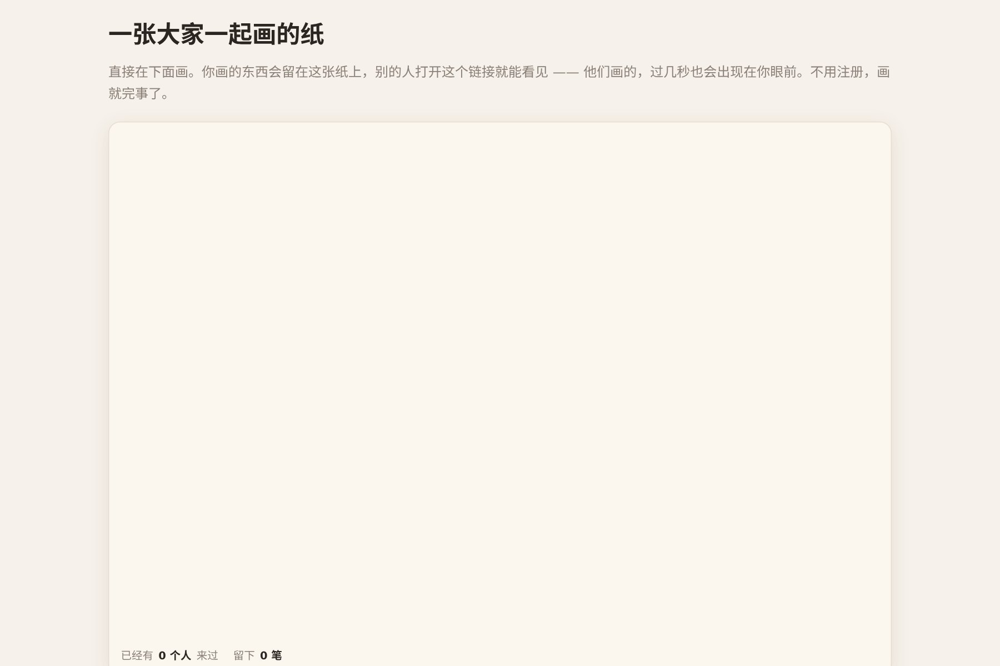

# 让 AI 做出一张所有人一起画的纸

打开就能画，几秒之后别人的笔迹会自己出现在你的纸上。**不用注册，不用后端，纯前端**。

这类作品有个别的做不到的好处：**一个新访客打开时，纸上已经有东西了**。空白页面留不住人，有别人痕迹的页面能。

▶ **[直接查看成品](https://view.tybbtech.com/p/pmsqu1oql5kxq/)**

---

## 开始之前

- **要花多久**：半小时
- **要装什么**：什么都不用。[打开造物台](https://coder.tybbtech.com)，注册送 50 积分
- **最容易做错的一步**：第 2 步。用错一个接口，**多人同时画会互相把对方的画抹掉**

---

## 第 1 步 · 先做出能画的那一半

> **这么说：**
> 做一张画布，按住拖动就能画线，线要圆头圆角。
> 底下放三个按钮：换个颜色、存成图片、和一行统计（多少人画过、一共多少笔）。

> **画的时候只补画当前这一笔，不要整张重画。** 每移动一个像素就把几百笔全部重绘一遍，手感会明显发涩。

---

## 第 2 步 · 🔴 一定要用「追加」，不能用「共享一个值」

这是全篇最重要的一条，写错了要过几天才会发现。

平台给了两种存法：
- `AIHEY.shared` —— 所有人**读写同一个值**
- `AIHEY.board` —— 所有人**各自追加自己的记录**

> **这么说：**
> 每画完一笔，就把这一笔（一串坐标点）作为**一条新记录追加**到榜单上。隔几秒把所有笔捞回来重画一遍。
> **不要用共享单值的方式存整张画。**

**为什么**：共享单值是"后写的覆盖先写的"。两个人同时在画，一个人抬笔上传的瞬间，就把另一个人这段时间画的全抹掉了——而且**双方都看不出发生了什么**，只觉得"我刚画的怎么没了"。

一句话记住：**多人各写各的，必须用追加。**

---

## 第 3 步 · 什么时候传上去

> **这么说：**
> **抬笔的时候才上传这一笔**，不要在手指移动的过程中传。
> 传失败的笔留在一个待传队列里，下一轮再试，别丢。

平台对写入有限速（大约每分钟三十次）。如果每移动一下就传一次，几秒钟就会被挡住。抬笔才传，一笔一条，正好。

而那个待传队列是为了网络抖动：手机上信号闪一下是常事，**用户不该因此丢掉自己刚画的东西**。

---

## 第 4 步 · 两个让它顺手的细节

> **采样别太密**：两个采样点之间至少隔两三个像素才记一个点。太密了不但没用，还白白占空间——一笔存几百个点，捞回来会明显变慢。

> **单点也要留一个墨点**：只点一下不拖动的时候，如果按"至少两个点才画线"处理，屏幕上什么都不会出现，用户以为坏了。让它画一个极短的线段就行。

---

## 第 5 步 · 让人看见"这里有人"

> **这么说：**
> 每个人第一次打开时随机分一个颜色，存在本机，刷新之后还是同一支笔。
> 统计栏显示"多少个人画过、一共多少笔"——人数用平台自动记的匿名身份去重来数，不用自己造。

颜色这件事看着是装饰，其实是**社交信号**：你能一眼看出纸上有几个人，哪几笔是同一个人画的。

---

## 第 6 步 · 别忘了退路

> **这么说：**
> 加一个「存成图片」按钮，把当前画布导出成 png。

共同画布的东西是会被后来的人盖掉的。给一个能把此刻留下来的按钮，成本极低。

---

## 第 7 步 · 改成你自己的

| 你想要 | 就这么说 |
|---|---|
| 接龙涂鸦 | 加个提示语「上一个人画了一半，你接着画」 |
| 签到墙 | 换成签名板，谁来了签一笔 |
| 团队白板 | 加上橡皮和粗细选择 |
| 弹幕留言板 | 把笔画换成文字气泡，同样用追加 |

---

## 关键的那些数

| 参数 | 值 | 为什么 |
|---|---|---|
| 轮询间隔 | 4 秒 | 再快没必要，还会撞读取限速 |
| 一次捞多少笔 | 几百笔 | 够填满一张画布了 |
| 采样最小间隔 | 2.5 像素 | 更密只是浪费空间 |
| 上传时机 | 抬笔 | 移动时传会撞写入限速 |
| 线宽 | 3 像素 | 手机上细了看不清，粗了画不细 |

---

## 这个作品免费拿走

不用从头做——**这张画布直接送你，拿走就是你的**。

打开下面的链接，页面右下角有「🎨 改造这个作品」，点一下就复制出一份完全属于你的副本，**画布上的内容从零开始，是你自己那张纸**。

👉 **[免费拿走这个作品](https://view.tybbtech.com/p/pmsqu1oql5kxq/)**

改完就是一个链接，发到群里，大家一起画。

---

**这篇是怎么写出来的**：方法来自一个真的在线上跑着的成品，源码逐行读过，上面那些做法和坑都是它实际在用的。
