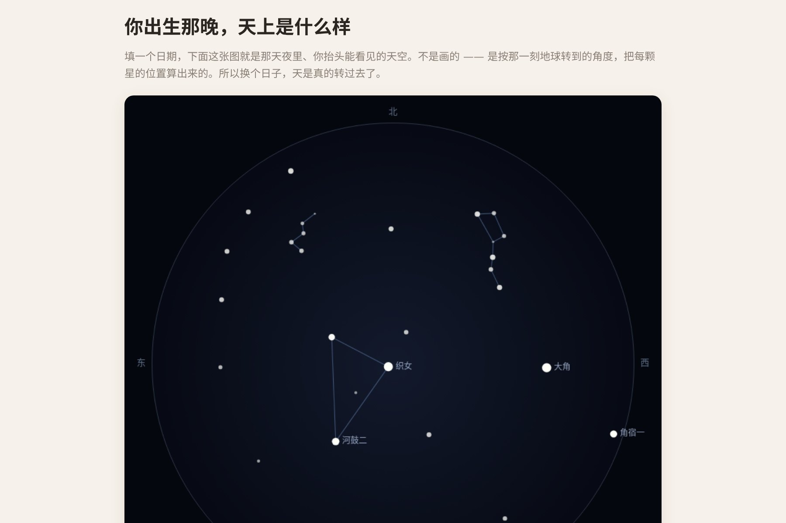

# 让 AI 算出某一个晚上，头顶真实的星空

输入一个日期——生日、纪念日、孩子出生那天——**算出那天晚上抬头看到的真实星空**。

关键词是"真实"。这不是随机撒一把星点的装饰画：换个日期，天是真的转过去了。**冬天的猎户座和夏天的天蝎座不会同时出现，因为它们本来就不会。**

▶ **[直接查看成品](https://view.tybbtech.com/p/pmsqu1oqli9ys/)**

---

## 开始之前

- **要花多久**：一小时左右，天文那部分是硬功夫
- **要装什么**：什么都不用。[打开造物台](https://coder.tybbtech.com)，注册送 50 积分
- **为什么值得做**：这是**最适合送人的**一类作品。一张"你出生那晚的星空"，比任何模板贺卡都动人

---

## 第 1 步 · 先要一张星表

没有星表就没有星空。好消息是不用抓数据——**几十颗最亮的星，直接写进代码里就够了**。

> **这么说：**
> 建一张亮星表，收 60 颗最亮的恒星，每颗四个数：中文名、赤经（小时）、赤纬（度）、视星等。用 J2000 历元的坐标。

> **诚实一点**：60 颗不是全天星表，肉眼可见的星有几千颗。但 60 颗**够把主要星座认出来，也够让画面好看**——这是一个刻意的取舍，不是偷工。

---

## 第 2 步 · 天文那一段（这是核心，没有捷径）

从"一个日期"到"星星在天上哪个位置"，中间是四步换算。这一段必须让 AI 老老实实按课本做，不能让它"估个大概"。

> **这么说：**
> 按这个顺序算：
> 1. 把日期换成**儒略日**
> 2. 由儒略日算出**格林尼治恒星时**，加上经度得到**本地恒星时**——它衡量的是地球此刻转到了哪个方向，不是钟表时间
> 3. 每颗星的**时角** = 本地恒星时 − 它的赤经
> 4. 由时角、赤纬、观测者纬度，用球面三角解出这颗星此刻的**地平高度和方位角**
>
> 当地时间要先换算回 UTC 再算儒略日（用经度除以 15 得到时差）。

**这一步做对了，整个作品就成立了**；估算的话，星座位置会差出几十度，懂行的人一眼看出是假的。

---

## 第 3 步 · 投影：天顶在圆心

> **这么说：**
> 画成一个圆盘：高度 90°（头顶）画在正中，0°（地平线）画在圆边，低于 0° 的星在地平线以下，不画。
> 圆边上标出东南西北四个方向。

---

## 第 4 步 · 🔴 东要在左边，不是右边

这一条是整篇里最容易错、也最难自己发现的。

> **这么说：**
> 画方位角的时候要**取负**（用 -方位角，不是方位角）。
> 因为这是**抬头看天**，不是低头看地图：躺下来头朝北看天，东边在你的左手边，跟地图正好相反。

**画成东在右，等于把整个天空镜像了**——所有星座都是反的。画面看着挺好看，程序也不报错，但**认星座的人一眼就看出不对**。正规星图在北朝上时，东都在左边。

---

## 第 5 步 · 连线，但别让线穿过地面

> **这么说：**
> 加几组星座连线：北斗七星、猎户座（身体、腰带、两侧、两腿分开写）、仙后座 W、夏季大三角。每组是一串星名，画成折线，断开的笔画各写一条。
> **连线时两头都在地平线以上才画**——只有一头在上面的话，会出现一条穿过地面伸向圆盘外的怪线。

---

## 第 6 步 · 让星星有亮度差别

> **这么说：**
> 星等越小的星画得越大越白（视星等是反的：数字越小越亮）。只画比 3.6 等更亮的星。
> 最亮的那几颗（亮于 1 等）在旁边标上名字。
> 背景用径向渐变：中心略亮、边缘压暗，像真的天穹。

不做亮度差别的话，满屏一样大的白点，看着像雪花屏，一个星座都认不出来。

---

## 第 7 步 · 三个控件 + 一个按钮

> **这么说：**
> 日期选择器、纬度滑块、看天时间滑块（几点看）。日期存在本机，下次打开还是那天。
> 再加一个「存成图片」按钮，文件名带上日期。

**存成图片这个按钮，是这个作品能被送出去的前提。**

---

## 第 8 步 · 改成你自己的

| 你想要 | 就这么说 |
|---|---|
| 生日礼物版 | 加一句题词，日期锁死，直接分享链接 |
| 星座教学 | 点星星显示它的名字、距离、亮度 |
| 流星 | 偶尔划过一颗，纯装饰但很讨喜 |
| 换半球 | 纬度调成负的，就是南半球的天 |

---

## 关键的那些数

| 参数 | 值 | 为什么 |
|---|---|---|
| 星表大小 | 60 颗 | 够认出主要星座，又不至于糊成一片 |
| 星等上限 | 3.6 等 | 再暗的星在小屏幕上只是噪点 |
| 标名阈值 | 亮于 1 等 | 标多了画面就乱了 |
| 圆盘半径 | 画布短边的 0.46 倍 | 留出边距写方向标签 |
| 默认时间 | 晚上 9 点 | 大部分人"看星星"想的就是这个时候 |

---

## 这个作品免费拿走

不用从头做——**这片星空直接送你，拿走就是你的**。

打开下面的链接，页面右下角有「🎨 改造这个作品」，点一下就复制出一份完全属于你的副本。跟它说「把日期锁在某一天，加一句题词」，就是一份能直接送出去的礼物。

👉 **[免费拿走这个作品](https://view.tybbtech.com/p/pmsqu1oqli9ys/)**

改完就是一个链接，发给谁，谁都能在手机上看到那天的天。

---

**这篇是怎么写出来的**：方法来自一个真的在线上跑着的成品，源码逐行读过，上面那些算法步骤、阈值和坑都是它实际在用的。
