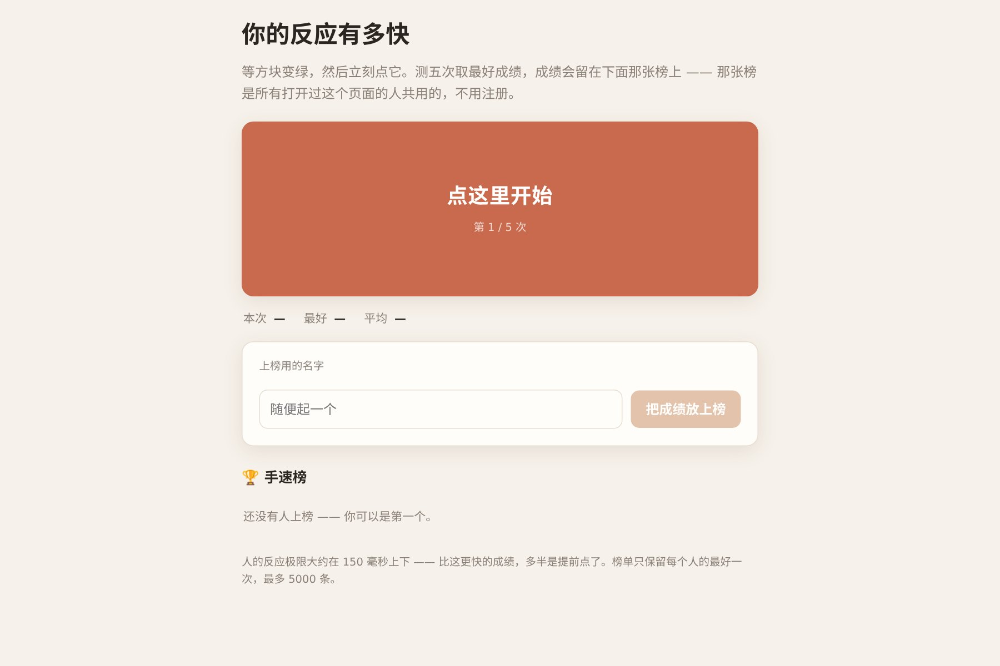

# 让 AI 做出一个能和所有人比手速的反应测试

等方块变绿，变绿就点，测五次取最好成绩，然后**跟所有玩过的人排在同一张榜上**。

反应测试到处都是，加上一张共用的榜单它才有意思——**一个人测完就走，有榜才会想再测一次**。

▶ **[直接查看成品](https://view.tybbtech.com/p/pmsqtsrw3jqx6/)**

---

## 开始之前

- **要花多久**：二十分钟
- **要装什么**：什么都不用。[打开造物台](https://coder.tybbtech.com)，注册送 50 积分
- **难点**：不在测量，在**防作弊和防刷屏**（第 3、5 步）

---

## 第 1 步 · 先做出测量这一半

> **这么说：**
> 做一个反应速度测试：一个大方块，点一下开始。等一会儿它变绿，变绿的瞬间点它，记下用时。
> 一共测 5 次，显示这次成绩、最好成绩、平均成绩。
> **计时用 `performance.now()`，不要用 `Date.now()`。**

`Date.now()` 的精度和稳定性都不适合测几十毫秒的东西，而且系统时间被调整时会跳。

---

## 第 2 步 · 状态要说清楚

这个作品的所有交互都压在一个方块上，状态必须写明白，不然 AI 会做出一个点一下就乱套的东西。

> **这么说：**
> 方块有四个状态：**空闲**（点一下开始）、**等待中**（灰色，等它变绿）、**可以点了**（绿色）、**测完了**（显示最好成绩，点一下重来）。
> 每个状态的文字和颜色都不一样，副标题显示「第几次 / 共几次」。

---

## 第 3 步 · 两道防作弊

> **① 等待时间的区间要够宽**
> 变绿前随机等 1.2 到 4.2 秒。
> **区间窄了就能靠数拍子作弊**——如果每次都是 2 秒左右，测几次就摸准了，闭着眼都能拿好成绩。

> **② 抢跑要抓**
> 还没变绿就点，这一次作废，提示「抢跑了，点一下重来这一次」。
> 不抓的话，最快的办法就是疯狂乱点——总有一下会撞在变绿那一刻。

> **③ 成绩下限**
> 快过 120 毫秒的成绩不给上榜，提示「这个成绩太快了，不像真的」。
> 人类的反应极限大概在 150 毫秒左右，低于 120 的基本是抢跑蒙对或者改了代码。**榜单上出现一个 20 毫秒，整张榜就没人信了。**

---

## 第 4 步 · 接上榜单（不用登录）

> **这么说：**
> 用平台的榜单 `AIHEY.board`，不用注册也不用后端：
> 提交时存名字和最好成绩，读榜时按成绩**升序**取前十几名，前三名给奖牌图标。

> **⚠️ 排序字段名必须和存进去的键名一模一样。** 存的时候叫 `ms`，排序就得按 `ms` 排。
> 写错了**不会报错**，只是榜单没排序——看着像随机排列，很难查。

---

## 第 5 步 · 🔴 一个人只能占一行

> **这么说：**
> 提交成绩时，**去重键用本设备的一个稳定随机身份**（第一次生成后存在本机）。
> 这样同一台设备再测，是覆盖自己那一行，而不是新增。

不加这一句会怎样：一个人测了二十次，榜单前二十名全是他。**榜就废了**，而且是当天就废。

---

## 第 6 步 · 空榜和自动刷新

> **这么说：**
> 榜单空的时候写「还没有人上榜 —— 你可以是第一个。」
> 每隔十几秒自动重读一次榜，别人的新成绩会自己冒出来。
> 榜上自己那一行要高亮出来。

那个自动刷新是这个作品的小心机：**你测完之后盯着榜，看见有人挤进来，就会想再测一次**。

---

## 第 7 步 · 🔴 名字一律 textContent

> **这么说：**
> 榜单上的名字用 `textContent` 渲染，**绝不要拼进 HTML 字符串**。

榜单谁都能写。拼字符串等于把页面交给最后一个上榜的人。

---

## 第 8 步 · 改成你自己的

| 你想要 | 就这么说 |
|---|---|
| 记忆力测试 | 换成闪一串数字，让人复述 |
| 找不同 | 换成两张图找差异，计时 |
| 打字速度 | 换成给一段话，测每分钟字数 |
| 部门内部赛 | 榜名换一个，就是你们自己的榜 |

---

## 关键的那些数

| 参数 | 值 | 为什么 |
|---|---|---|
| 测几次 | 5 次 | 3 次运气成分大，10 次太累 |
| 等待区间 | 1.2 ～ 4.2 秒 | 窄了能数拍子作弊 |
| 成绩下限 | 120 毫秒 | 低于这个不是人做到的 |
| 榜单长度 | 15 名 | 手机一屏能看完 |
| 自动刷新 | 15 秒 | 够让人感觉到"榜是活的" |

---

## 这个作品免费拿走

不用从头做——**这个手速榜直接送你，拿走就是你的**，换个榜名就是你们部门自己的榜。

打开下面的链接，页面右下角有「🎨 改造这个作品」，点一下就复制出一份完全属于你的副本。

👉 **[免费拿走这个作品](https://view.tybbtech.com/p/pmsqtsrw3jqx6/)**

改完就是一个链接，发到群里，看谁手最快。

---

**这篇是怎么写出来的**：方法来自一个真的在线上跑着的成品，源码逐行读过，上面那些数字和坑都是它实际在用的。
