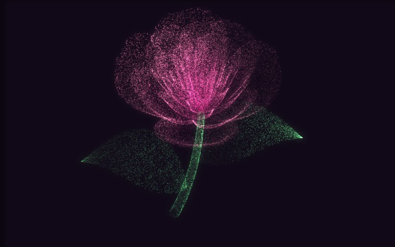

# 让 AI 做出一朵没有画过一笔的玫瑰



四万个发光的点，从一根茎开始，一层层开成一朵玫瑰。**没有图片、没有模型、没有一条手画的曲线**——花瓣是一组数学式子算出来的曲面。

"绽放"也不是动画：只是让那条螺旋线按顺序一点点显现出来。

▶ **[直接查看成品](https://view.tybbtech.com/p/pmst4h8it6d6v/)**

---

## 开始之前

- **要花多久**：一两个小时，调参数能调很久
- **要装什么**：什么都不用。[打开造物台](https://coder.tybbtech.com)，注册送 50 积分
- **说明白一点**：这是本仓库里**最难的一个**。但也是最出效果的——它适合当礼物、当封面、当背景

---

## 第 1 步 · 花瓣是一张参数曲面

整朵花的形状就压在这几行式子里。**把它原样给 AI，别让它自由发挥**——这个形状是调出来的，随便写一个曲面出不来玫瑰。

> **这么说：**
> 花瓣用一张参数曲面。给定 t（绕花轴转过的角度）和 x（从花轴到花瓣边缘的位置），这样算它的空间坐标：
> ```
> p = (π/2)·e^(−t/(curl·π))          花瓣越往外越平躺，curl 是躺下去的快慢
> u = 1 − (1 − (3.6t mod 2π)/π)⁴/2   花瓣边缘那圈一起一伏的波浪
> y = 2(x²−x)²·sin p                 花瓣中间那道往里弯的折
> r = u·(x·sin p + y·cos p)          这个点离花轴多远
> h = u·(x·cos p − y·sin p)          这个点有多高
> 位置 = (r·cos t, r·sin t, h)
> ```
> t 从 4π 走到 20π。curl 取 8 左右。

**为什么这样就能长出花瓣**：每走过 `2π/3.6` 那么长一段 t，u 就完成一次起伏——**花瓣就是这样一层层叠出来的**，没有哪一片是单独摆上去的。所以画面上能数出多少道花瓣，是算出来的，不是设定的。

---

## 第 2 步 · 🔴 点不能平均撒

这一步不说，出来的一定是"外层稀成一片雾、花心糊成一个白点"。

> **这么说：**
> 撒点时不要沿 t 平均分布。t 小的那头是摊开的外层花瓣，一圈的周长将近是花心那几圈的十倍。
> **先按每一段的面积（正比于 sin p）攒一张累积表，再照着表分配点数。**
> 另外，从花轴到花瓣边缘那个方向上，用随机数的**平方根**来取位置——靠外的一圈周长长，要分到更多点。

---

## 第 3 步 · 🔴 层次靠法线，不靠阴影

**光有位置，四万个点就是一团发光的雾**，你根本看不出花瓣压着花瓣。

> **这么说：**
> 每个点还要算一次曲面法线（这一小块花瓣朝哪边）：沿 t 和沿 x 各取一个微小增量，两个切向量叉乘，归一化。
> 用法线去对光——朝着光的那片亮，背过去的那片暗。留一点环境光当底，全黑太死。
> **法线要跟着花一起自转**，否则光会粘在花上跟着转，看着很假。

层次是这么出来的，不是画上去的阴影。这一条是这个作品成不成的分水岭。

---

## 第 4 步 · 🔴 别用 canvas 的画图接口

> **这么说：**
> 四万个点不要用 `fillRect`/`arc` 一个个画。**直接操作像素数组做加法**：把每个点的颜色加到对应像素上，再往上下左右四个像素各渗一点。

**为什么**：每帧改四万次 `fillStyle`，光是解析颜色字符串就把帧数吃光了。

而且直接做加法还白送一个效果：**点叠着点的地方自己就会加到发白**——花心那团白光不是画的，是加出来的。

---

## 第 5 步 · 让它像在"长"，不是在"显示"

> **这么说：**
> 点云数组里，茎和叶排在前面，花排在后面——**数组顺序本身就是生长顺序**，先抽茎，再从花心往外开。
> 绽放就是按下标从前往后逐个放出来。
> 靠近"生长前沿"的那一批点，让它们从一个固定的随机方向飘过来再收拢到位，并且更亮更白——像溅出来的火星。

> **⚠️ 生长进度不要夹在 100% 就停。** 让它继续往前走一段，生长前沿才能跑出点云之外，最后一批点才会真正落定；否则**花开满了，边上那圈会永远闪个不停**。

---

## 第 6 步 · 光晕

> **这么说：**
> 画完之后，把整张画面模糊一份再用叠加模式加回自己身上。亮的地方就晕开一圈光。
> 老浏览器不支持画布滤镜时自动跳过这一步，别报错。

一行的事，但有没有它，差别是"数据可视化"和"一张能当壁纸的图"。

---

## 第 7 步 · 控件和收尾

> **这么说：**
> 四个滑块：花瓣卷曲度、边缘褶皱道数、层数、配色（准备五种花色，每种给花心和花瓣边缘两个颜色）。
> 加上「重新绽放」「定格」「存成图片」三个按钮，拖动可以转着看、上下拖改俯视角度。

---

## 第 8 步 · 改成你自己的

| 你想要 | 就这么说 |
|---|---|
| 花苞 | 把卷曲度调小，花瓣就立起来收拢 |
| 大丽花 | 把卷曲度调大，摊开成一大盘 |
| 一束 | 复制几朵，错开位置和角度 |
| 表白页 | 加一句题词，绽放完停住 |

---

## 关键的那些数

| 参数 | 值 | 为什么 |
|---|---|---|
| 卷曲度 curl | 8 | 小了收成花苞，大了摊成大丽花 |
| t 的范围 | 4π ～ 20π | 一头是最外层花瓣，一头是卷得最紧的花心 |
| 点数 | 40000 | 少了稀，多了手机吃不消 |
| 绽放时长 | 7.5 秒 | 够看清过程，又不至于等得不耐烦 |
| 生长前沿宽度 | 1600 个点 | 这就是"粒子感"的来源 |
| 环境光 | 0.22 | 背光面留一点底，全黑就死了 |
| 俯视角 | 58° | 90° 是正俯视，8° 是趴着平视 |

---

## 这个作品免费拿走

不用从头做——**这朵玫瑰直接送你，拿走就是你的**。

打开下面的链接，页面右下角有「🎨 改造这个作品」，点一下就复制出一份完全属于你的副本。跟它说「加一句题词，绽放完就停住」，就是一页能发出去的心意。

👉 **[免费拿走这个作品](https://view.tybbtech.com/p/pmst4h8it6d6v/)**

改完就是一个链接，发给谁，谁的手机上都会开出这朵花。

---

<sub>**这篇是怎么写出来的**：方法来自一个真的在线上跑着的成品，源码逐行读过，上面那些式子、数值和坑都是它实际在用的。</sub>
