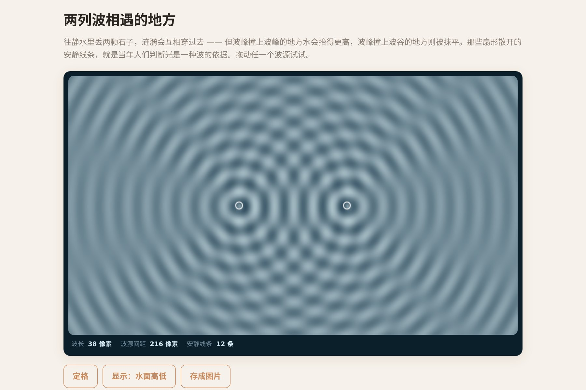

# 让 AI 做出一池会干涉的水波



两个波源在水面上打出一圈圈涟漪，交汇的地方出现明暗相间的扇形。拖动波源，扇形跟着变；调波长，条纹疏密跟着变。

**画面里那些扇形不是画上去的，是加出来的。** 每个像素只做一件事：把所有波源在它那里的高度加起来。

▶ **[直接查看成品](https://view.tybbtech.com/p/pmsqrjt1lbqym/)**

---

## 开始之前

- **要花多久**：半小时
- **要装什么**：什么都不用。[打开造物台](https://coder.tybbtech.com)，注册送 50 积分
- **适合谁**：想做物理/数学演示的人。这个作品的原理一句话说得完，效果却很扎实

---

## 第 1 步 · 核心只有一个求和

> **这么说：**
> 逐像素计算水面高度：
> ```
> 高度(p) = Σ  sin(2π · (p 到波源的距离 / 波长 − t)) / √距离
> ```
> 对所有波源求和。**除以距离的平方根**，这是涟漪越扩越弱的原因。
> 距离上加一个小常数再开方，避免波源那一点除零炸出白斑。

就这一行。干涉、衍射、明暗条纹，全是它自己出来的，一句都不用额外写。

---

## 第 2 步 · 🔴 别在全分辨率上算

这一步不说，出来的东西会卡到没法看。

> **这么说：**
> 物理计算放在一个**三分之一尺寸**的离屏画布上做，算完再拉伸放大到全画布，打开图像平滑。

**为什么**：全画布逐像素求和，每帧几十万次三角函数，帧率立刻掉到个位数。降到 1/3 尺寸就是**九分之一的计算量**——而水波本来就是平滑的，放大之后肉眼看不出区别。

> 写像素时直接操作 `ImageData` 的数组，别用画图接口一个个点。

---

## 第 3 步 · 配色决定它像不像水

> **这么说：**
> 把高度映射成颜色：波谷是深青色，波峰泛出浅色的浪花。三个通道各自给一个起点和一个变化幅度，别只是黑白灰度。

灰度图看着像噪声，加了青色就立刻是水了。这一步纯粹是审美，但它决定了别人看第一眼是"哦，物理演示"还是"哇，好看"。

---

## 第 4 步 · 加一个"能量视图"

> **这么说：**
> 加一个切换按钮：正常视图显示水面高低；**能量视图取高度的绝对值**，让波峰和波谷一样亮。

这一下切换很值钱：**能量视图里，那些"安静的方向"会变成清清楚楚的黑色射线**——干涉相消在哪里，一眼就看见了。正常视图里它们是晃动的，反而看不清。

---

## 第 5 步 · 让人能上手玩

> **这么说：**
> 波源可以拖动。**点空白水面时，把最近的那个波源挪过去**，不要什么都不做。
> 滑块控制波长和波源个数（2 到 4 个）。加波源时沿中线自动铺开。

那个"点空白就把最近的挪过去"是小体验大差别——不然用户点了半天没反应，以为坏了。

---

## 第 6 步 · 把结论写在页面上

> **这么说：**
> 显示三个数：波长、两个波源的间距、以及**两侧一共有几条安静的方向**。
> 安静方向的条数 = `2 × 四舍五入(间距 ÷ 波长)`。

**这一行把它从"好看的动画"变成了"能学到东西的演示"**：你拖着波源，看着那个数字跳变，一下就明白了间距和条纹数的关系。

---

## 第 7 步 · 改成你自己的

| 你想要 | 就这么说 |
|---|---|
| 双缝干涉 | 把两个波源换成一堵墙上的两个开口 |
| 声波演示 | 换个配色，标上"声压" |
| 多普勒 | 让波源移动起来，波长在前后变得不一样 |
| 交互装置 | 全屏、去掉界面，只留水面和拖动 |

---

## 关键的那些数

| 参数 | 值 | 为什么 |
|---|---|---|
| 计算缩放 | 1/3 | 九分之一的计算量，肉眼看不出差别 |
| 波长 | 38 像素 | 太短条纹糊成一片，太长看不到几条 |
| 周期 | 1.1 秒 | 慢到能看清波在走，又不至于催眠 |
| 距离补正 | +12 | 防止波源那一点除零炸出白斑 |
| 归一化 | 除以波源数的平方根 | 波源多了才不会整片过曝 |

---

## 这个作品免费拿走

不用从头做——**这池水直接送你，拿走就是你的**。

打开下面的链接，页面右下角有「🎨 改造这个作品」，点一下就复制出一份完全属于你的副本。跟它说「改成双缝干涉」或者「让波源动起来做多普勒」就行。

👉 **[免费拿走这个作品](https://view.tybbtech.com/p/pmsqrjt1lbqym/)**

改完就是一个链接，发给学生或者同事，手机上打开就能拖。

---

<sub>**这篇是怎么写出来的**：方法来自一个真的在线上跑着的成品，源码逐行读过，上面那些公式、数值和坑都是它实际在用的。</sub>
