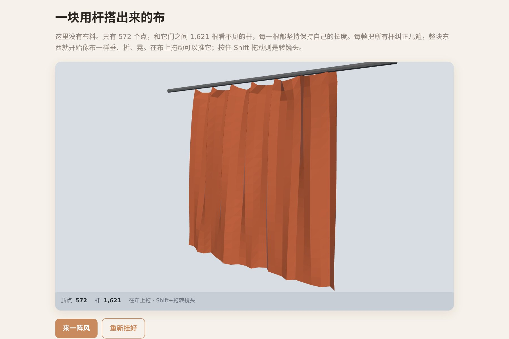

# 让 AI 做出一块会打褶、会被风吹起来的布

一块挂着的布，风吹会荡，鼠标戳会凹进去。**这里没有布，只有一堆点和它们之间的杆。**

布料感全部来自一件事：每一对相邻的点都想保持固定的距离。就这一条，反复执行几遍，一堆点就开始表现得像布。

▶ **[直接查看成品](https://view.tybbtech.com/p/pmsqrjt1lwgkb/)**

---

## 开始之前

- **要花多久**：一小时
- **要装什么**：什么都不用。[打开造物台](https://coder.tybbtech.com)，注册送 50 积分
- **最关键的一步**：第 4 步。**不说那一句，你得到的会是一块平板，不是一块布**

---

## 第 1 步 · Verlet：不存速度

> **这么说：**
> 用 **Verlet 积分**：每个质点只记自己的当前位置和上一帧位置，**不存速度**——速度就是这两者的差。
> 每一步：先算出隐含的速度、乘上阻尼，把当前位置存成"上一帧"，再把速度和外力加上去。

**为什么不存速度**：布料模拟里你会不停地直接改点的位置（约束纠正、鼠标拖拽、戳）。如果另外存着速度，这些位置修改和速度就对不上，**你使劲拽一下它就算炸了**。Verlet 里位置改了速度自动跟着变，怎么拽都稳。

---

## 第 2 步 · 布料感来自杆

> **这么说：**
> 每个点和右边、下面的邻居各连一根杆，记下自然长度。**再连一根斜杆**（到右下角那个邻居，自然长度是间距乘根号二）。
> 每一步之后做"松弛"：遍历所有杆，被拉长或压短了，就让两端各往回走一半，**把这一整轮反复跑几遍**。

**斜杆不能省**：只有横竖杆的话，整张布可以像手风琴一样折平而不违反任何约束——出来的东西会莫名其妙地塌下去。

**跑几遍 = 料子多硬**：跑一遍布是橡皮的，每多跑一遍就硬一点。把这个遍数做成"硬度"滑块，是这类模拟里最直观的一个参数。

---

## 第 3 步 · 钉住顶排

> **这么说：**
> 顶排选几个点钉住不动（两端各一个，中间每隔四个钉一个），其余的点自由下垂。

---

## 第 4 步 · 🔴 让它打褶：把顶排捏窄

**这是全篇最关键的一句。不说它，你会得到一块平得像板子的布。**

> **这么说：**
> 钉住的那几个点，**横向间距只取自然间距的 74%**，不是 100%。

**为什么**：窗帘会打褶，是因为**布比它挂着的那段空间宽**。多出来的料没地方去，只能往前后堆——那就是褶。

如果把顶排按 100% 的自然间距钉住，那**平板就真的是它的静止形状**，物理没有任何理由让它起皱。你会以为是重力不对、阻尼不对、迭代次数不对，怎么调都调不出褶来——**因为问题根本不在那儿。**

> **配套的一句**：给非固定点一个极小的初始前后厚度（比如按列号取个正弦，幅度几个百分点）。**多出来的料需要知道该往哪边鼓**，全是零的话它会卡在一个不稳定的完美平面上。

---

## 第 5 步 · 🔴 风必须是不均匀的

> **这么说：**
> 风力对每个点**不一样**：按时间叠两个不同快慢的正弦（一快一慢），再乘上一个跟着点的横向位置变化的因子。

**均匀的风只会把整块布平移过去**——布纹丝不动，整体飘走，看着极其假。

**不均匀才会让它荡起来。** 这一条对所有"风吹某物"的模拟都成立：旗帜、草地、头发，全一样。

---

## 第 6 步 · 让人能戳它

> **这么说：**
> 点击时把落点附近半径内的所有点朝外推开，越近推得越狠。
> **推的方向要偏向外侧**（远离观察者），这样戳下去布是被推开的，符合直觉。

---

## 第 7 步 · 改成你自己的

| 你想要 | 就这么说 |
|---|---|
| 旗帜 | 只钉左边一列，风调大 |
| 吊床 | 钉四个角，中间放个重物 |
| 撕开 | 杆被拉超过某个长度就删掉它 |
| 桌布 | 钉住四角，中间放一个球做碰撞 |

---

## 关键的那些数

| 参数 | 值 | 为什么 |
|---|---|---|
| 网格 | 26 × 22 | 再密手机上会掉帧 |
| **顶排收窄** | **74%** | **这一个数决定有没有褶** |
| 松弛遍数 | 做成滑块 | 一遍是橡皮，多遍是帆布 |
| 斜杆 | 必须有 | 没有它布会像手风琴一样折平 |
| 初始厚度 | 几个百分点 | 让多出来的料知道往哪边鼓 |

---

## 这个作品免费拿走

不用从头做——**这块布直接送你，拿走就是你的**。

打开下面的链接，页面右下角有「🎨 改造这个作品」，点一下就复制出一份完全属于你的副本。跟它说「改成一面旗帜」或者「加上撕裂」就行。

👉 **[免费拿走这个作品](https://view.tybbtech.com/p/pmsqrjt1lwgkb/)**

---

**这篇是怎么写出来的**：方法来自一个真的在线上跑着的成品，源码逐行读过，上面那些数值和坑都是它实际在用的。
