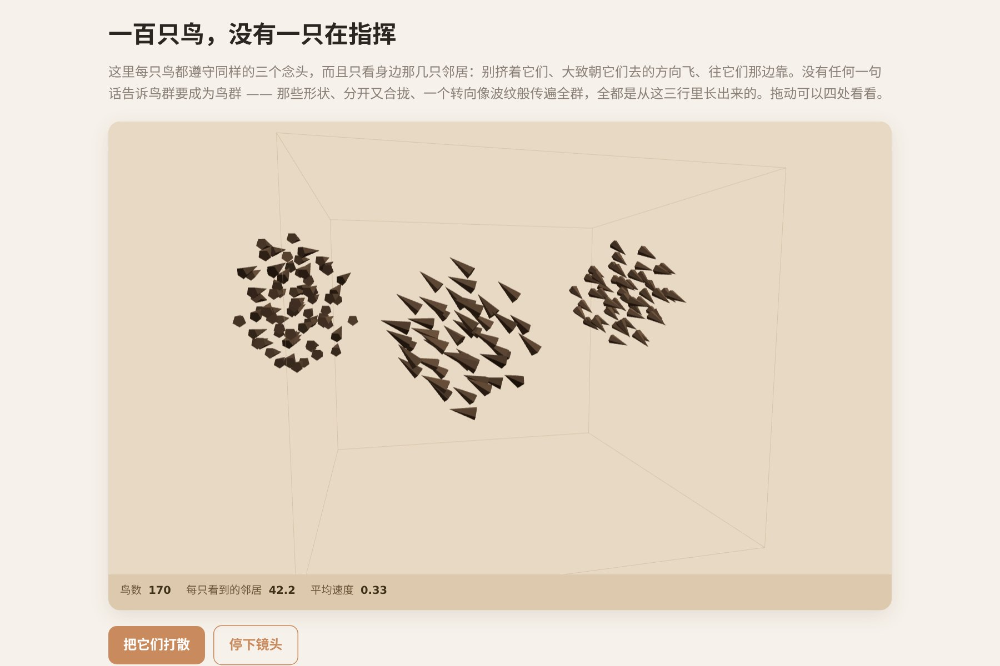

# 让 AI 做出一群没有领队的鸟

一百只鸟，**没有人在指挥**。每只鸟只看自己身边一小圈里的邻居，然后服从三个念头：别挤、跟着大家的方向、往大家那边靠。

人字形、分开又合拢、一个转向像波纹一样传遍整群——**这些没有被写在任何一行代码里**。它们只是因为一百只鸟各自遵守三条局部规则而出现。

这就是"涌现"，1987 年 Craig Reynolds 提出，此后所有鸟群都是这么做的。

▶ **[直接查看成品](https://view.tybbtech.com/p/pmsqrjt1l5omd/)**

---

## 开始之前

- **要花多久**：一小时
- **要装什么**：什么都不用。[打开造物台](https://coder.tybbtech.com)，注册送 50 积分
- **说明白**：这个作品**代码很短，但调参数能调半天**——三条规则的权重比例决定了它是一群鸟还是一团乱麻

---

## 第 1 步 · 三条规则

> **这么说：**
> 每只鸟只考虑感知半径内的邻居，对它们做三件事：
> - **分离**：离得太近（小于个人空间）的邻居，把自己推开，**越近推得越狠**（推力除以距离的平方）
> - **对齐**：把邻居们的速度平均起来，朝那个方向调整自己
> - **聚合**：把邻居们的位置平均起来，朝那个点靠
>
> 三条各给一个权重系数，做成滑块。

> **性能提示**：判断远近时用**距离的平方**比较，别开平方根。一百只鸟两两比较是一万次，每帧一万次开方是白花的钱。

---

## 第 2 步 · 🔴 位置要等所有鸟都决定完再更新

> **这么说：**
> 先遍历所有鸟，只更新它们的速度；**全部算完之后，再统一把位置加上去。**

**如果边算边动会怎样**：数组里排在前面的鸟先动了，后面的鸟看到的就是"已经动过的邻居"——于是**数组的顺序会影响模拟结果**。这种 bug 画面上看不出来，但它是错的，而且会在你想复现某个漂亮瞬间时坑你。

---

## 第 3 步 · 🔴 经典三规则少了一条：它们不知道该待在哪

这是所有人第一次做鸟群都会撞上的问题。

> **这么说：**
> 加一个朝原点的**微弱牵引**：速度按位置的一个小比例往回拉，**竖直方向拉得更紧一些**（大约 1.6 倍），免得飞出画面。

**为什么必须加**：那三条经典规则从没规定鸟群该待在哪儿。放任不管的话，整群鸟会一直朝一个方向飘，**最后找着一面墙停在那里** ——既不好看，也不是真实鸟群的样子。真鸟是绕着栖地盘旋的，这个牵引就是那个栖地。

---

## 第 4 步 · 边界要"拐回来"，不是"弹回来"

> **这么说：**
> 越过边界时，按超出的距离给一个**逐渐增强的回拉力**，不要直接把速度取反。

硬弹像球撞墙，一顿一顿的。轻轻一拉才像**一只鸟决定不往那边去了**。

---

## 第 5 步 · 给速度设上下限

> **这么说：**
> 每帧最后夹一下速度：低于最小速度就拉到最小，高于最大速度就压回最大。

**鸟不会停下，也不会突破音障。** 不夹的话，聚合力会让它们在中心堆成一团静止的球，或者互相加速到飞出宇宙。

---

## 第 6 步 · 让它好看

> **这么说：**
> 每只鸟画成一个朝着自己飞行方向的小锥体或纸片。用 three.js，不要模型文件。
> 可以按邻居数量给鸟上色——**独自在外围的和挤在核心的颜色不一样**，一眼就看出群的结构。

---

## 第 7 步 · 改成你自己的

| 你想要 | 就这么说 |
|---|---|
| 鱼群 | 换个配色，加一点水下的雾 |
| 加天敌 | 放一个鼠标控制的点，鸟躲着它 |
| 加食物 | 放几个吸引点，看群怎么分裂又合拢 |
| 二维版 | 去掉一个维度，做成平面的，性能好得多 |

---

## 关键的那些数

| 参数 | 值 | 为什么 |
|---|---|---|
| 鸟的数量 | 100 只左右 | 两两比较是平方级增长，再多就卡 |
| 活动范围 | 23 个单位 | 竖直方向只给 0.42 倍，画面才不空 |
| 牵引强度 | 很小的一个值 | 大了整群黏在原点不动 |
| 竖直牵引 | 横向的 1.6 倍 | 屏幕是横的，竖着容易飞出去 |
| 分离权重 | 通常要大于聚合 | 反过来会挤成一个球 |

---

## 这个作品免费拿走

不用从头做——**这群鸟直接送你，拿走就是你的**。

打开下面的链接，页面右下角有「🎨 改造这个作品」，点一下就复制出一份完全属于你的副本。跟它说「加一只鹰让它们躲」就行。

👉 **[免费拿走这个作品](https://view.tybbtech.com/p/pmsqrjt1l5omd/)**

---

**这篇是怎么写出来的**：方法来自一个真的在线上跑着的成品，源码逐行读过，上面那些数值和坑都是它实际在用的。
