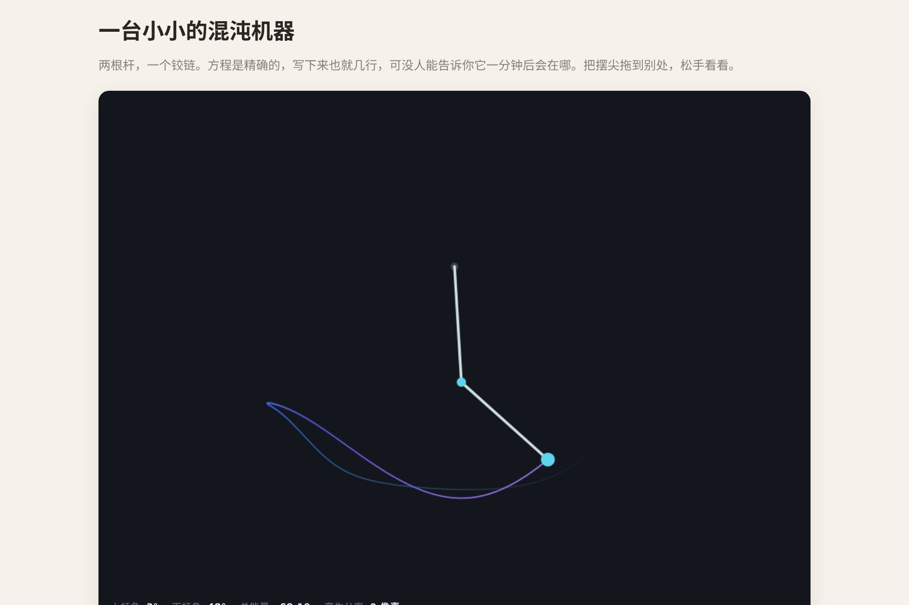

# 让 AI 做出一台真正在算的混沌机器

两根铰接的杆，放手让它自己摆。**没有任何预设动画、没有录制回放**——图形在哪，是因为方程算出来它就在那。这也正是它永不重复的原因。

再放两个"孪生摆"上去：初始角度只差 **0.001 弧度**，几秒之内它们就分道扬镳，再也找不回彼此。屏幕上那个"分开了多少像素"的数字，就是混沌这件事全部的意思。

▶ **[直接查看成品](https://view.tybbtech.com/p/pmsqrjt1lp00x/)**

---

## 开始之前

- **要花多久**：一小时
- **要装什么**：什么都不用。[打开造物台](https://coder.tybbtech.com)，注册送 50 积分
- **这篇的价值**：下面三条红线，是**所有物理模拟类作品共用的**。做完这个，做别的物理演示都不会再翻车

---

## 第 1 步 · 🔴 用米和秒，不要用像素

这是最容易被忽略、后果又最严重的一条。

> **这么说：**
> 物理量一律用**真实单位**：杆长用米、质量用千克、重力用 9.8 米每二次方秒。
> 画图的时候再乘一个"每米多少像素"的比例换算成屏幕坐标。**物理计算里永远不出现像素。**

**如果拿像素当长度会怎样**：一根"150 像素长"的杆，配 9.8 的重力，摆动周期会变成几十秒——**整个演示看起来像慢镜头**。然后人就会去把重力改成 800 之类的怪数字来"配"，从此所有参数都失去意义，再也调不动。

用米和秒，数字自己就讲道理：**一根 1 米的杆大约两秒摆一个来回，跟真的一样。**

---

## 第 2 步 · 写出真正的运动方程

> **这么说：**
> 用双摆的标准运动方程：给定两个角度和两个角速度，算出两根杆各自的角加速度。
> 分母是 `2m₁ + m₂ − m₂·cos(2θ₁ − 2θ₂)`，两个分子分别按标准公式写。

这套方程网上到处都有，让 AI 直接用标准形式，**别让它自己推**。

---

## 第 3 步 · 🔴 必须用四阶龙格库塔，不能用欧拉法

> **这么说：**
> 积分器用**四阶龙格库塔**（RK4）：一步之内取四次斜率再加权平均。
> **不要用最朴素的欧拉法**（把当前速度直接加上去）。

**欧拉法会怎样**：它会肉眼可见地漏能量，摆会自己慢慢停下来——**看起来就像模型里有一个并不存在的摩擦力**。而你去代码里找，一行摩擦都找不到，因为那不是 bug，是积分方法的误差。

这个坑非常典型：程序不报错，画面也在动，只是"物理不对"。**没人告诉你的话，你会以为是自己参数没调好。**

---

## 第 4 步 · 🔴 物理走固定步长，别跟着帧率走

> **这么说：**
> 物理按**固定步长**推进（比如每秒 480 步），用一个累加器攒够时间就走一步。
> **不要用"上一帧耗时"当步长去推进物理。**
> 另外，单帧间隔超过 0.1 秒时直接忽略（那是标签页被切走过）。

**为什么**：混沌系统对一切都敏感，包括步长。跟着帧率走的话，**同一个初始条件在不同机器、不同时刻会跑出完全不同的结果**——那是一种你永远复现不了、也永远查不明白的 bug。

---

## 第 5 步 · 把"混沌"这件事显示出来

光看一个摆乱晃，是感受不到混沌的。要看到的是**两个几乎一样的开局如何分开**。

> **这么说：**
> 同时跑三个摆：主摆，加两个"孪生摆"——一个的上杆初始角差 0.001 弧度，另一个的下杆初始角差 0.001 弧度。孪生摆画得淡一些。
> 页面上实时显示：**两个摆锤此刻分开了多少像素**。

那个数字前几秒纹丝不动，然后突然开始暴涨——**这就是这个作品要讲的全部**。

---

## 第 6 步 · 一个免费的自检

> **这么说：**
> 页面上显示系统的总能量（动能 + 势能）。

**无摩擦时它应该纹丝不动。** 盯着这个数看它变不变，是验证积分器有没有偷懒最便宜的办法——如果它一路往下掉，说明积分方法不对（回到第 3 步）。

这一招对任何物理模拟都管用，值得记住。

---

## 第 7 步 · 轨迹和手感

> **这么说：**
> 下端摆锤留一条轨迹，保留最近九百个位置，越新的越亮、颜色越偏暖。
> 拖动时把两根杆都指向指针，按住定住不动，松手就放开（速度清零、轨迹清空）。
> 滑块控制两根杆的长度、下端质量、重力大小。**滑块只能给整数，所以长度用厘米存，再换算成米。**

---

## 第 8 步 · 改成你自己的

| 你想要 | 就这么说 |
|---|---|
| 三节摆 | 加一根杆，混沌来得更快 |
| 摆的画笔 | 让轨迹永久保留，它就变成一台绘图机 |
| 一群摆 | 放二十个初始角略微不同的摆，看它们从一束散成一片 |
| 加摩擦 | 把阻尼从 1 调到 0.999，看它慢慢停下来 |

---

## 关键的那些数

| 参数 | 值 | 为什么 |
|---|---|---|
| 物理步频 | 每秒 480 步 | 低了 RK4 也会失真，高了白费性能 |
| 孪生偏移 | 0.001 弧度 | 小到肉眼看不出差别，这才是重点 |
| 阻尼 | 0.9999 | 1 是永不停歇，0.999 就明显在停 |
| 轨迹长度 | 900 个点 | 够画出图案，又不至于糊成一团 |
| 每米像素 | 150 | 只管画图，物理永远看不到这个数 |
| 忽略间隔 | 超过 0.1 秒 | 标签页切回来时别让物理一次性狂奔 |

---

## 这个作品免费拿走

不用从头做——**这台机器直接送你，拿走就是你的**。

打开下面的链接，页面右下角有「🎨 改造这个作品」，点一下就复制出一份完全属于你的副本。跟它说「加到三节」或者「让轨迹永久保留」就行。

👉 **[免费拿走这个作品](https://view.tybbtech.com/p/pmsqrjt1lp00x/)**

改完就是一个链接，发给学生，手机上就能拖着玩。

---

**这篇是怎么写出来的**：方法来自一个真的在线上跑着的成品，源码逐行读过，上面那些数值和坑都是它实际在用的。
