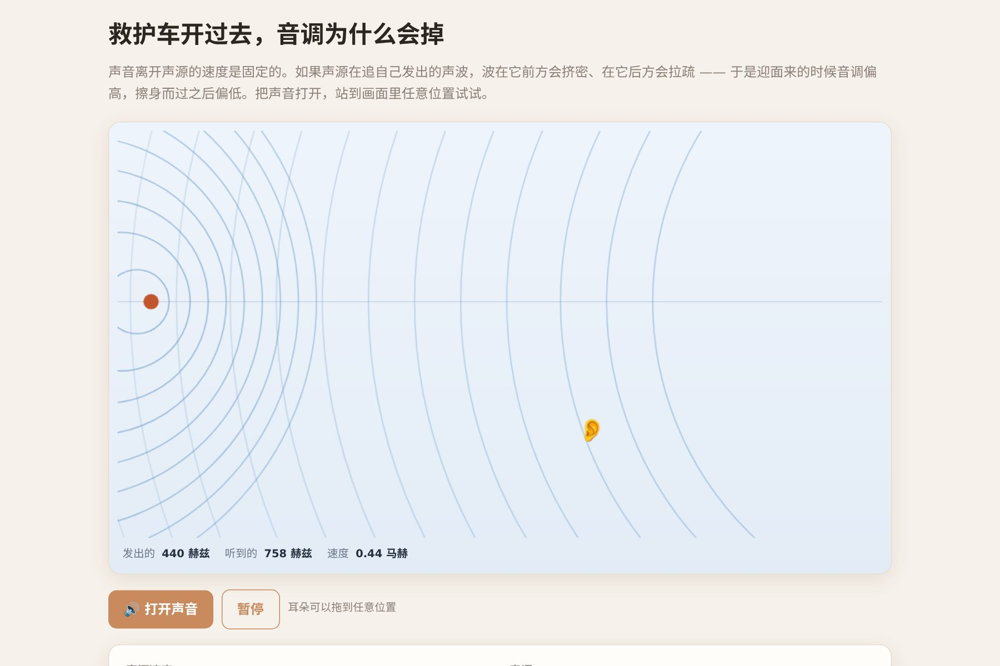

# 让 AI 做出一个能听见的多普勒效应

一辆"救护车"开过去，波前的圆环在它前方挤密、后方拉疏。**打开声音，你能真的听见那一下降调**——拖着耳朵换个位置，音调跟着变。

圆环不是画上去的示意图：每一圈都记着自己被发出的位置，然后按声速往外长。**它们会自己挤密，这一点没有作假。**

▶ **[直接查看成品](https://view.tybbtech.com/p/pmsqrjt1lkvx6/)**

---

## 开始之前

- **要花多久**：四十分钟
- **要装什么**：什么都不用。[打开造物台](https://coder.tybbtech.com)，注册送 50 积分
- **它的特别之处**：本仓库里少有的**能听的**演示。物理演示配上声音，说服力完全不是一个量级

---

## 第 1 步 · 让波前是真的

大部分多普勒演示都是画几个假的同心圆糊弄过去。真做出来其实更简单。

> **这么说：**
> 每隔一小段时间，在**声源当前的位置**放下一个圆环，记住它的出生位置和出生时间。
> 之后每一帧，圆环的半径 = 已经过去的时间 × 声速。圆心永远停在它出生的地方不动。
> 超过一定寿命的圆环删掉。

就这样，**挤密和拉疏会自己出现**——因为声源在动，而每一圈的圆心留在原地。你什么都不用额外做。

> **诚实一点**：画出来的圆环是每 0.1 秒一圈，不是真的每 1/440 秒一圈（那样屏幕上会是一片实心）。这是示意用的抽样，值得在页面上或注释里说明。

---

## 第 2 步 · 频率公式

> **这么说：**
> 听到的频率 = 发出的频率 × 声速 ÷ (声速 − 声源朝向听者的速度分量)。
> 速度分量 = 声源速度 × (听者与声源连线在声源运动方向上的投影比例)。
> 声速取 343 米每秒（常温空气）。

> **⚠️ 分母要夹住**：声源速度接近或超过声速时，分母会趋近于零，频率跑到无穷大。给分母设一个下限（比如声速的 12%），否则超声速时数字直接爆掉。

---

## 第 3 步 · 🔴 让它出声，而且不能有咔哒声

> **这么说：**
> 用 Web Audio 开一个振荡器，**波形用锯齿波**——警笛是有泛音的，纯正弦听着太薄，不像车。
> 每一帧把频率调到当前听到的值，但**要用平滑过渡（setTargetAtTime），不要直接赋值**。
> 音量按听者到声源的距离衰减。

**为什么不能直接赋值**：每帧硬改频率，等于每 16 毫秒把波形切断一次，**会有非常明显的咔哒声**，一片噼里啪啦。用一个 0.02 秒左右的平滑常数滑过去就干净了。

> **另外**：浏览器不允许页面自动出声。**必须放在一个"打开声音"的按钮后面**，由用户点击触发。

---

## 第 4 步 · 让人能动

> **这么说：**
> 耳朵可以拖到画面任何地方，频率实时跟着变。
> 滑块控制声源速度和发出频率。

**拖着耳朵从车前面挪到车后面**，看着数字从高变低——这个交互就是整个作品的教学价值所在。静态图讲不清"为什么开过去之后声音会变低"，拖一次就懂了。

---

## 第 5 步 · 把马赫数亮出来

> **这么说：**
> 显示三个数：发出频率、听到频率、**马赫数**（声源速度 ÷ 声速）。
> 马赫数超过 1 时，显示一条"音爆"提示。

速度滑块拉过声速那一刻，圆环会全部挤到一个锥形的包络面上——那就是音爆锥。**滑块能拉到超声速，是这个作品的彩蛋。**

---

## 第 6 步 · 改成你自己的

| 你想要 | 就这么说 |
|---|---|
| 红移蓝移 | 换成星光，频率变化对应颜色偏移 |
| 雷达测速 | 加上反射回来的第二次多普勒 |
| 双声源 | 放两辆车，听拍频 |
| 教学版 | 加上公式推导的分步展示 |

---

## 关键的那些数

| 参数 | 值 | 为什么 |
|---|---|---|
| 声速 | 343 米/秒 | 常温空气，用真值 |
| 声源速度 | 150 米/秒起 | 慢了效果不明显 |
| 画环间隔 | 0.1 秒 | 真频率画出来是一片实心 |
| 环的寿命 | 3.2 秒 | 够铺满画面又不至于糊 |
| 分母下限 | 声速的 12% | 防止超声速时频率爆掉 |
| 频率平滑 | 0.02 秒 | 再快就有咔哒声 |

---

## 这个作品免费拿走

不用从头做——**这个演示直接送你，拿走就是你的**。

打开下面的链接，页面右下角有「🎨 改造这个作品」，点一下就复制出一份完全属于你的副本。跟它说「改成星光的红移蓝移」就行。

👉 **[免费拿走这个作品](https://view.tybbtech.com/p/pmsqrjt1lkvx6/)**

改完就是一个链接，发给学生，戴上耳机就能听。

---

**这篇是怎么写出来的**：方法来自一个真的在线上跑着的成品，源码逐行读过，上面那些数值和坑都是它实际在用的。
