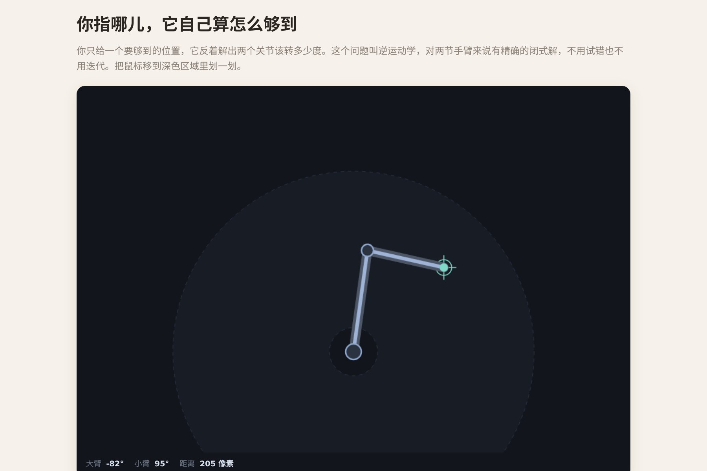

# 让 AI 做出一条会自己算角度的机械臂

鼠标走到哪，机械臂就伸到哪。**你只告诉它"末端要在这个点"，两个关节该转多少度是它自己反解出来的。** 按下画笔，它就变成一台绘图机。

这叫**逆运动学**。对两节手臂来说它有精确解——不用猜、不用迭代，一个余弦定理加一次 `atan2` 就完事。

▶ **[直接查看成品](https://view.tybbtech.com/p/pmsqrjt1l1y5i/)**

---

## 开始之前

- **要花多久**：一小时
- **要装什么**：什么都不用。[打开造物台](https://coder.tybbtech.com)，注册送 50 积分
- **说明白**：AI 很可能会想用迭代逼近（CCD、FABRIK 之类）来解。**两节臂不需要那些**，直接告诉它用解析解，代码短一半、还不抖

---

## 第 1 步 · 解析解，不要迭代

> **这么说：**
> 两节手臂的逆运动学用**解析解**，不要迭代逼近：
> 两段臂和"基座到目标"的连线构成一个三角形，三边已知——
> - **肘角**：用余弦定理，`cos(肘角) = (距离² − L1² − L2²) / (2·L1·L2)`
> - **大臂角**：先用 `atan2` 对准目标方向，再减去小臂贡献的那部分角度
>
> 同一个点有两组解（肘朝上 / 肘朝下），加一个按钮切换。

---

## 第 2 步 · 🔴 反余弦之前必须夹住

**这一条不说，手臂会毫无征兆地整个僵住。**

> **这么说：**
> 调用 `acos` 之前，**把那个余弦值夹到 −1 到 1 之间**。

**为什么**：浮点误差会让你算出 `1.0000000002` 这种值。`acos` 遇到超出范围的输入返回 **NaN**，NaN 传下去，两个关节角全变成 NaN，**手臂当场定住不动，控制台一句报错都没有**。

这是数值计算里最典型的一类坑：不是逻辑错，是精度溢出边界。**任何用到 `acos` / `asin` 的地方都该夹一下。**

---

## 第 3 步 · 🔴 够不着的点，要"使劲伸"而不是崩掉

> **这么说：**
> 手臂能够到的是一个圆环：外圈是两段臂完全伸直（L1+L2），内圈是完全折回来（|L1−L2|），**中间那个小圆是死区，够不着**。
> 目标点超出范围时，**保留方向、把距离夹到边界上**再去解。

这样手臂会朝着够不着的点**使劲伸过去**，看着就像一个真的在努力的机器——而不是数学炸掉、手臂乱抽。

> **顺手做一件事**：把这个可达圆环用虚线和淡色画在背景上（外圆减去内圆，用 even-odd 填充规则挖空）。**用户一眼就知道哪里能去哪里不能去**，而且它本身很好看。

---

## 第 4 步 · 关节要有转速上限

> **这么说：**
> 关节不能瞬移。每一帧朝目标角度转过去，但**每秒最多转多少度有个上限**（比如 320 度）。

不限速的话，鼠标一跳手臂就瞬移过去，看着像贴图不像机器。加了限速，快速甩鼠标时手臂会"追不上"——**那个追赶的感觉就是机械感的来源**。

---

## 第 5 步 · 🔴 转角要走近路

> **这么说：**
> 计算角度差时，**先把差值归一化到 −π 到 π 之间**（大于 π 就减 2π，小于 −π 就加 2π），再决定往哪边转。

**不做归一化会怎样**：角度是绕圈的，从 350° 转到 10° 明明只差 20°，程序会以为要转 340°，于是**手臂偶尔会绕远路兜一大圈**。这个 bug 只在跨过某条线的时候出现，非常难复现。

---

## 第 6 步 · 加一支笔

> **这么说：**
> 加一个「开始画画」按钮。按下之后，末端走过的位置记成一条轨迹画出来。
> **抬笔时往轨迹数组里塞一个空标记**，画线时遇到空标记就断开、下一笔重新起头。
> 采样时距离上一个点太近就跳过，别记一堆重复的点。

那个"空标记断笔"是让它能画多笔的关键——不然抬笔再落笔，中间会连出一条不该有的直线。

---

## 第 7 步 · 让它像个机器

> **这么说：**
> 两条臂沿同一条路径描两遍：先画一条粗的深色外壳，再在正中间描一条细的亮线当高光。
> 关节画成带描边的圆点，末端根据是否落笔换颜色。

两遍描边这个小技巧，能让简单的线条立刻有金属的体积感。**把它抽成一个函数**，以后想改臂型只有一份路径要动。

---

## 第 8 步 · 改成你自己的

| 你想要 | 就这么说 |
|---|---|
| 三节臂 | 多一个关节，这时才需要迭代解法 |
| 写字 | 给它一串预设路径，让它自动写一个字 |
| 双臂协作 | 放两条，让它们传递一个东西 |
| 抓取 | 末端加一个会开合的夹爪 |

---

## 关键的那些数

| 参数 | 值 | 为什么 |
|---|---|---|
| 上臂 / 前臂 | 170 / 130 像素 | 不等长才有内圈死区，等长的话死区退化成一个点 |
| 关节转速 | 320 度/秒 | 快了没机械感，慢了跟不上鼠标 |
| 轨迹长度 | 2600 个点 | 够画一幅画 |
| 采样阈值 | 1.2 像素 | 更密只是浪费 |
| 余弦夹紧 | −1 ～ 1 | 不夹就会 NaN，手臂僵死 |

---

## 这个作品免费拿走

不用从头做——**这条机械臂直接送你，拿走就是你的**。

打开下面的链接，页面右下角有「🎨 改造这个作品」，点一下就复制出一份完全属于你的副本。跟它说「加一个夹爪」或者「让它自动写字」就行。

👉 **[免费拿走这个作品](https://view.tybbtech.com/p/pmsqrjt1l1y5i/)**

---

**这篇是怎么写出来的**：方法来自一个真的在线上跑着的成品，源码逐行读过，上面那些数值和坑都是它实际在用的。
