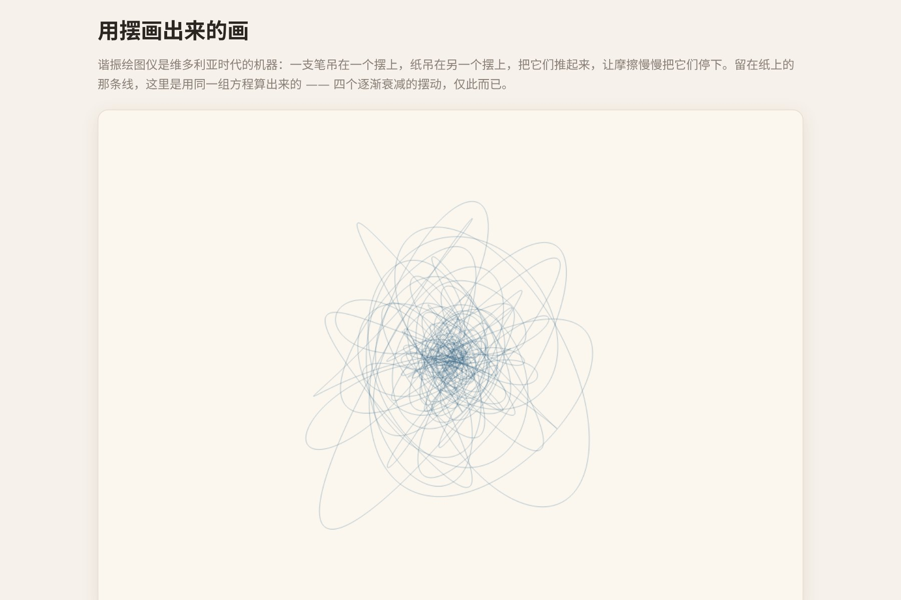

# 让 AI 做出一台会画画的摆锤机器



十九世纪的一种机器：两个摆，一个吊着笔，一个吊着纸，一起摆起来，笔尖就在纸上画出一张谁也预料不到的图。**摆动慢慢停下，图案也就自己收笔了。**

这是本仓库里**代码最短的一个**——核心只有四条正弦波相加。但出图的漂亮程度跟代码长度完全不成比例。

▶ **[直接查看成品](https://view.tybbtech.com/p/pmsqrjt1l1gs7/)**

---

## 开始之前

- **要花多久**：二十分钟
- **要装什么**：什么都不用。[打开造物台](https://coder.tybbtech.com)，注册送 50 积分
- **适合谁**：想快速做出一个"看起来很高级"的东西的人。投入产出比是本仓库里最高的

---

## 第 1 步 · 核心就是四条正弦波

> **这么说：**
> 做一个谐振绘图仪。笔尖在时刻 t 的位置由四条衰减正弦波决定，x 方向两条、y 方向两条：
> ```
> x(t) = A₁·sin(f₁·t + p₁)·e^(−d·t) + A₂·sin(f₂·t + p₂)·e^(−d·t)
> y(t) = A₃·sin(f₃·t + p₃)·e^(−d·t) + A₄·sin(f₄·t + p₄)·e^(−d·t)
> ```
> 其中 d 是摩擦系数，对四条一视同仁。把 t 从 0 走到很大，把笔尖轨迹连成一条线。

真机器就是这样：每个摆在两个方向上同时摆动，两个摆加起来就是四条。**摩擦让振幅指数衰减，图案自然向中心收拢，不用你去决定什么时候停笔。**

---

## 第 2 步 · 🔴 频率要「几乎」成整数比

这一句是全篇的关键，也是这台机器全部魅力的来源。

> **这么说：**
> 四个频率各自落在一个小整数（1 到 4）附近，然后**被一个小的失谐量推开一点点**。失谐量默认 0.18 左右。

**为什么不能是正好的整数比**：

| 频率关系 | 画出来是什么 |
|---|---|
| 正好 2:1 | 一个干净的闭合环。转一圈回到原点，之后就一直重复同一条线，**永远只有一个环** |
| 2.005:1 | 每转一圈都偏移一点点，一圈一圈地铺开，**最后填满整张纸** |
| 差得太远（比如 2.4:1） | 乱线团，看不出结构 |

**正是那点"不准"把整张纸填满的。** 完全准确反而什么都没有。

---

## 第 3 步 · 一笔画完，用很低的透明度

> **这么说：**
> 整条轨迹**一笔画完**（一个路径走到底再描边），线宽 0.6 左右，颜色透明度大约 0.55。

**为什么不能一段段画**：一笔画完 + 低透明度，线与线交叠的地方会自然变深——**真墨水落在纸上就是这样**。分成很多段各自描边的话，交叠处不会累积，出来是平的，一下就假了。

---

## 第 4 步 · 让同一张图能找回来

> **这么说：**
> 不要用 `Math.random`，自己写一个带种子的随机数发生器，四个频率、相位、振幅全从它取数。
> **把种子号显示在画面上**，「画一张新的」就是换一个种子。

这台机器每次出图都不一样，**你一定会画到一张特别喜欢的**——没有种子，它就永远丢了。

---

## 第 5 步 · 控件

> **这么说：**
> 四个滑块：墨色、摩擦（衰减快慢）、失谐量、笔画粗细。再加「画一张新的」和「存成图片」两个按钮，点画布本身也能换一张。

> **⚠️ 滑块只能给整数**，所以每一项要各自换算：摩擦除以 1000、失谐除以 100、粗细除以 10。不换算的话滑块一动图就全毁了。

---

## 第 6 步 · 改成你自己的

| 你想要 | 就这么说 |
|---|---|
| 会动的版本 | 让它一边算一边画，看着笔尖走 |
| 多色 | 让墨色随时间缓慢变化，出来是彩虹丝线 |
| 装置感 | 背景换成深色，墨色换成亮色，像示波器 |
| 印章 / 头像 | 缩小画布，调高摩擦，出来是一个紧凑的图章 |

---

## 关键的那些数

| 参数 | 值 | 为什么 |
|---|---|---|
| 失谐量 | 0.18 | 太小只有一个环，太大成乱线团 |
| 摩擦 | 0.012 | 大了几圈就收笔，小了永远画不完 |
| 频率基数 | 1 ～ 4 的整数 | 再大图案就细碎得看不清结构 |
| 画多久 | 190 秒机器时间 | 到这里振幅已经衰减得差不多了 |
| 采样率 | 每秒 90 步 | 低了线会出现折角 |
| 透明度 | 0.55 | 交叠处才有墨色累积的层次 |

---

## 这个作品免费拿走

不用从头做——**这台机器直接送你，拿走就是你的**。

打开下面的链接，页面右下角有「🎨 改造这个作品」，点一下就复制出一份完全属于你的副本。跟它说「让墨色随时间变化」或者「做成会动的」就行。

👉 **[免费拿走这个作品](https://view.tybbtech.com/p/pmsqrjt1l1gs7/)**

改完就是一个链接，画到喜欢的那张，存下来就能当壁纸。

---

<sub>**这篇是怎么写出来的**：方法来自一个真的在线上跑着的成品，源码逐行读过，上面那些数值和坑都是它实际在用的。</sub>
