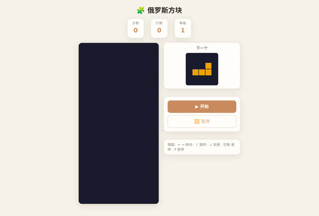

# 「做一个俄罗斯方块游戏，可以直接在浏览器里玩的」

> **AI 生成** · **1 轮对话** · 说完这一句，没有第二句

上面这个游戏，就是这一句话做出来的。**原话一个字没改**，就是标题那句。

▶ **[直接查看成品](https://view.tybbtech.com/p/pmr34omqdrspn/)**

---

## 完整对话

| # | 当时说的话 |
|---|---|
| 1 | 做一个俄罗斯方块游戏，可以直接在浏览器里玩的 |

完。没有第 2 轮。

---

## 为什么这一句能一次成

这不是运气。俄罗斯方块符合"一句话能成"的三个条件，**你下次想估计某个想法要磨几轮，可以拿这三条去套**：

**① 规则是公开的、完整的、没有歧义的。**
七种方块的形状、旋转、消行、计分，全世界的版本都一样。AI 不需要猜你想要哪一种。

反过来说，如果你要的是"一个好玩的解谜游戏"，那 AI 得先猜"好玩"是什么——**猜就要来回，来回就是轮数**。

**② 对错一眼就能看出来。**
方块掉下去、能不能转、满行消不消，你打开就知道对不对。**不需要你去描述哪里不对。**

**③ 没有外部依赖。**
不用联网、不用数据、不用图片。全在浏览器里算。

---

## 那句「可以直接在浏览器里玩的」不是废话

它其实排除掉了一整类误解：不要下载、不要安装、不要注册。

**在提需求时，把"不要什么"说清楚，往往比把"要什么"说清楚更省事。**

---

## 想改成你自己的

| 你想要 | 就这么说 |
|---|---|
| 手机能玩 | 加上触屏操作：左右滑动移动，点击旋转，下滑加速 |
| 双人对战 | 分成左右两块，消行给对方加一行垃圾 |
| 换皮 | 方块换成水果 / 表情 / 你公司的 logo 色 |
| 加难度 | 每消十行加速一档，显示当前等级 |

---

## 这个作品免费拿走

**这个游戏直接送你，拿走就是你的。**

打开下面的链接，页面右下角有「🎨 改造这个作品」，点一下就复制出一份完全属于你的副本，接着跟它说话就能改。

👉 **[免费拿走这个作品](https://view.tybbtech.com/p/pmr34omqdrspn/)**

---

**关于这一篇**：对话记录是真实的，从平台的聊天存档里原样取出。这个作品是在造物台上说话做出来的，不是我们手写的。
