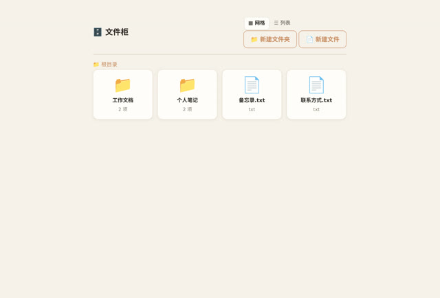

# 「做一个文件柜，打开后可以看到里面储存的文件」

> **AI 生成** · **1 轮对话** · 一句话里藏了三层结构

▶ **[直接查看成品](https://view.tybbtech.com/p/pmr3bbrocaf4t/)**

---

## 完整对话

| # | 当时说的话 |
|---|---|
| 1 | 做一个文件柜，打开后可以看到里面储存的文件，有文件夹和文件列表，点击可以查看文件内容 |

完。没有第 2 轮。

---

## 这句话为什么好使

它看着随口，其实**一口气说清了三层结构**：

1. 有一个**柜子**（入口，要能"打开"）
2. 柜子里有**文件夹和文件列表**（两级）
3. 文件**点击能看内容**（第三级，详情）

这就是一个完整的信息架构。AI 不用猜层级关系，直接照着搭就行。

**对比一下**：如果只说「做一个文件管理器」，AI 就得猜——是要上传吗？要搜索吗？要多少级目录？**每一个猜错，就是一轮返工。**

---

## 一条可复用的经验

> **描述界面类需求时，按"从外到里点进去"的顺序说一遍。**

「打开后看到 A，A 里有 B，点 B 能看到 C」——这个句式几乎总是一次成。它天然对应了页面的层级，AI 照着这个顺序搭，不会漏也不会多。

---

## 想改成你自己的

| 你想要 | 就这么说 |
|---|---|
| 真的能存东西 | 内容存到浏览器本地，刷新还在 |
| 团队共享 | 用平台的共享存储，所有人看到同一份 |
| 加搜索 | 顶上加个搜索框，按文件名筛 |
| 换成资料库 | 文件换成产品说明书 / 课件 / 菜谱 |

---

## 这个作品免费拿走

**这个文件柜直接送你，拿走就是你的。**

打开下面的链接，页面右下角有「🎨 改造这个作品」，点一下就复制出一份完全属于你的副本。

👉 **[免费拿走这个作品](https://view.tybbtech.com/p/pmr3bbrocaf4t/)**

---

**关于这一篇**：对话记录是真实的，从平台的聊天存档里原样取出。这个作品是在造物台上说话做出来的，不是我们手写的。
