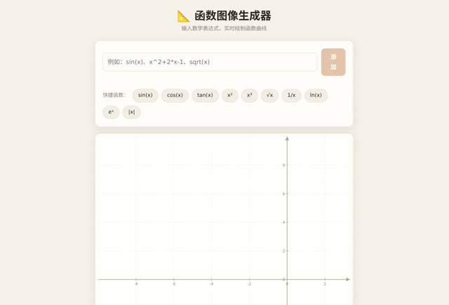

# 「我想通过输入数学函数生成对应的函数图的应用」

> **AI 生成** · **1 轮对话** · 输入和输出都明确，就没有猜的余地

▶ **[直接查看成品](https://view.tybbtech.com/p/pmru811xw7h9m/)**

---

## 完整对话

| # | 当时说的话 |
|---|---|
| 1 | 我想通过输入数学函数生成对应的函数图的应用 |

完。没有第 2 轮。

---

## 这句话的结构值得抄

它是一个标准的「**输入 → 处理 → 输出**」句式：

- **输入**：数学函数（用户打字）
- **输出**：对应的函数图

一句话把两头都钉死了，中间怎么实现随 AI 去想。**这类需求几乎总是一次成**，因为验收标准是自明的——输入 `sin(x)`，画出来不是正弦波就是错的。

> **反例**：「做一个数学工具」——两头都没钉住，AI 只能猜，你只能一轮一轮告诉它猜错了。

---

## 顺带说一句它背后干了什么

要让这个成立，程序得**解析用户打进来的字符串**（把 `x^2+2*x-1` 变成能计算的东西），再逐点求值画线。这一步听着麻烦，但你完全不用提——**"输入数学函数"这五个字已经蕴含了它**。

**提需求时说"要什么"，不用说"怎么做"。** 该它想的让它想。

---

## 想改成你自己的

| 你想要 | 就这么说 |
|---|---|
| 多条曲线对比 | 支持同时输入几个函数，用不同颜色画 |
| 能拖能缩放 | 拖动平移、滚轮缩放坐标系 |
| 求交点 | 标出两条曲线的交点坐标 |
| 教学版 | 加参数滑块，拖动看曲线怎么变 |

---

## 这个作品免费拿走

**这个函数图工具直接送你，拿走就是你的。**

打开下面的链接，页面右下角有「🎨 改造这个作品」，点一下就复制出一份完全属于你的副本。

👉 **[免费拿走这个作品](https://view.tybbtech.com/p/pmru811xw7h9m/)**

---

**关于这一篇**：对话记录是真实的，从平台的聊天存档里原样取出。这个作品是在造物台上说话做出来的，不是我们手写的。
