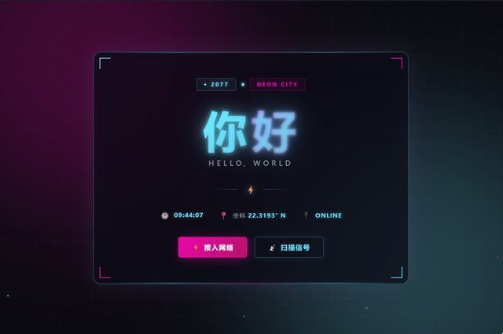

# 「做一个赛博朋克风格的你好海报」

> **AI 生成** · **1 轮对话** · 只有十四个字

▶ **[直接查看成品](https://view.tybbtech.com/p/pmquyvkhrrf5j/)**

---

## 完整对话

| # | 当时说的话 |
|---|---|
| 1 | 做一个赛博朋克风格的你好海报 |

完。没有第 2 轮。**这是本仓库里最短的一句需求。**

---

## 为什么这么短也能成

因为**它没有对错**。

纯视觉的东西，只要好看就算成。没有"功能不对"这回事，也就没有"我得告诉它哪里不对"这回事——**那一整类来回全省掉了**。

而且"赛博朋克"这四个字信息量极大：霓虹、暗底、青紫对比、故障感、等宽字体、扫描线。**一个风格词顶一整段描述。**

---

## 一条可复用的经验

> **想快速看到点东西，先做一个"没有对错"的作品。**

海报、动效、封面、装饰页——这类东西第一次就能给你成就感，而且几乎不会卡住。

反过来，如果你的第一个作品就是"带登录和数据库的管理系统"，那你会在第一天遇到一连串"这里不对那里不对"，很容易就放弃了。

**难度不在于技术，在于对错的多少。**

---

## 想改成你自己的

这个作品最适合当**模板**用——换掉字就是一张新海报：

| 你想要 | 就这么说 |
|---|---|
| 换文案 | 把"你好"换成我要的字，字号自适应 |
| 换风格 | 改成国风 / 蒸汽波 / 极简黑白 |
| 生日贺卡 | 加一句祝福，配一个日期 |
| 活动海报 | 加时间地点，底部放二维码位 |

---

## 这个作品免费拿走

**这张海报直接送你，拿走就是你的。**

打开下面的链接，页面右下角有「🎨 改造这个作品」，点一下就复制出一份完全属于你的副本，换掉文字就是你的海报。

👉 **[免费拿走这个作品](https://view.tybbtech.com/p/pmquyvkhrrf5j/)**

---

**关于这一篇**：对话记录是真实的，从平台的聊天存档里原样取出。这个作品是在造物台上说话做出来的，不是我们手写的。
