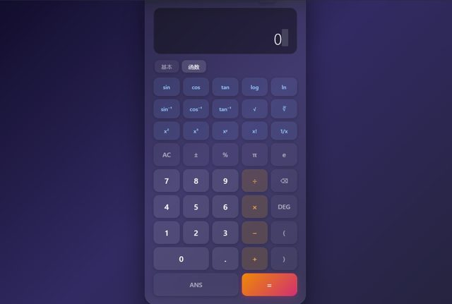

# 「我想把这个计算器做的高级一些，可以有函数的」

> **AI 生成** · **1 轮对话** · 这一句是**改**，不是**做**

▶ **[直接查看成品](https://view.tybbtech.com/p/pmqqe27fki16u/)**

---

## 完整对话

| # | 当时说的话 |
|---|---|
| 1 | 我想把这个计算器做的高级一些，可以有函数的。 |

完。没有第 2 轮。

---

## 注意开头那两个字：「**这个**」

这句话不是从零开始的。当时页面上已经有一个普通计算器了，这一句是在它基础上升级。

**这是本仓库里第一个"改"而不是"做"的例子**，而且它揭示了一件事：

> **在一个已经跑起来的东西上改，比从白纸开始容易得多。**

因为你能指着屏幕说话。"这个"、"上面那个"、"颜色太深"——**有参照物的时候，你不需要精确描述，只需要指出差别。**

---

## 这也正是「改造别人的作品」比「从零做」更适合新手的原因

这个仓库里每一篇末尾都有「免费拿走这个作品」的链接，不是客套。**它是更容易走通的那条路**：

- 从零开始：你得先把想要什么想清楚、说清楚
- 从一个现成的东西开始：你只需要说"哪里不满意"

第二条对绝大多数人友好得多。

---

## 那句「高级一些」为什么没出问题

按理说"高级"是个很虚的词，容易翻车。但它后面跟了一句具体的：**"可以有函数的"**。

> **虚的形容词 + 一个具体的例子 = 够用了。**
>
> 单说"高级一些"，AI 会猜；加上"可以有函数的"，它就知道你说的高级是哪个方向的高级。

---

## 想改成你自己的

| 你想要 | 就这么说 |
|---|---|
| 单位换算 | 加一个换算标签页：长度、重量、温度 |
| 程序员模式 | 加二进制、十六进制切换 |
| 历史记录 | 算过的式子留在旁边，点一下能复用 |
| 大字版 | 按钮和字都放大，给老人用 |

---

## 这个作品免费拿走

**这个计算器直接送你，拿走就是你的。**

打开下面的链接，页面右下角有「🎨 改造这个作品」，点一下就复制出一份完全属于你的副本。

👉 **[免费拿走这个作品](https://view.tybbtech.com/p/pmqqe27fki16u/)**

---

**关于这一篇**：对话记录是真实的，从平台的聊天存档里原样取出。这个作品是在造物台上说话做出来的，不是我们手写的。
