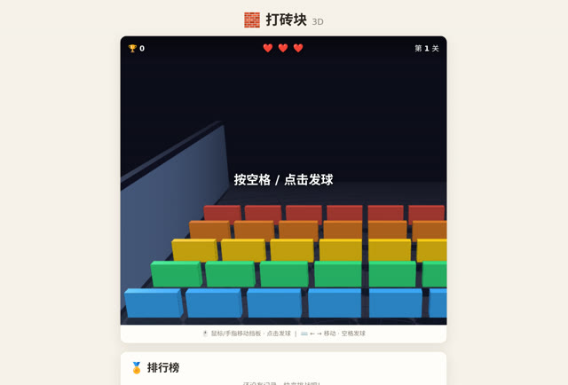

# 「做一个打砖块游戏」→「能改成3D感觉的吗」

> **AI 生成** · **2 轮对话** · 第二句不是修 bug，是升级

▶ **[直接查看成品](https://view.tybbtech.com/p/pmru7821ok6aw/)**

---

## 完整对话

| # | 当时说的话 |
|---|---|
| 1 | 做一个打砖块游戏 |
| 2 | 能改成3D感觉的吗 |

完。就这两句。

---

## 这两轮的关系值得注意

**第二句不是"你做错了"，是"再进一步"。**

这是最理想的一种对话形状：第一句拿到一个能跑的东西，第二句在它基础上加一层。中间没有任何返工。

**很多人卡住，是因为想在第一句里就把所有要求说完。** 结果是：一段话里塞了七八条要求，AI 顾此失彼，你也分不清是哪一条没做到。

> **先要一个能跑的最简版，再一次加一件事。** 这个节奏比"一次说清"快得多，也稳得多。

---

## 「3D 感觉」这个词用得很准

注意它说的是「3D **感觉**」，不是「3D」。

这个差别很大：真 3D 要建模、要相机、要光照；而"3D 感觉"只要透视、阴影、层次——**用平面的手法造出立体的观感**，实现成本低一个数量级，视觉效果却差不多。

> **描述视觉要求时，说"感觉像什么"往往比说"是什么"更好用。** 前者给了 AI 选择实现方式的余地，后者可能把它逼进一条又慢又难的路。

---

## 想改成你自己的

| 你想要 | 就这么说 |
|---|---|
| 加道具 | 打碎特定砖块掉落道具：加宽挡板、多球、穿透 |
| 关卡 | 做十关，砖块排列各不相同 |
| 手机能玩 | 手指按住屏幕拖动挡板 |
| 换主题 | 砖块换成你想砸的东西 |

---

## 这个作品免费拿走

**这个游戏直接送你，拿走就是你的。**

打开下面的链接，页面右下角有「🎨 改造这个作品」，点一下就复制出一份完全属于你的副本。

👉 **[免费拿走这个作品](https://view.tybbtech.com/p/pmru7821ok6aw/)**

---

**关于这一篇**：对话记录是真实的，从平台的聊天存档里原样取出。这个作品是在造物台上说话做出来的，不是我们手写的。
