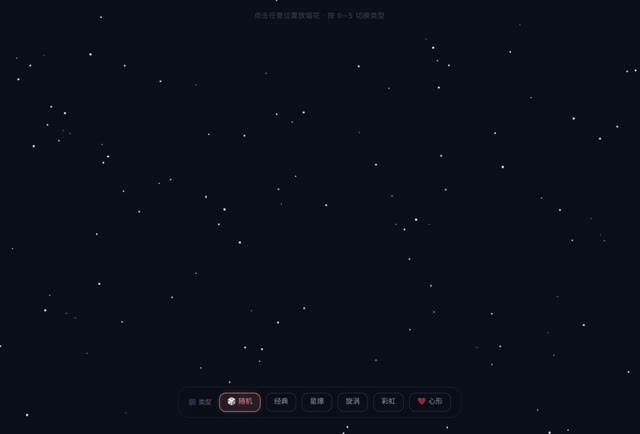

# 「做一个点击屏幕位置就可以放烟花」

> **AI 生成** · **2 轮对话** · 第一句把动作全说清了

▶ **[直接查看成品](https://view.tybbtech.com/p/pmr0rh6cjeile/)**

---

## 完整对话

| # | 当时说的话 |
|---|---|
| 1 | 做一个点击屏幕位置就可以放烟花，烟花要从下放上去然后再天空形成不同类型的 |
| 2 | 能否做成混合随机的烟花 |

完。就这两句。

---

## 第一句里其实说了一整套动作链

拆开看：

- **点击屏幕位置** → 交互方式 + 位置由用户决定
- **从下放上去** → 有一个升空的过程，不是原地炸开
- **再在天空形成** → 到达点击位置才绽放
- **不同类型的** → 不止一种花样

**四个动作，一句话说完，中间没有一个多余的词。**

这就是为什么它两轮就成了：AI 不需要问"是点了就炸还是先升空"，因为已经说了。

> **描述动画和交互时，把"先怎样、再怎样"按时间顺序说一遍。** 这个句式比形容词有效得多。

---

## 第二句的价值：让它有一点点悬念

「混合随机」听着是个小改动，其实改变了体验：

每次点击随机出一种烟花——**你不知道会开出哪种，就会想多点几下**。而且成品里做了一个细节：升空时尾焰的颜色，就是即将绽放的那种烟花的颜色，**所以你可以在它炸开前猜一下**。

一个"随机"的要求，换来了"再来一次"的动力。

---

## 想改成你自己的

| 你想要 | 就这么说 |
|---|---|
| 加声音 | 用 WebAudio 合成升空的咻和爆开的砰，不要用音频文件 |
| 自动放 | 加一个自动模式，隔几秒自己放一发 |
| 写字 | 让烟花炸开时组成指定的字 |
| 跨年页 | 加倒计时，归零那一刻满屏烟花 |

---

## 这个作品免费拿走

**这个烟花直接送你，拿走就是你的。**

打开下面的链接，页面右下角有「🎨 改造这个作品」，点一下就复制出一份完全属于你的副本。

👉 **[免费拿走这个作品](https://view.tybbtech.com/p/pmr0rh6cjeile/)**

---

**关于这一篇**：对话记录是真实的，从平台的聊天存档里原样取出。这个作品是在造物台上说话做出来的，不是我们手写的。
