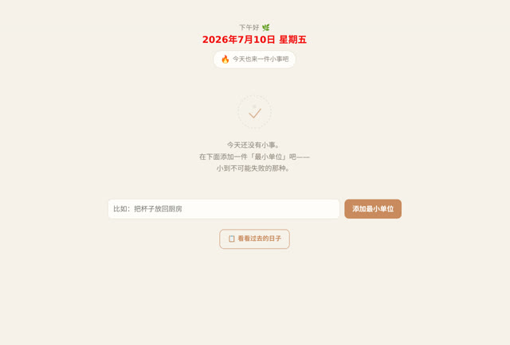

# 「每天只设 1-3 个『最小单位』任务」

> **AI 生成** · **2 轮对话** · 第一句是一整段想清楚的产品构想

▶ **[直接查看成品](https://view.tybbtech.com/p/pmreqfa9v6jma/)**

---

## 完整对话

**第 1 轮**（原话，一字未改）：

> 针对"微小掌控感"——《最小单位》
> 一个只关心你今天能不能完成一件小事的应用，专门对抗无力感。
> - **核心机制**：不让写大目标清单，每天只设 1-3 个"最小单位"任务，比如"洗一个杯子"、"写 50 个字"。完成了，就会有非常具体、细腻的"完成瞬间"体验——比如屏幕里长出一棵树，或沙子落下形成图案。任务越小，奖励的视觉反馈反而越精良。
> - **解决什么**：用大量微小、确凿的闭环，重塑"我能做成事"的底层信心。

**第 2 轮**（这一条是**在页面上点选了那个元素**之后自动生成的指令，不是手打的）：

> 把页面里的［写着"2026年7月10日 星期五"的 `<h1#date-title>` 元素］的文字颜色改成 `#f20d0d`。只改这一个元素，别动别的。

完。两轮，第二轮还只是改了个颜色。

---

## 这一篇和本仓库其他所有篇都不一样

别的作品是"一句话丢出去，然后一轮轮磨"。这一个是**先把想法想透了，再一次性说出来**。

结果就是：**一轮出成品，第二轮只需要调个颜色。**

第一句里包含了四样东西，缺一样都会多几轮：

| 说了什么 | 如果不说会怎样 |
|---|---|
| **名字和定位**（《最小单位》，对抗无力感） | AI 不知道整体调性，做出一个普通待办清单 |
| **核心机制**（每天只设 1-3 个，且必须极小） | 会做成无限添加的任务列表，那就完全是另一个东西 |
| **具体例子**（"洗一个杯子"、"写 50 个字"） | "最小单位"到底多小？例子一给就清楚了 |
| **反常识的那一条**（任务越小，反馈越精良） | 这是整个设计的灵魂，不说就没有 |

---

## 值得抄走的一条经验

> **如果一个想法你自己都还没想清楚，不要指望在对话里想清楚。**

对话适合"改"，不适合"想"。你脑子里越模糊，来回就越多，而且**每一轮都在花钱**。

**反过来**：如果你已经想明白了，就一次说完——像上面这样，分成"这是什么 / 核心机制 / 具体例子 / 解决什么"四段。这几乎总能一轮到位。

> 本仓库里最长的那一篇对话磨了 30 轮，最短的这一类只用 1-2 轮。**差别经常不在难度，在于开口之前想清楚了没有。**

---

## 另外说一句那个「点选元素」

第 2 轮那条指令的格式很特别——它精确指出了元素、写明了"只改这一个，别动别的"。

这是造物台上**点选页面元素**之后自动生成的。当你只想改一个具体的东西（这行字的颜色、那个按钮的大小），点它比描述它准确得多，**也不会连累到别处**。

---

## 想改成你自己的

| 你想要 | 就这么说 |
|---|---|
| 换奖励动画 | 完成时长出的东西换成花 / 星星 / 城市天际线 |
| 记录连续天数 | 显示已经连续完成多少天 |
| 存下来 | 任务和完成记录存本地，换天自动清空 |
| 团队版 | 用平台的共享榜单，同事之间互相看得见 |

---

## 这个作品免费拿走

**这个应用直接送你，拿走就是你的。**

打开下面的链接，页面右下角有「🎨 改造这个作品」，点一下就复制出一份完全属于你的副本。

👉 **[免费拿走这个作品](https://view.tybbtech.com/p/pmreqfa9v6jma/)**

---

**关于这一篇**：对话记录是真实的，从平台的聊天存档里原样取出；其中标注了哪一条是点选元素后自动生成的指令。这个作品是在造物台上说话做出来的，不是我们手写的。
