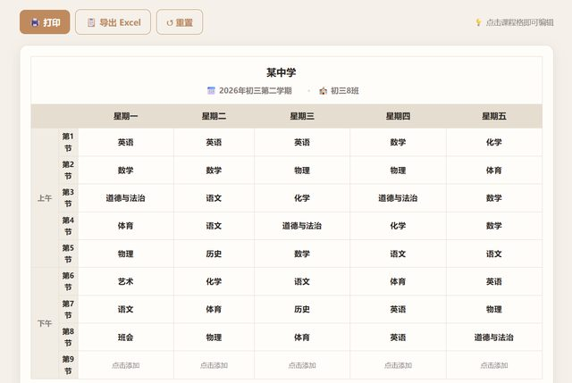

# 「帮我参考这个设置一个可以编辑的课程表」

> **AI 生成** · **3 轮对话** · 第一句**带了一个附件**

▶ **[直接查看成品](https://view.tybbtech.com/p/pmqx6gd2kx1pq/)**

---

## 完整对话

| # | 当时说的话 |
|---|---|
| 1 | 帮我参考这个设置一个可以编辑的课程表。输入课程后可以保存成这样的格式。要方便使用，输出格式要直接可以打印　*（附带了 1 个文件）* |
| 2 | 下方显示的表格应该加上标题，学年，教室的表头。打印的时候直接打印下面的表格即可。 |
| 3 | 不错。再修改一个点，就是导出现在只是复制文本，应该可以直接导出表格。 |

完。三轮。

---

## 最重要的一点：**你可以直接把图丢给它**

第一句里那个「**参考这个**」和「**保存成这样的格式**」，靠的是**附带的那个文件**——一张现成的课程表。

**描述一个表格长什么样，非常费劲；截个图丢过去，一秒钟的事。**

> **凡是"我想要的东西已经存在"的情况，都别费劲描述，直接给它看。**
> 手上那张表、看到的那个页面、随手拍的一张照片——传上去，比你写三百字管用。

---

## 这三轮的走向也很典型：越来越具体

- 第 1 轮：整体（参考这个、能编辑、能打印）
- 第 2 轮：**局部**（加标题、学年、教室三个表头）
- 第 3 轮：**一个点**（导出不该只是复制文本，要能导出表格）

从大到小，每轮只推进一层。**没有一轮是在返工**，全是在往前走。

---

## 「要方便使用」这种话，为什么这次没坏事

一般来说这类虚词很危险。但这次它后面跟着一句非常硬的约束：**"输出格式要直接可以打印"**。

打印这个词把一堆东西钉死了：纸张比例、黑白也能看清、不能有花哨背景、按钮不能被打进去。**一个具体的使用场景，抵得过十个形容词。**

---

## 想改成你自己的

| 你想要 | 就这么说 |
|---|---|
| 值日表 / 排班表 | 把课程换成人名和班次 |
| 会议室预定表 | 行是时间，列是会议室 |
| 训练计划 | 一周七天，每天几组动作 |
| 存下来 | 编辑的内容存到浏览器本地，下次打开还在 |

---

## 这个作品免费拿走

**这张课程表直接送你，拿走就是你的。**

打开下面的链接，页面右下角有「🎨 改造这个作品」，点一下就复制出一份完全属于你的副本。

👉 **[免费拿走这个作品](https://view.tybbtech.com/p/pmqx6gd2kx1pq/)**

---

**关于这一篇**：对话记录是真实的，从平台的聊天存档里原样取出。这个作品是在造物台上说话做出来的，不是我们手写的。
