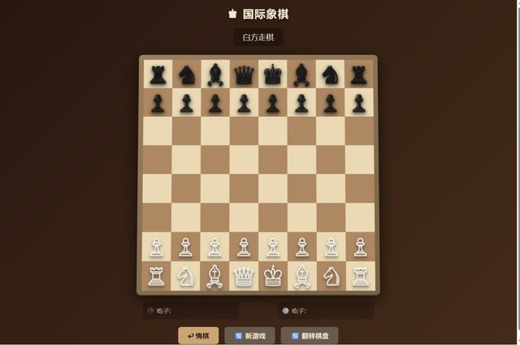

# 「帮我做一个国际象棋的游戏，能人机对战」

> **AI 生成** · **4 轮对话** · 一个逻辑 bug，一个视觉 bug，一次升级

▶ **[直接查看成品](https://view.tybbtech.com/p/pmqqnlj2prsiu/)**

---

## 完整对话

| # | 当时说的话 |
|---|---|
| 1 | 帮我做一个国际象棋的游戏，能人机对战 |
| 2 | 怎么走呢？我试了下棋子好像走不动 |
| 3 | 棋盘的格子不太对，有棋子的格子是正常大小，整行没有棋子的格子都是扁的，最好让格子都是一样的大小。 |
| 4 | 我想把棋子变成3d样式的 |

完。四轮。

---

## 这四轮里有一个特别值得学的地方：**第 3 轮**

对比一下同样一件事的两种说法：

| 大部分人会说 | 这里实际说的 |
|---|---|
| 「棋盘显示不正常」 | 「**有棋子的格子是正常大小，整行没有棋子的格子都是扁的**」 |

第二种说法**直接把 bug 的规律说出来了**：有内容的正常，没内容的塌陷。任何一个懂点前端的人看到这句，立刻知道是格子高度没有固定、被内容撑着。

> **描述画面问题时，别说"不对"，说"什么情况下对、什么情况下不对"。**
>
> 这个对比本身就是线索。AI 看不见你的屏幕，它唯一的信息来源就是你这句话——**你说出规律，它就能定位；你只说"坏了"，它只能猜。**

---

## 第 2 轮的说法也很好

「怎么走呢？**我试了下**棋子好像走不动」

注意"我试了下"这三个字。它同时传达了：我操作过了、我用的是拖/点、没有反应。**比"棋子不能动"多了一层"我是怎么试的"。**

AI 修 bug 最需要的就是复现路径。

---

## 一个真实的边界

第 1 轮就出了一个能下的完整棋盘（走法规则、将军、人机对战全在里面）——**逻辑这一头 AI 很能打**。

翻车的是第 3 轮那个格子塌陷：**这是纯视觉问题，程序自己发现不了**。它不报错，代码逻辑也没问题，只是长歪了。

> 这条边界在本仓库里反复出现：**能跑不报错但长歪了，只有你能当眼睛。** 所以做完一定要自己打开看一眼，别只看它说"已完成"。

---

## 想改成你自己的

| 你想要 | 就这么说 |
|---|---|
| 调难度 | 加三档 AI 难度，改搜索深度 |
| 悔棋 | 加悔棋按钮，能退回上一步 |
| 记谱 | 旁边显示棋谱，能复盘 |
| 换成中国象棋 | 规则和棋子全换，棋盘改成九宫 |

---

## 这个作品免费拿走

**这盘棋直接送你，拿走就是你的。**

打开下面的链接，页面右下角有「🎨 改造这个作品」，点一下就复制出一份完全属于你的副本。

👉 **[免费拿走这个作品](https://view.tybbtech.com/p/pmqqnlj2prsiu/)**

---

**关于这一篇**：对话记录是真实的，从平台的聊天存档里原样取出。这个作品是在造物台上说话做出来的，不是我们手写的。
