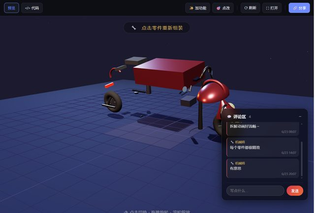

# 「能否做的像真的摩托车？现在的车身还是一个方块」

> **AI 生成** · **4 轮对话** · 全仓最难传达的那类要求：**审美**

▶ **[直接查看成品](https://view.tybbtech.com/p/pmqqdp7wu5uf2/)**

---

## 完整对话

| # | 当时说的话 |
|---|---|
| 1 | 我想在这个页面上增加一个评论区，任何人都可以在这个页面上评论，并且循环播放评论。 |
| 2 | 这个评论区的手机适配不太好，"发送"按钮右侧在手机上被页面截断了，稍微改一下，做好手机适配 |
| 3 | 优化这个的3D效果 |
| 4 | 能否做的像真的摩托车？现在的车身还是一个方块。整体应该像哈雷摩托的样子最好 |

完。四轮。

---

## 对比第 3 轮和第 4 轮，差别巨大

| | 说的话 | 结果 |
|---|---|---|
| 第 3 轮 | 「**优化这个的 3D 效果**」 | 太虚。"优化"是什么？光影？材质？细节？AI 只能自己挑一个方向 |
| 第 4 轮 | 「**现在的车身还是一个方块**。整体应该像**哈雷摩托**的样子」 | 一针见血 |

第 4 轮做对了两件事：

**① 指出了现状哪里不对**——"车身还是一个方块"。这不是评价，是**观察**。AI 看不见画面，你这一句等于替它看了一眼。

**② 给了一个参照物**——"像哈雷摩托"。一个具体的名字，比一百个形容词管用：油箱形状、排气管、坐姿、比例，全在这三个字里。

> **说审美要求，最有效的两句话是：**
> **「现在是 ___ 」**（客观描述现状，不带评价）
> **「我想要像 ___ 」**（给一个具体的、有名字的参照）

---

## 一个诚实的边界

即便如此，**审美类要求仍然是最容易反复的一类**。原因在本仓库里说过很多次：**AI 没有眼睛**。它改完不会自己看一眼，只能靠你告诉它像不像。

所以这类改动的正确心态是：**准备好来回两三轮，每轮只说一个具体的不像之处。**

一次说"整体不好看"，你会绕很久；一次说"车身是方块"，一轮就能推进。

---

## 顺带：第 1 轮那个评论区

「任何人都可以在这个页面上评论」——这在纯前端作品里能做到，靠的是平台注入的免登录存储。不用注册、不用后端。

本仓库[共同画布](../05-canvas/)、[手速榜](../07-reaction/)那几篇讲了这套东西怎么用。

---

## 想改成你自己的

| 你想要 | 就这么说 |
|---|---|
| 换车 | 改成越野摩托 / 复古机车 / 赛车 |
| 能骑 | 加上前进转向，做成第一人称 |
| 配色器 | 加几个滑块，实时改车漆颜色 |
| 展厅 | 加一个转台和聚光灯，做成产品展示页 |

---

## 这个作品免费拿走

**这辆摩托直接送你，拿走就是你的。**

打开下面的链接，页面右下角有「🎨 改造这个作品」，点一下就复制出一份完全属于你的副本。

👉 **[免费拿走这个作品](https://view.tybbtech.com/p/pmqqdp7wu5uf2/)**

---

**关于这一篇**：对话记录是真实的，从平台的聊天存档里原样取出。这个作品是在造物台上说话做出来的，不是我们手写的。
