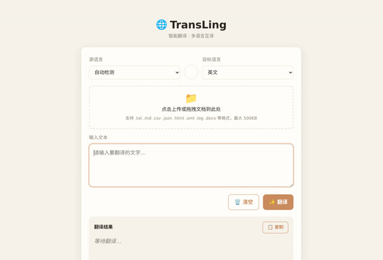

# 「帮我做一个翻译软件」

> **AI 生成** · **5 轮对话** · 最后一句不是需求，是**提问**

▶ **[直接查看成品](https://view.tybbtech.com/p/pmr1vs6fvitpi/)**

---

## 完整对话

| # | 当时说的话 |
|---|---|
| 1 | 帮我做一个翻译软件 |
| 2 | 帮我把这个翻译功能增加一个可以上传文档的功能，可以根据文档翻译，并可以下载保存翻译后的文档 |
| 3 | 需要支持word格式 |
| 4 | 翻译完成后输出的格式可以是word吗？现在默认是txt。 |
| 5 | **只回答我一个问题，不用修改内容**，这个翻译应用最多支持多少个文字？或者支持多大的文件？ |

完。五轮。

---

## 最值得学的是第 5 轮

> 「**只回答我一个问题，不用修改内容**」

这七个字前缀，解决了一个很常见的麻烦：**你只是想问点什么，它却动手改起代码来了。**

AI 编程助手默认把你说的每句话当成任务。你说"这个按钮是不是太小了"，它可能直接就去改了——而你只是想问问。

> **想问不想改，就在句子最前面写一句「只回答，不要改代码」。** 一句话，省下一次不必要的改动和一次积分。

---

## 第 3、4 轮暴露了一个真实的沟通问题

第 3 轮说「需要支持 word 格式」——**指的是"能上传 word"**。
第 4 轮又说「输出的格式可以是 word 吗？现在默认是 txt」——**这次说的是"能导出 word"**。

同一个词，两个意思。第一次说的时候，AI 理解成了"输入端支持 word"，做对了；但用户心里的"支持"其实包括输出。**于是多了一轮。**

> **涉及"格式"「支持」「兼容」这类词时，加一个方向词：**
> **「能上传 word」/「能导出 word」**——两个字，省一轮。

---

## 这条对话线的形状：一路加，没有退

1. 先要最小的（能翻译）
2. 加上传文档
3. 加 word 输入
4. 加 word 输出
5. 问清楚边界在哪

**每一轮都在往前，没有一轮是返工。** 这是花钱最省的一种走法。

---

## 想改成你自己的

| 你想要 | 就这么说 |
|---|---|
| 对照阅读 | 左右分栏，原文和译文段落对齐 |
| 术语表 | 让用户传一份术语对照表，翻译时优先用 |
| 只翻一段 | 选中页面上的文字才翻，做成划词翻译 |
| 保留排版 | 导出的 word 保留原文的标题和段落层级 |

---

## 这个作品免费拿走

**这个翻译工具直接送你，拿走就是你的。**

打开下面的链接，页面右下角有「🎨 改造这个作品」，点一下就复制出一份完全属于你的副本。

👉 **[免费拿走这个作品](https://view.tybbtech.com/p/pmr1vs6fvitpi/)**

---

**关于这一篇**：对话记录是真实的，从平台的聊天存档里原样取出。这个作品是在造物台上说话做出来的，不是我们手写的。
