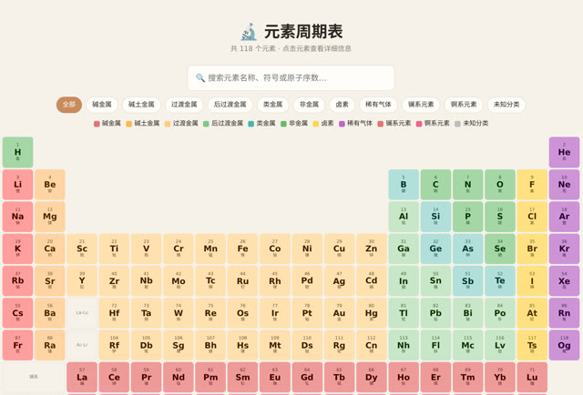

# 「帮我做一个元素周期表」

> **AI 生成** · **6 轮对话** · 有一轮是**传了张截图让它自己看**

▶ **[直接查看成品](https://view.tybbtech.com/p/pmr7iowd22ql9/)**

---

## 完整对话

| # | 当时说的话 |
|---|---|
| 1 | 帮我做一个元素周期表 |
| 2 | 适配手机 |
| 3 | 行间距有问题，前两行没错，第三行隔了很大，后面也有类似问题，应该所有行间距一样才对，排列紧凑 |
| 4 | 你看看对吗　*（附带了 1 个文件）* |
| 5 | 可以了，刚才为什么会出错？ |
| 6 | 适配手机 |

完。六轮。

---

## 第 3 轮是本仓库里描述 bug 的范本

> 「行间距有问题，**前两行没错，第三行隔了很大**，后面也有类似问题，应该所有行间距一样才对」

三句话，三层信息：

1. **哪里出问题**：行间距
2. **规律是什么**：前两行对，第三行开始错 ← **这是最值钱的一句**
3. **应该是什么样**：所有行间距一样，排列紧凑

**"前两行没错"这四个字是关键。** 它把问题从"整个表格乱了"缩小到"从第三行开始有什么不同"——而元素周期表恰恰是从第三行开始出现空缺格的。**这一句直接指向了病根。**

> **报 bug 时，"哪里是对的"和"哪里是错的"一样重要。** 对错的分界线就是线索。

---

## 第 4 轮：直接传张图过去

> 「你看看对吗」＋ 一个文件

改完之后，与其用文字描述"现在变成什么样了"，**不如直接截个图丢给它**。

这一招在两种时候特别管用：
- **改完验收**：让它自己看结果对不对
- **说不清哪里怪**：你也说不上来，那就让它看

---

## 第 5 轮：问一句「刚才为什么会出错？」

这一句既不是需求也不是 bug，但它很值：

**你会知道这类问题下次怎么避免。** 而且花的钱和改一次代码差不多。

> 磨完一个难缠的问题之后，顺手问一句"刚才为什么错的"，是本仓库里性价比最高的一个习惯。

---

## 一个可以预期的现实：第 6 轮又说了一次「适配手机」

第 2 轮说过一次，第 6 轮又说了一次。

不是 AI 偷懒，是**中间几轮改了布局，手机上的适配被改动带歪了**。

> **布局改动之后，手机端要重新看一遍。** 这在本仓库的多个作品里都出现过，属于正常流程，不是失败。

---

## 想改成你自己的

| 你想要 | 就这么说 |
|---|---|
| 点开看详情 | 点元素弹出它的密度、熔点、发现年份 |
| 按属性染色 | 加几个切换：按金属性、按状态、按电负性上色 |
| 做成考题 | 遮住元素符号，让人填 |
| 换成别的表 | 换成星座表 / 中药表 / 产品矩阵 |

---

## 这个作品免费拿走

**这张周期表直接送你，拿走就是你的。**

打开下面的链接，页面右下角有「🎨 改造这个作品」，点一下就复制出一份完全属于你的副本。

👉 **[免费拿走这个作品](https://view.tybbtech.com/p/pmr7iowd22ql9/)**

---

**关于这一篇**：对话记录是真实的，从平台的聊天存档里原样取出。这个作品是在造物台上说话做出来的，不是我们手写的。
