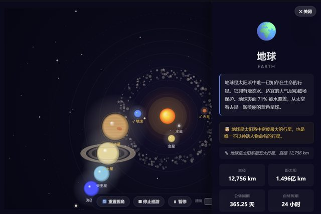

# 「帮我做一个太阳系，可以点击不同的行星看到它的介绍，3d的」

> **AI 生成** · **7 轮对话** · 其中一轮的回答只有一个字母：**B**

▶ **[直接查看成品](https://view.tybbtech.com/p/pmqxk7zxo2z4x/)**

---

## 完整对话

| # | 当时说的话 |
|---|---|
| 1 | 帮我做一个太阳系，并可以点击不同的行星看到它的介绍，3d的 |
| 2 | 【请对照需求要点检查代码】 |
| 3 | **帮我想想怎么做的更好** |
| 4 | 直接做吧 |
| 5 | 【请对照需求要点检查代码】 |
| 6 | 为什么没有冥王星？ |
| 7 | **B** |

完。七轮。

---

## 第 3 轮：把它当顾问用，不只当工人用

> 「帮我想想怎么做的更好」

这句话不给任何具体要求，**只是让它出主意**。然后第 4 轮一句"直接做吧"，把主意变成了成品。

**这是一个被严重低估的用法。** 大部分人只会命令，不会咨询——但你面对的东西是见过无数个太阳系页面的，让它先提方案再动手，往往比你自己憋一个要求更好。

> **句式：「帮我想想怎么做得更好」→ 看它列的清单 → 「就按第几条做」或「直接做吧」。**

---

## 第 7 轮那个「B」

前一轮问「为什么没有冥王星？」，AI 大概给了几个选项（比如：A 加回来当行星 / B 加进去但标注它是矮行星 / C 保持现状）。

用户回了一个字母：**B**。

> **AI 给选项的时候，回答编号就够了。** 不用重复它的话，不用解释理由。**一个字母，最省。**

---

## 第 2、5 轮那个方括号里的东西

「【请对照需求要点检查代码】」——这是**造物台上的一个按钮**，不是手打的。

它的作用是让 AI 把当前代码和积累下来的需求文档对一遍，看有没有漏做的、做歪的。

> **在磨了几轮之后按一下，经常能捞回一两个你自己都忘了提过的要求。**

---

## 「为什么没有冥王星？」这一问很典型

做知识类内容时，**你一定会发现它漏了点什么，或者用了某个你不同意的口径**。冥王星在 2006 年被降级成矮行星，AI 按现行分类没放进去——这不算错，但可能不是你想要的。

> **知识类作品做完，一定要按自己熟悉的那部分抽查一下。** 你懂行的那一块，就是你验收的抓手。

---

## 想改成你自己的

| 你想要 | 就这么说 |
|---|---|
| 真实比例 | 轨道和大小按真实比例，加一个"夸张/真实"切换 |
| 加卫星 | 木星和土星带上主要卫星 |
| 时间轴 | 拖动时间，看行星走到哪个位置 |
| 教学版 | 加一个小测验，随机问行星顺序 |

---

## 这个作品免费拿走

**这个太阳系直接送你，拿走就是你的。**

打开下面的链接，页面右下角有「🎨 改造这个作品」，点一下就复制出一份完全属于你的副本。

👉 **[免费拿走这个作品](https://view.tybbtech.com/p/pmqxk7zxo2z4x/)**

---

**关于这一篇**：对话记录是真实的，从平台的聊天存档里原样取出；其中标注了哪几条是平台按钮生成的指令。这个作品是在造物台上说话做出来的，不是我们手写的。
