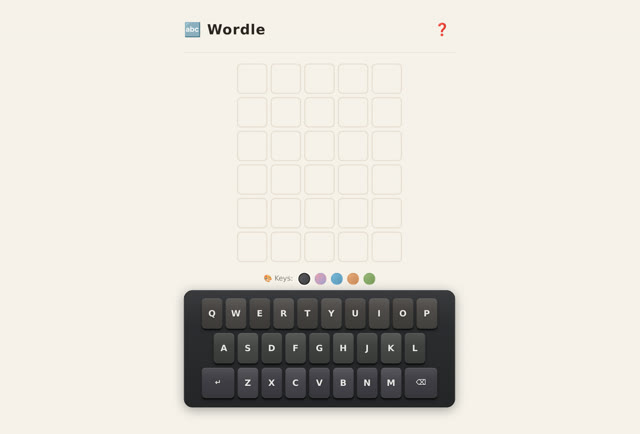

# 「帮我做一个 worldle 的游戏」（打错字了）

> **AI 生成** · **8 轮对话** · 前 4 轮在纠正，后 4 轮全在磨键盘

▶ **[直接查看成品](https://view.tybbtech.com/p/pmr534cae7z08/)**

---

## 完整对话

| # | 当时说的话 |
|---|---|
| 1 | 帮我做一个 **worldle** 的游戏 |
| 2 | 继续 |
| 3 | 改成英文的 **wordle**，也就是猜五个字母的英文单词 |
| 4 | 里面还有汉语拼音吧 |
| 5 | 增加一个 play again |
| 6 | 下面的键盘做成字母不同颜色的，且底色可更换，并且键盘大一些 |
| 7 | 键盘的字母可以变成立体感 |
| 8 | 键盘改成机械感的键盘 |

完。八轮。

---

## 第 1 轮打错了一个字母，代价是两轮

`worldle` 和 `wordle` 差一个 `l`。而 **Worldle 是真实存在的另一个游戏**（猜国家轮廓的），所以 AI 并没有理由觉得你打错了。

第 3 轮才纠正过来：「改成英文的 wordle，也就是猜五个字母的英文单词」——**注意后半句**。

> **纠正的时候，别只改名字，顺手把它是什么解释一句。**
> 「wordle，也就是猜五个字母的英文单词」——这样即使名字还是有歧义，后半句也把它钉死了。

第 4 轮「里面还有汉语拼音吧」是残留清理：前面按中文版做的东西没删干净。**方向性的大改之后，一定要再看一遍有没有旧东西留着。**

---

## 后 4 轮全在磨同一个东西：键盘

看这个递进：

| # | 说的话 | 性质 |
|---|---|---|
| 6 | 字母不同颜色、底色可更换、**键盘大一些** | 功能 + 尺寸 |
| 7 | 字母可以变成**立体感** | 观感 |
| 8 | 改成**机械感**的键盘 | 风格 |

**从具体到抽象，一轮比一轮虚——但顺序是对的。**

先把实的定了（大小、颜色），再谈虚的（立体感、机械感）。如果第一句就说"做一个机械感的键盘"，那"大小"和"配色"它得自己猜，很可能猜的方向和你想的不一样，然后你还得回头改。

> **视觉类改动的顺序：先定尺寸和布局，再定质感和风格。** 反过来会返工。

---

## 「继续」这个词

第 2 轮只有两个字：「继续」。

当 AI 因为篇幅停在半路（写到一半、列了个计划还没做），**打两个字让它接着往下就行**，不用重复需求。本仓库里好几篇长对话都出现过这个词。

---

## 想改成你自己的

| 你想要 | 就这么说 |
|---|---|
| 中文版 | 改成猜四字成语，格子变成四个 |
| 每日一题 | 按日期固定今天的答案，所有人猜同一个 |
| 自定义词库 | 让用户传一份词表，从里面出题 |
| 分享战绩 | 猜完生成那种黄绿方块图，能复制发群里 |

---

## 这个作品免费拿走

**这个游戏直接送你，拿走就是你的。**

打开下面的链接，页面右下角有「🎨 改造这个作品」，点一下就复制出一份完全属于你的副本。

👉 **[免费拿走这个作品](https://view.tybbtech.com/p/pmr534cae7z08/)**

---

**关于这一篇**：对话记录是真实的，从平台的聊天存档里原样取出。这个作品是在造物台上说话做出来的，不是我们手写的。
