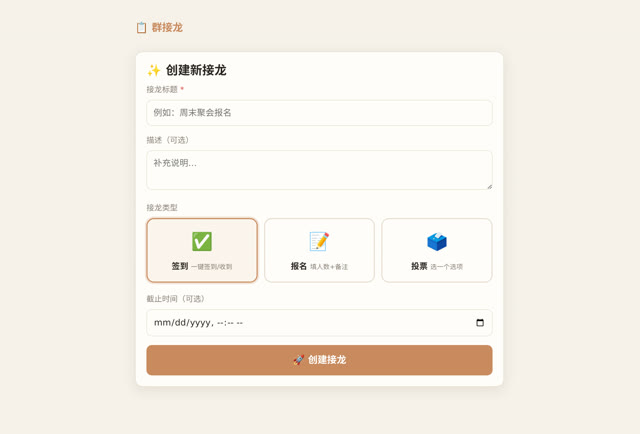

# 群接龙：一个解决真实麻烦的东西

> **AI 生成** · **8 轮对话** · 第一轮**只传了一个文件，一个字没打**

▶ **[直接查看成品](https://view.tybbtech.com/p/pmrin6c8kdqbu/)**

---

## 它解决的问题

微信群里接龙，每个人都要复制上一条再加一行，**几十条消息把群刷屏**，而且经常有人复制错把前面的人删掉。

这个作品的做法：发起人建一个页面，把链接发群里，群友点开提交就完事，**一条群消息都不产生**。只有发起人能看到汇总。

---

## 完整对话

| # | 当时说的话 |
|---|---|
| 1 | *（只传了一个文件，没有打字）* |
| 2 | 页面提示错误，说出了点问题 |
| 3 | 点击创建接龙后没有反应 |
| 4 | 没有正常弹出啊。如果调用 AIHEY 是不是应该有登录？ |
| 5 | 还是不对，现在有两个问题：1、签到、报名、投票，这三个选择目前看只能选择签到，其他两个点击后没有变化。2、创建接龙仍然点了没有用。**我建议你仔细查一下原因** |
| 6 | 可以了，还有一个新问题，就是签到完成后，管理端的签到列表昵称没有显示，时间显示的是 NAN |
| 7 | 现在创建后生成的是链接，复制给别人是可用的，是否可以把链接带上接龙标题？分享出去之后别人能一目了然，当然不要影响打开链接 |
| 8 | 链接复制后在微信中看到的仍然是一串乱码 |

完。八轮。

---

## 第 1 轮：一个字没打，只传了个文件

需求写在文档里，直接传上去。

**当你的想法比较复杂时，这比在对话框里打字好得多**——你可以在文档里慢慢想、反复改，想清楚了再一次性交过去。

---

## 第 5 轮那句「我建议你仔细查一下原因」

前面两轮（第 3、4 轮）都在说同一件事：**创建按钮点了没反应**。修了两次没修好。

第 5 轮做了两件对的事：

**① 把两个问题一起列出来编号**——"1、三个选择只能选签到 2、创建仍然没用"。两个症状放在一起，**它们的共同点本身就是线索**（都是点击没反应 → 事件根本没绑上）。

**② 明确要求它先查再改**——「我建议你仔细查一下原因」。

> **同一个 bug 修了两次还没好，就别再让它"改"了，让它"查"。**
> 说「先别急着改，把原因找出来告诉我」，比第三次说"还是不对"有效得多。

（后来查出来的原因是：绑定按钮事件的代码跑在页面元素被放进页面之前，所以根本没绑上。这类问题不查是猜不到的。）

---

## 第 6 轮：昵称空白 + 时间显示 NaN

这是**联网作品特有的一类 bug**：数据存进去了，读出来的形状和你以为的不一样（字段被包在了一层里），于是取不到值。

时间显示成 `NaN` 是最典型的表现——**看到 NaN，基本就是"拿到的东西不是你以为的那个东西"**。

---

## 第 7、8 轮：一个特别真实的收尾

第 7 轮想让分享链接带上标题，"分享出去别人能一目了然"。
第 8 轮：「链接复制后在微信中看到的仍然是**一串乱码**」。

中文放进网址会被转义成 `%E6%8E%A5%E9%BE%99` 这种东西——技术上没错，但**发到群里没人看得懂**。

最后的解法是：只把 `/ # ? &` 这几个真正会破坏链接的字符替换掉，**中文原样保留**。

> 这一轮体现了一个重要的判断：**"技术上正确"和"用户看着舒服"不是一回事**，而后者才是你要的。这种问题只有真的把链接发到群里才会发现。

---

## 想改成你自己的

| 你想要 | 就这么说 |
|---|---|
| 报名收款 | 加上金额和收款码 |
| 限额 | 报名满了自动关闭 |
| 导出 | 管理页加一个导出表格 |
| 提醒 | 快截止时在页面上显示倒计时 |

---

## 这个作品免费拿走

**这个接龙工具直接送你，拿走就是你的。**

打开下面的链接，页面右下角有「🎨 改造这个作品」，点一下就复制出一份完全属于你的副本。

👉 **[免费拿走这个作品](https://view.tybbtech.com/p/pmrin6c8kdqbu/)**

---

**关于这一篇**：对话记录是真实的，从平台的聊天存档里原样取出。这个作品是在造物台上说话做出来的，不是我们手写的。
