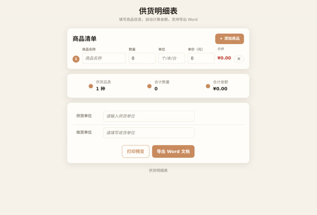

# 从一张具体的单子，变成一个通用的工具

> **AI 生成** · **8 轮对话** · 全仓最"能直接拿去干活"的一个

▶ **[直接查看成品](https://view.tybbtech.com/p/pmrefqpu761bq/)**

---

## 完整对话

> ⚠️ 第 1 轮原话里包含真实的商品名、单位名和交易数字，**这里已做脱敏处理**，用占位内容代替。其余各轮为原文。

| # | 当时说的话 |
|---|---|
| 1 | 帮我做一个供货明细表，供货内容是书籍，书籍名称是《某某某》，数量是 800 本，单价是 50 元，供货单位是某某公司，收货单位先空着 |
| 2 | 收货单位设计成可编辑的。另外去掉那些 emoji，能够直接打印的版本 |
| 3 | 给我能够输出成 word 的版本 |
| 4 | 把这个供货明细做成一个通用版，包括商品信息、数量、单价、供货单位、收货单位都做成可编辑的。 |
| 5 | 不一定是书籍了，所以单位不能是"本"。另外可以增加商品种类 |
| 6 | 能否把所有默认的内容都删掉？ |
| 7 | 再做一下手机适配 |
| 8 | 再增加一个打印预览功能 |

完。八轮。

---

## 这条对话最值得学的地方：**先做一张真的，再做成通用的**

看它的走向：

- 第 1 轮：**一张具体的单子**（真实的商品、真实的数量、真实的单位名）
- 第 4 轮：**做成通用版**（所有字段可编辑）
- 第 5 轮：**去掉行业假设**（单位不能写死是"本"）
- 第 6 轮：**清空默认内容**

**如果第一句就说"做一个通用的供货明细表"，会难得多。** "通用"是个抽象概念，AI 得猜你要哪些字段、什么排版、给谁用。

而先做一张真的具体的单子，你立刻能看出：字段够不够、排版顺不顺、打出来好不好看。**看到实物之后再说"把这些都变成可填的"，就是一件很容易的事了。**

> **要做一个模板，先做一个实例。**
> 这条经验适用于所有表单、报表、合同、清单类的东西。

---

## 第 2 轮那句「去掉那些 emoji」

AI 默认喜欢在界面上加表情符号，看着活泼。**但这是一张要打印出来盖章的单子**——emoji 在这里是灾难。

> **凡是要打印、要正式、要给客户看的东西，第一句就说清「不要 emoji，不要花哨背景，黑白打印要清楚」。** 省一轮。

---

## 一个真实的赚钱角度

这个作品是本仓库里**最直接能拿去干活**的一个：

- 你手上有一门小生意，需要开供货单 / 结算单 / 报价单
- 现有的软件要么收费、要么字段对不上、要么打出来不好看
- **你花二十分钟做一个正好合你需要的，还能改成任何格式**

而且这类东西做完之后，**别人也用得上**。同行、上下游、同一个行业的人，需求几乎一样。

---

## 想改成你自己的

| 你想要 | 就这么说 |
|---|---|
| 报价单 | 字段换成规格、报价、有效期 |
| 收据 | 加上收款人、日期、盖章位置 |
| 出入库单 | 加上库位、经手人、入/出标记 |
| 存历史 | 开过的单子存在本地，能翻出来重开 |
| 自动算 | 数量 × 单价自动出小计和合计，带大写金额 |

---

## 这个作品免费拿走

**这张单子直接送你，拿走就是你的**，改成你行业里那张单子。

打开下面的链接，页面右下角有「🎨 改造这个作品」，点一下就复制出一份完全属于你的副本。

👉 **[免费拿走这个作品](https://view.tybbtech.com/p/pmrefqpu761bq/)**

---

**关于这一篇**：对话记录取自平台的聊天存档，**第 1 轮中的商品名、数量、单价和单位名已做脱敏替换**，其余为原文。这个作品是在造物台上说话做出来的，不是我们手写的。
