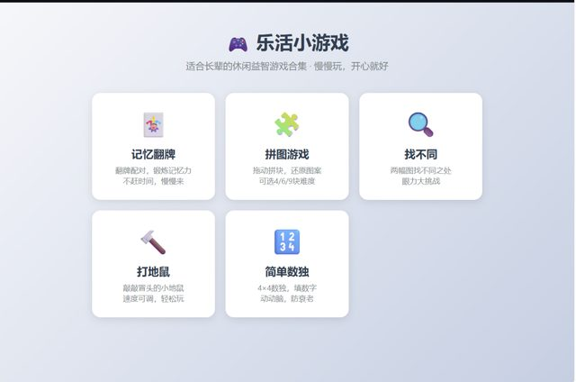

# 「你觉得什么游戏适合老人玩儿」

> **AI 生成** · **13 轮对话** · 第一句不是需求，**是一个问题**

▶ **[直接查看成品](https://view.tybbtech.com/p/pmqsuh6tg7zmo/)**

---

## 完整对话

| # | 当时说的话 |
|---|---|
| 1 | **你觉得什么游戏适合老人玩儿** |
| 2 | 再推荐一个，**先别做，先给个建议我看看再说** |
| 3 | 把这几个游戏都做一起，可以让用户选择玩儿 |
| 4 | 游戏都出来了，但是每个游戏点击进去后都没有游戏画面 |
| 5 | 继续 |
| 6 | 继续 |
| 7 | 继续 |
| 8 | 有一个小问题，就是记忆翻牌，现在翻出来的看不到图。 |
| 9 | 是翻转后看不到图像，翻转前没问题 |
| 10 | 这里面的拼图游戏是什么规则？ |
| 11 | 那页面是不是应该有一个标准图？ |
| 12 | 拼图中的示例图如果是 3×3 和 4×4，示例图会超过框 |
| 13 | 不对，点击查看原图后弹出来的"完整图案"包不住 3×3 和 4×4 的示例图，右侧超出框架了。2×2 没问题 |

完。十三轮。

---

## 前三轮：不知道要做什么，也能开始

**这是本仓库里唯一一个"没想好就开口"的例子，而且它走得很顺。**

| # | 干了什么 |
|---|---|
| 1 | 「你觉得什么游戏适合老人玩儿」——**问，不是要** |
| 2 | 「再推荐一个，**先别做**，先给个建议我看看再说」——**明确叫停，只要建议** |
| 3 | 「把这几个游戏都做一起」——看完建议，做决定 |

第 2 轮那句「**先别做，先给个建议**」是关键。不说这句，AI 会直接开始写代码——**而你还没决定要哪个**。

> **想不清楚要做什么的时候，就先聊。**
> 「你觉得 ___ 适合做点什么？」→「再多给几个方向，**先别动手**」→「就按第几个做」
>
> 这三步花的钱很少，但能避免做完一个你其实不想要的东西。

---

## 第 9 轮：一次很漂亮的补充定位

第 8 轮说：「记忆翻牌，翻出来的看不到图」。
第 9 轮补了一句：「**是翻转后看不到图像，翻转前没问题**」。

这一句把范围缩小了一半——**翻转前是好的，说明图片本身没问题、加载也没问题，出问题的是翻转这个动作之后的状态。**

（这类问题通常是卡片翻转时背面朝向了观察者，图被"翻到后面去了"。）

> **报视觉 bug 的万能句式：「什么时候是对的，什么时候是错的」。**
> 本仓库里[国际象棋](../25-chess/)那篇也是靠这个句式一次定位的。

---

## 第 10、11 轮：问着问着，问出一个需求

> 10.「这里面的拼图游戏是什么规则？」
> 11.「那页面是不是应该有一个标准图？」

第 10 轮只是想搞清楚规则。**搞清楚之后，立刻发现了一个缺失**：拼图得让人知道要拼成什么样，所以页面上应该有一张原图作参照。

**这个需求不是一开始就有的，是"问明白之后长出来的"。**

> 做到一半觉得哪里怪，别急着改，先问一句「这个是怎么运作的」。**你需要的往往不是修，而是先看懂。**

---

## 第 13 轮：连着两轮说同一个问题，第二次说得更狠

第 12 轮：「拼图中的示例图如果是 3×3 和 4×4，示例图会超过框」
第 13 轮：「不对，**点击查看原图后弹出来的"完整图案"**包不住 3×3 和 4×4 的示例图，**右侧超出框架了。2×2 没问题**」

第二次多了三样东西：**在哪个界面**（点击查看原图弹出来的那个）、**哪个方向溢出**（右侧）、**什么情况下正常**（2×2 没问题）。

> **第一次说不清很正常。第二次就把"在哪、哪个方向、什么时候正常"补上。** 这比重复说"还是不对"有用一百倍。

---

## 想改成你自己的

| 你想要 | 就这么说 |
|---|---|
| 加大字号 | 所有文字和按钮再放大一号，给老人用 |
| 加语音 | 每一步操作配语音提示 |
| 换游戏 | 换成连连看 / 找不同 / 数独 |
| 记录 | 记住每个游戏玩了几次、最好成绩 |

---

## 这个作品免费拿走

**这套小游戏直接送你，拿走就是你的。**

打开下面的链接，页面右下角有「🎨 改造这个作品」，点一下就复制出一份完全属于你的副本。

👉 **[免费拿走这个作品](https://view.tybbtech.com/p/pmqsuh6tg7zmo/)**

---

**关于这一篇**：对话记录是真实的，从平台的聊天存档里原样取出。这个作品是在造物台上说话做出来的，不是我们手写的。
