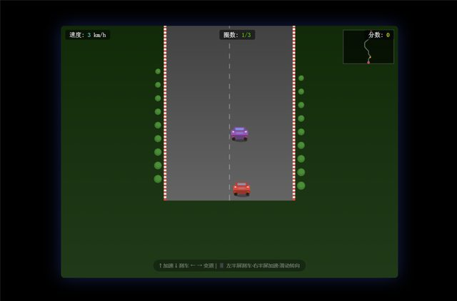

# 「仿照极品飞车2，做一个第一关」

> **AI 生成** · **13 轮对话** · 第 5 轮那句描述是全仓最准的一句 bug 报告

▶ **[直接查看成品](https://view.tybbtech.com/p/pmqtcf7rht4a8/)**

---

## 完整对话

| # | 当时说的话 |
|---|---|
| 1 | 仿照极品飞车2，做一个第一关 |
| 2 | 看不到赛道啊。 |
| 3 | 不要全是直线赛道，要有弯道，再增加两辆电脑对手车 |
| 4 | 看不到对手车。也没感觉到弯道 |
| 5 | 1、我的车一直在路中央。**左右晃动的时候路在跟着车一起晃**。2、还是看不到别的车，页面只有我的车 |
| 6 | 你自己再检查一遍代码看看有没有需要优化和修改的地方 |
| 7 | 增加一个比赛开始按钮，增加一个终点线，所有车辆都改成平面的。道路也改成平面的吧 |
| 8 | 继续 |
| 9 | 还需要再优化几个地方：1.其他赛车最好和玩家赛车是一样的，只用颜色区分 2.赛车应该碰撞时会有反应，比如车要歪一下 3.车速太快了，整体速度放慢一点 |
| 10 | 还有在手机上如何加速？ |
| 11 | 好多了，还有几个地方：1.用户好像永远都是冠军？实际不是 2.应该是三圈，但是三圈结束屏幕显示 2/3 |
| 12 | 检查一下有没有 bug |
| 13 | 再重新帮我想一下这个赛车的项目能否再优化？ |

完。十三轮。

---

## 第 5 轮：「**左右晃动的时候路在跟着车一起晃**」

**这是本仓库里描述最精准的一句 bug 报告。**

它没有说"手感不对"，也没有说"视角有问题"。它说的是一个**可观察的现象**：车往左动，路也跟着往左动。

这一句直接暴露了病根：**车和路被绑在同一个坐标系里一起移动了**，所以两者的相对位置永远不变，看起来就是车在路中央、路跟着车走。

> **描述"动起来不对"的问题，说清楚「什么跟着什么动」。**
> 「A 动的时候 B 也跟着动」/「A 动了 B 没动」——这两句话的信息量，抵得过十句"感觉不对"。

前面第 2、4 轮说的是「看不到赛道」「看不到对手车」——**这类"看不到"的说法只能让 AI 去猜**，所以连着两轮没修好。到第 5 轮换成描述现象，立刻就有进展了。

---

## 第 7 轮的取舍：主动把 3D 降成平面

> 「所有车辆都改成平面的。道路也改成平面的吧」

前面几轮一直在为 3D 的透视、遮挡、视角纠缠。第 7 轮直接**把技术方案降级**——不要 3D 了，改成平面。

**这是一个很成熟的决定。** 3D 带来的麻烦（看不到车、看不到弯道、视角乱）远大于它带来的好处，而"平面赛车"照样好玩，还稳定得多。

> **当一个方向连续两三轮都在出问题，考虑换一个更简单的方案，而不是继续修。**
> 你要的是能玩的游戏，不是特定的实现方式。

---

## 第 11 轮：两个只有真玩过才会发现的问题

> 1.「用户好像永远都是冠军？实际不是」
> 2.「应该是三圈，但是三圈结束屏幕显示 2/3」

这两个都是**逻辑正确但结果不对**的典型：

- 名次算法可能写反了，或者压根没算对手的进度
- 圈数从 0 还是从 1 开始数，差一个，界面就少一圈

**这类问题程序不会报错，AI 也检查不出来——只有真的跑完三圈的人才会发现。**

> 本仓库反复出现的一条：**做完一定要自己玩一遍到底**。不是打开看一眼，是真的从头玩到通关。

---

## 第 6、12、13 轮：三次"你自己看看"

- 第 6 轮：「你自己再检查一遍代码看看有没有需要优化和修改的地方」
- 第 12 轮：「检查一下有没有 bug」
- 第 13 轮：「再重新帮我想一下这个赛车的项目能否再优化？」

**磨到一定程度，把方向盘交回去。** 你已经不知道还缺什么了，但它读得到全部代码。这三句都属于低成本高回报的用法。

---

## 想改成你自己的

| 你想要 | 就这么说 |
|---|---|
| 多关卡 | 做三条不同的赛道，难度递增 |
| 计时赛 | 去掉对手，改成刷最快圈速，存最好成绩 |
| 排行榜 | 用平台的共享榜单，所有人的最快圈速排一起 |
| 换主题 | 赛车换成外卖电动车，赛道换成小区 |

---

## 这个作品免费拿走

**这个赛车游戏直接送你，拿走就是你的。**

打开下面的链接，页面右下角有「🎨 改造这个作品」，点一下就复制出一份完全属于你的副本。

👉 **[免费拿走这个作品](https://view.tybbtech.com/p/pmqtcf7rht4a8/)**

---

**关于这一篇**：对话记录是真实的，从平台的聊天存档里原样取出。这个作品是在造物台上说话做出来的，不是我们手写的。
