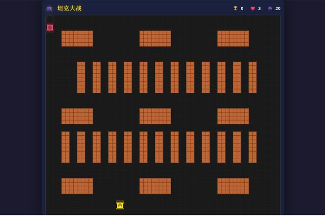

# 「我觉得这个游戏耐玩儿性还不够，应该怎么提升呢？」

> **AI 生成** · **13 轮对话** · 有一轮是**问它意见**，不是给它命令

▶ **[直接查看成品](https://view.tybbtech.com/p/pmqsu2s4d5huh/)**

---

## 完整对话

| # | 当时说的话 |
|---|---|
| 1 | 帮我做一个经典的坦克大战的游戏，**先只做第一关** |
| 2 | 这个游戏也需要做一下手机适配 |
| 3 | 重新设计一下这个游戏，要三关 |
| 4 | 【请对照需求要点检查代码】 |
| 5 | 检查一下 bug |
| 6 | 第三关玩家的坦克动不了 |
| 7 | 页面好像不全，下方看不到 |
| 8 | 再看下手机适配 |
| 9 | 游戏再设计的完整一些，有不同的工具，坦克也有不同的能力。 |
| 10 | 护盾好像没有生效 |
| 11 | **我觉得这个游戏目前整体的耐玩儿性还不够，应该怎么提升呢？** |
| 12 | 继续 |
| 13 | 这个游戏在手机上的方向能否改成摇杆式的？ |

完。十三轮。

---

## 第 1 轮那三个字：「**先只做**」

> 「帮我做一个经典的坦克大战的游戏，**先只做第一关**」

这三个字值很多钱。

不加这句，AI 会试图一次做出完整的多关卡游戏——**东西一大，出错的地方就多，你也不知道该先看哪儿**。加上"先只做第一关"，你很快拿到一个能玩的东西，验证方向对不对。

方向对了，第 3 轮再说"要三关"，这时是在一个已经能跑的基础上扩展，稳得多。

> **需求越大，越要在第一句里给它划一个小范围。**
> 「先只做 ___ 」「先做最简单的版本」「先不考虑 ___ 」——这类限定不是保守，是提速。

---

## 第 11 轮：把它当策划用

> 「我觉得这个游戏目前整体的**耐玩儿性还不够**，应该怎么提升呢？」

这一句不含任何具体要求，也不是 bug。**它在问意见。**

而且问得很准：说出了自己的感受（不够耐玩），但**没有自己拍脑袋想方案**。

大部分人卡在这一步时，会自己憋一个想法（"加个道具吧"），然后让 AI 实现。但你面对的东西读过无数游戏设计，**让它先列几条，你再挑，通常比自己憋一个强**。

> **本仓库出现过三种"问"，都很划算：**
> - 「帮我想想怎么做得更好」（[太阳系](../29-solar/)）
> - 「你觉得什么 ___ 适合 ___ 」（[乐活小游戏](../33-elder-games/)）
> - 「___ 还不够，应该怎么提升？」（本篇）
>
> 共同点：**说清现状和目标，把方案留给它。**

---

## 第 2、8 轮，还有第 13 轮：手机适配说了三次

- 第 2 轮：做一下手机适配
- 第 8 轮：再看下手机适配
- 第 13 轮：手机上的方向能否改成**摇杆式**的？

前两次是修（改完布局又歪了），第三次是**升级**——从虚拟按键改成摇杆。

> **手机适配不是一次性的事。** 每次大改布局之后都要再看一眼。这在本仓库多篇里都出现了，属于正常流程。

而第 13 轮那个"摇杆"很关键：**方向键在手机上很难按准**，尤其是斜向移动。摇杆是这类游戏在触屏上的标准解法。

---

## 第 6、10 轮：两个"看起来做了但没生效"

- 「第三关玩家的坦克动不了」
- 「护盾好像没有生效」

**这两类 bug 的共同点：功能写了，代码也在，就是不起作用。**

程序不报错，AI 检查代码也看不出问题（因为代码逻辑是对的，可能是某个条件永远不成立、或者被别的东西覆盖了）。

> **只有真的玩到第三关、真的吃到护盾的人，才能发现它们。**
> 所以第 5 轮那句"检查一下 bug"抓不到这些——**机器检查代替不了人真的玩一遍。**

---

## 想改成你自己的

| 你想要 | 就这么说 |
|---|---|
| 双人同屏 | 加第二个玩家，一个用方向键一个用 WASD |
| 关卡编辑器 | 让玩家自己摆砖块和敌人出生点 |
| 无尽模式 | 敌人一波波来，比谁撑得久 |
| 上榜 | 用平台的共享榜单，把通关成绩排出来 |

---

## 这个作品免费拿走

**这个游戏直接送你，拿走就是你的。**

打开下面的链接，页面右下角有「🎨 改造这个作品」，点一下就复制出一份完全属于你的副本。

👉 **[免费拿走这个作品](https://view.tybbtech.com/p/pmqsu2s4d5huh/)**

---

**关于这一篇**：对话记录是真实的，从平台的聊天存档里原样取出；其中标注了哪一条是平台按钮生成的指令。这个作品是在造物台上说话做出来的，不是我们手写的。
