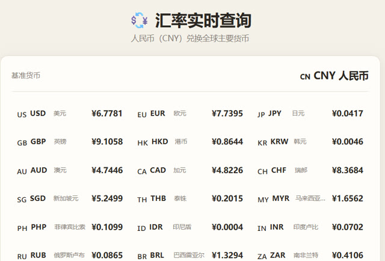

# 开口要的是股票，最后交付的是汇率查询



> **AI 生成** · **17 轮对话** · 一份**需求在做的过程中被发现**的完整样本

▶ **[直接查看成品](https://view.tybbtech.com/p/pmqxc6d40bp3t/)**

---

## 完整对话

| # | 当时说的话 |
|---|---|
| 1 | 帮我做一个可以自动获取**股票**实时价格的程序 |
| 2 | 页面提示网络请求失败 |
| 3 | 先不要美股了，只保留 A 股，同时 A 股数据现在价格扩大了 100 倍。**是接口问题还是程序错了** |
| 4 | 能否给股票加上 K 线图？ |
| 5 | 下面的刷新自选股功能好像不管用。 |
| 6 | 我想去掉股票代码前面的英文字母，直接输入 6 位代码即可 |
| 7 | 增加一个模拟买入的程序，初始资金 10 万。 |
| 8 | 把这个页面改成两个入口，一个是**汇率**实时查询入口……另外一个入口就是股票这个 |
| 9 | 最下面的几家写反了吧，左边应该是美元右边是人民币，现在显示的是：100 CNY = 681.116 USD |
| 10 | *（点选了页面上那个元素）* 把［写着"100 CNY"的元素］的文字改成"100 USD"。只改这一个元素，别动别的。 |
| 11 | 再整体做一下手机适配 |
| 12 | 汇率页的手机适配不好，主要是所有货币展示的部分，右侧数据溢出页面了 |
| 13 | 好了。现在汇率是 60 秒刷新吧？ |
| 14 | 股票现在是实时刷新吗 |
| 15 | 帮我加一个 30 秒股票刷新吧，同时模拟持仓也按 30 秒对应的价格实时刷新 |
| 16 | 【请对照需求要点检查代码】 |
| 17 | **把股票的这个部分去掉吧，只保留汇率查询** |

完。十七轮。

---

## 这条线最值得看的是它的走向

```
要股票 → 接口不顺 → 加K线 → 加模拟买入 → 顺手加了个汇率入口
     → 汇率越做越顺 → 最后把股票整个砍掉
```

**开口要的东西，最后被删掉了。** 而那个第 8 轮才"顺手加上"的汇率，成了整个作品。

这不是失败，这是**需求在做的过程中被发现**。股票行情有一堆麻烦——接口不稳、数据口径要对、盘中盘后不一样；而汇率查询干净、稳定、随时能用。**做过一遍才知道。**

> **不要因为"我一开始不是这么想的"就舍不得砍。**
> 第 17 轮那句「把股票的这个部分去掉吧」，是这条对话里最果断也最正确的一句。

---

## 第 3 轮：一句问句省下好几轮

> 「A 股数据现在价格扩大了 100 倍。**是接口问题还是程序错了**」

**没有直接说"你算错了，改过来"。** 而是把现象说清楚（价格大了 100 倍），然后问：是数据源本来就这样，还是我们的代码错了？

这个区分很重要：
- 如果是接口本来返回"分"为单位 → 那就是要除以 100，一行的事
- 如果是代码写错了 → 得找哪里多乘了

**问清楚再改，比让它盲目改一遍强。** 而且"扩大了 100 倍"这个具体倍数本身就是线索——100 倍几乎一定是单位问题（元和分）。

---

## 第 9、10 轮：先描述，再点选

第 9 轮用文字描述了问题：「左边应该是美元右边是人民币，现在显示的是：100 CNY = 681.116 USD」——**把错误的那一行原样贴出来**，这比"显示反了"清楚得多。

第 10 轮直接**点选了页面上那个元素**，生成了一条精确指令：「把［写着"100 CNY"的元素］改成"100 USD"，只改这一个元素，别动别的」。

> **改一个具体的、看得见的东西时，点它比描述它准。**
> 尤其是"别动别的"这个约束——它能防止 AI 在修一处的时候把旁边搞坏。

---

## 第 13、14 轮：两句只问不改

> 13.「好了。现在汇率是 60 秒刷新吧？」
> 14.「股票现在是实时刷新吗」

**磨了十几轮之后，你已经记不清哪些设定生效了。** 直接问一句，比自己翻代码快，也比猜着改安全。

问清楚之后，第 15 轮才下具体指令（加 30 秒刷新）。**先问后改，是这条对话通篇的节奏。**

---

## 想改成你自己的

| 你想要 | 就这么说 |
|---|---|
| 换算器 | 输入金额直接换算，支持双向 |
| 历史走势 | 画出最近三十天的汇率曲线 |
| 出国用 | 只留几个常去国家，做成大字版 |
| 提醒 | 汇率到某个点时页面变色提示 |

---

## 这个作品免费拿走

**这个汇率查询直接送你，拿走就是你的。**

打开下面的链接，页面右下角有「🎨 改造这个作品」，点一下就复制出一份完全属于你的副本。

👉 **[免费拿走这个作品](https://view.tybbtech.com/p/pmqxc6d40bp3t/)**

---

<sub>**关于这一篇**：对话记录是真实的，从平台的聊天存档里原样取出；其中标注了哪几条是点选元素或平台按钮生成的指令。这个作品是在造物台上说话做出来的，不是我们手写的。</sub>
