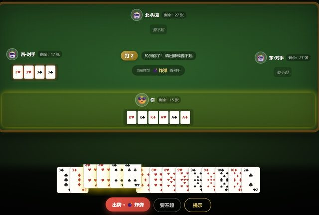

# 「你重新想一下扑克应该有的样子」

> **AI 生成** · **20 轮对话** · **最后 6 轮全卡在扑克牌长什么样**

▶ **[直接查看成品](https://view.tybbtech.com/p/pmqxqvd5h4o3r/)**

---

## 完整对话

| # | 当时说的话 |
|---|---|
| 1 | 帮我设计一个掼蛋的游戏，一个真实玩家和三个电脑，符合真实的掼蛋规则以及一些掼蛋技巧。 |
| 2 | 1、按最常见的。2、游戏感强一点 |
| 3 | 都 ok |
| 4 | 现在的规则，如果从 2 开始打 2 是大牌还是小牌？ |
| 5 | 那规则有问题，正常规则打几，对应的数就是主牌。比如打 2，2 就是主牌比其他牌都大除了大小王，同时红桃 2 可以带牌 |
| 6 | 继续 |
| 7 | 还有个小问题，玩家的花色都是黑色，方片和红桃应该是红色 |
| 8 | 【请对照需求要点检查代码】 |
| 9 | 按需求补全 |
| 10 | 如果有一家出完了牌，剩下的三家应该怎样？ |
| 11 | 游戏还是有个 bug，完成一局后，再进入下一局的时候页面会卡死。 |
| 12 | 刚才又出现 bug，完成一局后，再下一局虽然页面没有死，但是我出牌的时候出牌的按钮一直都是等待中。 |
| 13 | 可以了，再增加一个小功能，就是游戏要有个开始键，点击开始再正式开始 |
| 14 | *（点选了那张牌）* 大小王的牌太难看了，改成真实扑克的大小王的样子。只改这一个元素，别动别的。 |
| 15 | 刚发现所有的扑克牌的样子都不太对，不符合真正扑克的样式设计，再改一下 |
| 16 | 不对，大小王可以。其他扑克牌面中间都应该是对应数字的花色啊，JQK 应该是有小人的那种 |
| 17 | 还是不对啊。数字牌中间应该对应的是花色的数量。比如红桃 10，中间应该是 10 个红桃，JQK 是王后国王的图案啊 |
| 18 | 不对，你重新想一下扑克应该有的样子 |
| 19 | JQK 还是没改 |
| 20 | 不对 JQK 现在中间就是一个花色展示，你再好好想想 |

完。二十轮。

---

## 我们没有美化这段对话

**最后 6 轮全部在改扑克牌的样子，而且到第 20 轮还没完全改对。**

「还是不对啊」「不对，你重新想一下」「你再好好想想」——这三句里的挫败感是真的。这是本仓库里**最不好看、也最诚实**的一段记录。

我们放上来，是因为你迟早会遇到同样的情况，**知道这很正常比看一百个成功案例有用**。

---

## 为什么偏偏卡在这里

对比一下这局对话的前后两半：

| | 内容 | 效果 |
|---|---|---|
| 前 13 轮 | 掼蛋规则、主牌逻辑、出完牌怎么算、卡死、按钮卡在等待中 | **全都解决了**，而且掼蛋规则相当复杂 |
| 后 6 轮 | 扑克牌面该长什么样 | **反复不对** |

**复杂的规则它能搞定，一张牌该长什么样它搞不定。**

原因在本仓库反复出现：**它没有眼睛**。规则对不对，代码里读得出来；牌面像不像，只有看见了才知道。它改完不会自己看一眼，只能靠你一轮轮描述。

---

## 那几轮描述其实一次比一次好

看第 16、17 轮，用户已经在拼命把"像"翻译成"是什么"：

> 16.「其他扑克牌面中间都应该是**对应数字的花色**，JQK 应该是**有小人的那种**」
> 17.「比如**红桃 10，中间应该是 10 个红桃**，JQK 是**王后国王的图案**」

第 17 轮举了具体的例子（红桃 10 = 10 个红桃），**这已经是很好的描述方式了**。

但第 18 轮又退回了「你重新想一下扑克应该有的样子」——这句就没有信息量了。**越急越容易说这种话，而这种话恰恰最没用。**

> **如果一个视觉问题连着三轮没改对，别再说"不对"了，换一种方式：**
> - **给它看**：找一张真扑克的图传上去
> - **拆成一个**：「先只改红桃 10 这一张，中间放 10 个红桃图案，排成两列」
> - **换个思路**：问它"你现在是怎么画牌面的？"先搞清它的实现方式

一次改十三种牌，你没法判断哪里对哪里错；先改对一张，剩下的就是复制。

---

## 前半段也有很值得学的

**第 4 轮先问规则再纠错：**

> 4.「现在的规则，如果从 2 开始打 2 是大牌还是小牌？」
> 5.「那规则有问题。正常规则**打几，对应的数就是主牌**。比如打 2，2 就是主牌比其他牌都大除了大小王，同时红桃 2 可以带牌」

**先用一个具体场景去测它**（打 2 的时候 2 算大还是小），发现错了，**再把正确规则完整讲一遍并举例**。

这比直接说"掼蛋规则你写错了"有效得多——AI 不知道错在哪一条。

> **你比它懂的那部分，就是你验收的抓手。** 用一个你确定答案的具体问题去问它，是最快的检查方法。

---

## 想改成你自己的

| 你想要 | 就这么说 |
|---|---|
| 换玩法 | 改成斗地主 / 跑得快，规则整套换 |
| 联机 | 用平台的共享存储，四个人在各自手机上打 |
| 教学模式 | 出牌时提示"这手牌还可以这样打" |
| 复盘 | 一局结束后能回看每一轮出了什么 |

---

## 这个作品免费拿走

**这个牌局直接送你，拿走就是你的。**

打开下面的链接，页面右下角有「🎨 改造这个作品」，点一下就复制出一份完全属于你的副本。

👉 **[免费拿走这个作品](https://view.tybbtech.com/p/pmqxqvd5h4o3r/)**

---

**关于这一篇**：对话记录是真实的，从平台的聊天存档里原样取出，**包括没有解决的那几轮**；其中标注了哪几条是点选元素或平台按钮生成的指令。这个作品是在造物台上说话做出来的，不是我们手写的。
