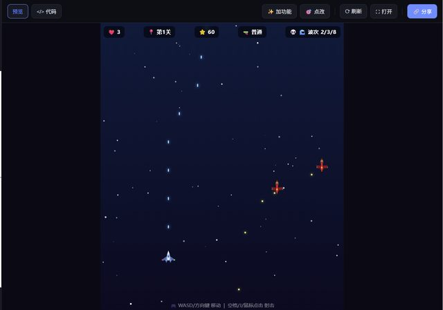

# 一个 bug 查了八轮，最后是人自己找到的

> **AI 生成** · **30 轮对话** · 本仓库最长的一段，也是最能说明问题的一段

▶ **[直接查看成品](https://view.tybbtech.com/p/pmqudtqoui06c/)**

---

## 完整对话（前 30 轮）

| # | 当时说的话 |
|---|---|
| 1 | 帮我做一个飞机**设计**类的游戏 |
| 2 | **写错了，是飞机射击类的游戏** |
| 3 | 改成用键盘操作吧 |
| 4 | 可以，再设计成关卡的，设计三关，每一关最后有 BOSS。同时可以获得增强的武器 |
| 5 | 继续吧 |
| 6 | 护盾出现后发不了弹了，而且护盾一直在不会消失 |
| 7 | 还有关底什么时候出现？ |
| 8 | 再做一下手机适配，能在手机上玩儿 |
| 9 | 移动没问题了，但是打击按钮不管用 |
| 10 | 还有一个，页面下面太长了，飞机有时候会飞到屏幕下方看不到了 |
| 11 | 检查一下这个程序，看看有没有可以优化的地方 |
| 12 | 现在点击开始战斗没有反应 |
| 13 | 我想再优化一下，BOSS 来之前应该有一个警告提示。每一关结束后，应该有一个恭喜通关，然后可以点击进入下一关 |
| **14** | 现在点击下一关仍然还是第一关，没有真正进入下一关 |
| **15** | 还是不对，点击下一关的时候仍然还是第一关 |
| **16** | 这个游戏完成第一关后点击进入下一关，仍然还是第一关。怎么回事 |
| **17** | 还是不行……会不会和点击下一关的浏览器缓存有关系？ |
| **18** | 左上角没有变，也没有加载中 |
| **19** | 没有加载中，点击进入下一关感觉就像是重新开始了 |
| **20** | 没看到日志 |
| **21** | 怎么打开控制台 |
| **22** | *（贴了一段控制台日志）* |
| **23** | **我告诉你找哪里吧，你现在点击进入下一局应该和再来一局的按钮重叠了，所以点击进入下一局实际上点击了再来一局** |
| 24 | 现在又有了新的问题，点击进入第三关没有反应 |
| 25 | 现在再来一局有点不动了。 |
| 26 | 现在最后通关后的重新开局点击没有反应 |
| 27 | 通关后再来一次还是没有反应。控制台也没有报错 |
| 28 | 现在又开始回到点击下一关仍然是第一关了 |
| 29 | **你是不是忘了之前这个问题已经出现过，就是再来一局和进入下一关重叠了。** |
| 30 | 可以了 |

---

## 第 14 到 23 轮：**同一个 bug，十轮**

「点击下一关还是第一关」这一个问题，从第 14 轮说到第 23 轮。

中间发生了什么：
- 三轮重复描述同一个现象（14、15、16）
- 用户开始猜原因（17：会不会是浏览器缓存？）
- 被要求去看控制台（20、21：**"怎么打开控制台"**）
- 贴日志（22）
- **最后是用户自己发现的**（23）

> 第 23 轮：「**我告诉你找哪里吧**，你现在点击进入下一局应该和再来一局的按钮重叠了，所以点击进入下一局实际上点击了再来一局」

两个按钮在页面上**重叠**了。你以为点的是"下一关"，实际点到了盖在上面的"再来一局"——所以它当然回到第一关。

**代码逻辑完全正确。日志也完全正常**（第 22 轮那段日志里，关卡结算的流程一步不差）。问题只存在于像素层面：一个东西盖住了另一个东西。

---

## 这一段说明了一件很重要的事

**AI 查不出"被挡住"这类问题，因为它看不见页面。**

它能读代码、能看日志、能推理逻辑。但"两个按钮在屏幕上重叠了"这件事，**不在代码里，也不在日志里**——它只存在于渲染出来的画面上。

所以第 14 到 22 轮，本质上是**在错误的地方找了九轮**。

> **如果一个问题满足这三条，先怀疑"有东西盖住了"：**
> 1. 点击没反应，或者点击触发了别的东西
> 2. 控制台没有任何报错
> 3. 代码逻辑看起来完全正确
>
> **这时候最快的办法不是继续让它查代码，而是你自己看一眼**——或者直接说"是不是有元素重叠了"。

---

## 第 29 轮：**它把已经修过的 bug 又改回去了**

> 「**你是不是忘了之前这个问题已经出现过**，就是再来一局和进入下一关重叠了。」

第 23 轮修好的问题，到第 28 轮又出现了。中间几轮（24～27）在修别的按钮问题，**改着改着把之前的修复覆盖掉了**。

这是长对话里非常常见的一件事：**改 A 的时候碰坏了 B**。

> **对策：**
> - **改完一处，把之前修过的关键路径再走一遍**（尤其是同一个区域的）
> - **发现旧 bug 复发，直接告诉它"这个问题之前修过，原因是 ___ "**——第 29 轮就是这么说的，一轮就好了
> - 一次只改一件事。第 24～27 轮连着改了四个按钮问题，回头很难分清是哪一次碰坏的

---

## 第 1、2 轮：一个字打错，一轮纠正

> 1.「帮我做一个飞机**设计**类的游戏」
> 2.「**写错了，是飞机射击类的游戏**」

"设计"和"射击"。发现打错了，**下一句直接说"写错了，是 ___ "就行**，不用重新描述一整遍。

---

## 想改成你自己的

| 你想要 | 就这么说 |
|---|---|
| 加武器 | 做一个武器升级树，打 BOSS 掉零件 |
| 双人 | 加第二架飞机，本地双打 |
| 无尽模式 | 敌人一波波来，比谁分高 |
| 排行榜 | 用平台的共享榜单，把分数排出来 |

---

## 这个作品免费拿走

**这个游戏直接送你，拿走就是你的。**

打开下面的链接，页面右下角有「🎨 改造这个作品」，点一下就复制出一份完全属于你的副本。

👉 **[免费拿走这个作品](https://view.tybbtech.com/p/pmqudtqoui06c/)**

---

**关于这一篇**：对话记录是真实的，从平台的聊天存档里原样取出，**包括那十轮没找对方向的过程**。这个作品是在造物台上说话做出来的，不是我们手写的。
