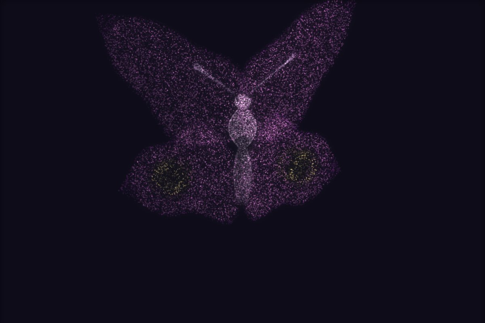

# 让 AI 做出一只会扇翅膀的粒子蝴蝶

三万个点扇起来的翅膀。**整只蝴蝶没有一张图片**——两片前翅、两片后翅、身子和触角，全是参数曲面算出来的。

▶ **[直接查看成品](https://view.tybbtech.com/p/pmstxc0c0qq3e/)**

---

## 开始之前

- **要花多久**：一两个小时
- **要装什么**：什么都不用。[打开造物台](https://coder.tybbtech.com)，注册送 50 积分
- **关键一句**：**眼斑**。没有它，那就是两片彩色的叶子；有了它，一眼就是蝴蝶

---

## 第 1 步 · 翅膀是一张曲面

> **这么说：**
> 翅膀用参数曲面：沿着翅脉方向走 `s`（0 翅根 → 1 翅尖），横着展开 `w`（−1 后缘 → +1 前缘）。
> 半宽 = `A · sin(π·s^0.72) · (1 + lobe·sin(3πs))`
>
> 那个 `sin(3πs)` 就是外缘的三道波浪——**翅膀不是一颗光溜的水滴形**，边上有起伏才像蝴蝶。
> 再让翅膀中间鼓一点、翅尖略微往下垂，它就不是一张平纸了。

一共八片：前翅和后翅，各有左右，各有上下两个表面（翅膀是有厚度的两张皮）。加上身子和两根触角，一共十一块。

---

## 第 2 步 · 🔴 眼斑是"像不像"的分水岭

> **这么说：**
> 后翅上各画一个眼斑：一个亮环，环内压暗。位置在 `s≈0.58` 的地方。

**这不是装饰。** 翅脉和镶边都可以省，眼斑不能——它是人眼识别"这是蝴蝶"的那个特征。少了它，观众看到的是两片彩色的叶子。

> **顺带说翅脉**：沿 `w` 方向数过去的一组暗线，稍微跟着 `s` 弯一点，像从翅根散出去。
> ⚠️ **别用 `pow(|sin|, 0.28)` 去压**——那条曲线几乎全程贴着 1，画面上根本看不出线。
> 要的是"细而黑"，所以**只在 `|sin|` 很小的一小段里压暗**。

---

## 第 3 步 · 扇翅：别每帧重算点云

> **这么说：**
> 每个点出生时记住自己属于哪一片翅膀（右翅 / 左翅 / 身子）。
> 画的时候，整片翅膀绕身体那根轴转一个角度就行——右翅 +角度，左翅 −角度，**法线跟着一起转**。
> 身子跟着上下浮动一点，不然像被钉在空中。

**每个点只多两次乘法。** 三万个点每帧重新生成一遍点云是撑不住的——这一条对所有"有局部动作"的粒子作品都成立。

---

## 第 4 步 · 🔴 薄片的法线定向要单独处理

这是本篇和[玫瑰](../08-rose/)、[祝福机](../39-blessing/)共用那件通用件时唯一要改的地方。

> **这么说：**
> 撒点仍然按面积配（把曲面切成网格逐块量面积，再照面积抽格子），法线仍然用数值微分叉乘。
> 但**翅膀这种薄片，必须强制指定法线 y 分量的正负**（上表面朝上、下表面朝下）。
> 身子和触角这种绕轴的形体才用「跟从中心指向该点同侧」那条规则。

**为什么**：薄片上"从中心指向该点"这个方向几乎垂直于法线，**判不出来**——用那条规则的话，同一片翅膀上的法线会一半朝上一半朝下，光一打就是花的。

---

## 第 5 步 · 一个省很多时间的小设计

> **这么说：**
> 撒点时把每个点是从曲面上哪个 `(u,v)` 来的一起存下来。
> 换配色、改翅脉道数时，**只重算颜色，点一个都不动**。

**重撒一次要 100 毫秒，拖滑块就是一路卡；重算颜色 4 毫秒。** 凡是"参数只影响颜色不影响形状"的滑块，都该走这条路。

---

## 第 6 步 · 加法混合没有遮挡，得自己补

> **这么说：**
> 画点用像素加法（三万个点改 `fillStyle` 会把帧数吃光）。但加法混合**没有前后遮挡**，翅膀的正面和背面一样亮，看着像一团雾。
> 补一条最省的判定：**法线背对眼睛的点压暗**——那些点本来就该被挡住。

这一条在本仓库的[玫瑰](../08-rose/)、[塔](../41-tower/)、[樱花树](../43-sakura/)里都出现了，是这套画法的固定配套。

---

## 想改成你自己的

| 你想要 | 就这么说 |
|---|---|
| 换品种 | 改翅形参数和配色：帝王斑蝶、蓝闪蝶、白纹蝶 |
| 一群 | 复制十几只，各自错开位置、大小和扇翅相位 |
| 会飞 | 让它沿一条曲线在画面里游走，扇翅快慢跟着速度变 |
| 标本框 | 扇翅幅度调到 0，摊平不动，加一个木框和标签 |

---

## 关键的那些数

| 参数 | 值 | 为什么 |
|---|---|---|
| 点数 | 30000 | 十一块曲面分下来，每块都够密 |
| 翅膀半宽 | `A·sin(π·s^0.72)` | 指数 0.72 让最宽处偏向翅根一侧 |
| 外缘波浪 | `1+0.16·sin(3πs)` | 三道波，多了就碎 |
| 扇翅幅度 | 0.62 弧度 | 0 是标本，大了翅膀会穿过身子 |
| 翅脉压暗 | 只在 `\|sin\|<0.22` 那段 | 全程压的话根本看不出线 |
| 眼斑位置 | s≈0.58 的后翅上 | 一眼认出是蝴蝶的关键 |

---

## 这个作品免费拿走

**这只蝴蝶直接送你，拿走就是你的。**

打开下面的链接，页面右下角有「🎨 改造这个作品」，点一下就复制出一份完全属于你的副本。

👉 **[免费拿走这个作品](https://view.tybbtech.com/p/pmstxc0c0qq3e/)**

---

**这篇是怎么写出来的**：方法来自一个真的在线上跑着的成品，源码逐行读过，上面那些式子、数值和坑都是它实际在用的。
