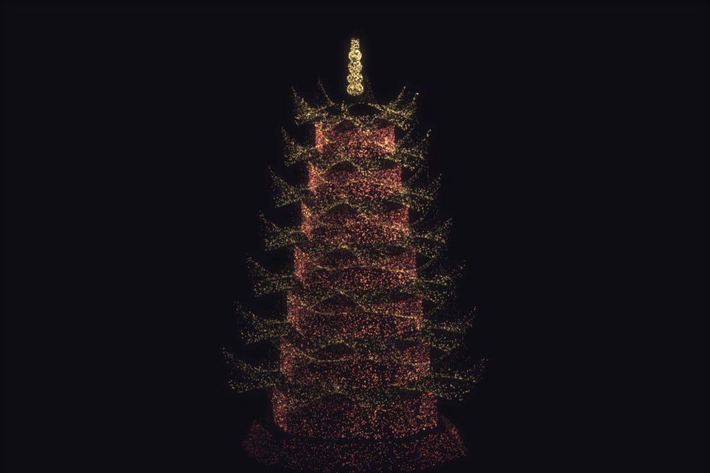

# 让 AI 算出一座八角塔



七层八角塔，飞檐翘角、瓦垄、拱门、塔刹全在。**没有模型文件，也没有一张贴图**——整座塔是同一组式子按层数重复出来的，拖动层数滑块就从三层长到十一层。

▶ **[直接查看成品](https://view.tybbtech.com/p/pmstxc0c7d6po/)**

---

## 开始之前

- **要花多久**：一个多小时
- **要装什么**：什么都不用。[打开造物台](https://coder.tybbtech.com)，注册送 50 积分
- **全篇的核心是一行式子**：怎么让八边形的**边是直的**

---

## 第 1 步 · 🔴 八边形：一行式子决定边直不直

> **这么说：**
> 八边形的半径这样算：
> ```
> r(θ) = a / cos(φ)      φ = 这个方向偏离最近那面法线的角度
> ```
> `a` 是面心到中轴的距离（内切圆半径）。到了转角处 φ = ±π/8，`1/cos` 正好把半径拉长成外接圆半径。

**这一行就是"边是直的"。**

- 写成常数半径 → 是个圆筒
- 写成 `sin` 起伏 → 是朵花
- 写成 `a/cos(φ)` → 才是正八边形

塔身、飞檐、塔基全都调用这一个函数，所以整座塔的横截面天然一致。

---

## 第 2 步 · 飞檐翘角：两件事同时发生

中式屋顶的那个"翘"，拆开看是两个动作叠在一起。

> **这么说：**
> 屋檐用一张曲面，`v` 从 0（檐口）走到 1（屋脊）：
> - **半径**从檐口的 `a×1.62` 收到柱顶的 `a×0.82`
> - **同时**，越靠近转角抬得越高：`lift = curl · (φ/φ角)² · (1−v)²`
>
> 那个平方就是翘角——**面心几乎不抬，转角抬得最狠**。

只做第一件事是个平屋顶，只做第二件事是个歪盘子。两件一起做，才是飞檐。

---

## 第 3 步 · 拱门：不是画上去的，是判出来的

> **这么说：**
> 门不用单独建模。上色时判断这个点落在这一面的哪儿：**面心附近、下半段的一块**，上沿按半圆收，落在里面的就染成亮色。

> ### ⚠️ 门洞里必须点灯
> 直觉是把门洞染暗（门是黑的嘛）。**但在黑底上、用加法混合画，暗门洞和暗墙面几乎分不开**——门就消失了。
> 反过来把门洞染成一块**亮区**，一眼就看得出每一面上开着门。

这条经验适用于所有"深色背景 + 加法混合"的作品：**要表现细节，靠亮不靠暗。**

---

## 第 4 步 · 自动取景（层数一改就顶出画面）

> **这么说：**
> 别把缩放写死。建完点云之后量一遍它的实际范围（最高、最低、最远），再按画布尺寸反算缩放和中心。

**三层和十一层的塔高度差两倍多。** 写死缩放的话，你一拖层数滑块，塔要么顶穿画面要么缩成一小撮。量一遍再反算，换几层都合适。

这条对所有"结构数量可调"的作品都成立。

---

## 第 5 步 · 通用件：按面积撒点

> **这么说：**
> 撒点按面积配，不是按参数平均分：把曲面切成网格，逐块量面积（两条边叉乘的长度），攒累积表，照面积抽格。法线用数值微分叉乘，塔是绕中轴的形体，法线一律朝外。

**飞檐那圈面积远大于柱身**，平均撒的话屋檐会稀成一片雾。这一段和本仓库的[玫瑰](../08-rose/)、[蝴蝶](../40-butterfly/)、[祝福机](../39-blessing/)是同一件通用件。

> **顺带**：把每个点是从哪个 `(u,v)` 来的存下来，换配色时只重算颜色，不重新撒点。

---

## 第 6 步 · 让它有"瓦"的感觉

> **这么说：**
> 屋面颜色沿着面的方向做一道一道的起伏（瓦垄），转角那条垂脊最亮。
> 塔身转角那根柱子也亮一点。
> 加法混合没有遮挡，背对眼睛的那半座塔要压暗——**否则前后墙叠在一起像张网**。

---

## 想改成你自己的

| 你想要 | 就这么说 |
|---|---|
| 换成六角 / 四方塔 | 改边数，那一行 `a/cos(φ)` 自动跟着变 |
| 夜景 | 每层门洞里加一盏会呼吸的灯 |
| 大雁塔风格 | 收分调大、飞檐外挑调小、翘角调低 |
| 加地基和台阶 | 塔基下面再叠两级平台 |

---

## 关键的那些数

| 参数 | 值 | 为什么 |
|---|---|---|
| 边数 | 8 | 八角塔转起来不会"转到背面" |
| 层数 | 7 | 三层太矮，十一层顶部太细 |
| 檐口外挑 | 1.62 倍 | 小于 1.3 就不像中式屋顶了 |
| 收分 | 0.52 | 顶层比底层细一半 |
| 翘角 | 0.30 | 大了像帽子，小了看不出翘 |
| 撒点网格 | 56×56 | 量面积用 |
| 点数 | 34000 | 层数多时每层还够密 |

---

## 这个作品免费拿走

**这座塔直接送你，拿走就是你的。**

打开下面的链接，页面右下角有「🎨 改造这个作品」，点一下就复制出一份完全属于你的副本。

👉 **[免费拿走这个作品](https://view.tybbtech.com/p/pmstxc0c7d6po/)**

---

<sub>**这篇是怎么写出来的**：方法来自一个真的在线上跑着的成品，源码逐行读过，上面那些式子、数值和坑都是它实际在用的。</sub>
