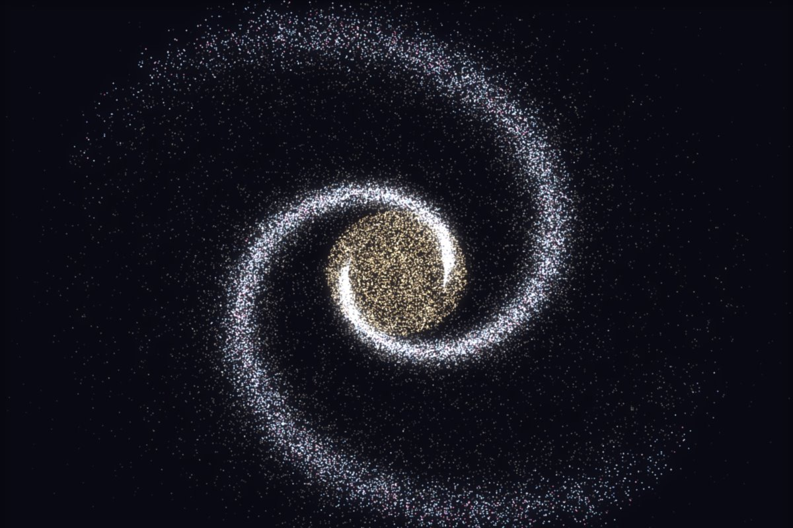

# 让 AI 算出一个会自己解开的旋涡星系



三万四千颗星，各转各的。里圈转得快、外圈转得慢——**看着看着，旋臂就被差速抹平了**。

这个作品真正想给你看的不是好看，是一个天文学上的真问题：**旋臂如果是一批固定的星，几十转之内就该被缠没了。可真实星系并没有。** 所以旋臂不是星，是一道波。

▶ **[直接查看成品](https://view.tybbtech.com/p/pmstxc0cegkri/)**

---

## 开始之前

- **要花多久**：一小时
- **要装什么**：什么都不用。[打开造物台](https://coder.tybbtech.com)，注册送 50 积分
- **它的特别之处**：本仓库里少有的**能让人明白一件事**的作品，不只是好看

---

## 第 1 步 · 旋臂只是一条对数螺线

> **这么说：**
> 旋臂用对数螺线：
> ```
> θ = ln(r / r₀) / tan(倾角) + 第几条臂 × 2π / 臂数
> ```
> 真实星系的旋臂就是这个形状——**倾角越小缠得越紧**。
> 星不是画在线上，是**围着这条线撒开**，越往外撒得越散。散开用正态分布（Box–Muller），边界才不生硬。

---

## 第 2 步 · 每颗星的转速：这才是重点

> **这么说：**
> 每颗星的角速度 `ω ∝ 1/r`——里圈快、外圈慢。这叫平坦转速曲线，**真实星系测出来就是这样**。
> 再加一个「相对图案的差速」参数，做成滑块。

**把这个滑块拉大，就能亲眼看见"缠绕问题"**：老恒星（黄白色）被差速一圈圈越缠越紧，旋臂在几十秒内被抹平。

而真实星系并没有被抹平——所以旋臂**不可能是一批固定的星**。它是一道密度波，星穿过它、被它压缩、亮一阵，然后走掉。

---

## 第 3 步 · 分五种星，旋臂才标得住

> **这么说：**
> 星分五类，各占不同比例、各有各的转速：
> - **核球**（16%）：中心那团，随机角度，转得略快
> - **老盘星**：七成贴着旋臂，**三成是臂间的背景星**——真实星系的臂间并不是空的
> - **年轻蓝星**（盘的 30%）：只生在旋臂上，而且 **ω 固定为 1**（跟着图案跑）
> - **电离氢区**（盘的 5%）：更少、更亮、更红，抱着蓝星那一带
> - **晕**（6%）：稀稀拉拉一层球状分布的老星

**年轻蓝星和电离氢区寿命短、跟着波跑，所以它们始终把旋臂标着。** 这就是为什么老星被缠平了，旋臂还在——画面上能直接看到这个对比。

---

## 第 4 步 · 🔴 性能：把三角函数从循环里赶出去

三万四千颗星，每颗每帧都要算 `cos(起始角 + ω·t)`。直接算就是三万四千次三角函数，**实测 14 毫秒一帧**。

> **这么说：**
> 用和角公式把它拆开：
> ```
> cos(a+b) = cos a · cos b − sin a · sin b
> ```
> - `cos a`、`sin a` 只跟这颗星的**起始角**有关 → 建星时算一次存下来
> - `cos b`、`sin b` 只跟 **ω** 有关 → 把 ω 分成 96 档，**每帧只算 96 对**
>
> 循环里于是一次三角函数都不用了。

**14 毫秒 → 1 毫秒出头。** 这个手法对任何"一堆东西各自绕圈"的作品都适用。

---

## 第 5 步 · 恒星不用打光

> **这么说：**
> 星是自己发光的，亮度就是它自己的亮度，**不要算法线、不要算光照**。

本仓库其他粒子作品（[玫瑰](../08-rose/)、[蝴蝶](../40-butterfly/)、[塔](../41-tower/)）都要靠法线对光才有层次，这一个是例外——省掉整套法线计算，也正因如此它能跑三万四千颗。

**画法还是像素加法**：点叠点的地方自己就亮起来，核球那团白光是加出来的。

---

## 想改成你自己的

| 你想要 | 就这么说 |
|---|---|
| 棒旋星系 | 中间加一根棒，旋臂从棒的两端甩出来 |
| 星系碰撞 | 放两个星系，让它们互相绕着靠近 |
| 教学版 | 加一段文字解释缠绕问题，配一个"只看老星"的开关 |
| 银河系 | 四条旋臂、倾角调小，标出太阳的位置 |

---

## 关键的那些数

| 参数 | 值 | 为什么 |
|---|---|---|
| 星数 | 34000 | 免了法线计算，所以能撑这么多 |
| 旋臂 | 2 条 | 四条以上就看不清缠绕过程了 |
| 倾角 | 0.34 弧度 | 小了缠太紧，大了不像旋涡 |
| 差速 | 0.35 | 拉大就能看见旋臂被抹平 |
| ω 分档 | 96 档 | 每帧只算 96 对三角函数 |
| 臂间背景星 | 老盘星的 30% | 臂间不是空的，全贴臂上会假 |

---

## 这个作品免费拿走

**这个星系直接送你，拿走就是你的。**

打开下面的链接，页面右下角有「🎨 改造这个作品」，点一下就复制出一份完全属于你的副本。

👉 **[免费拿走这个作品](https://view.tybbtech.com/p/pmstxc0cegkri/)**

---

<sub>**这篇是怎么写出来的**：方法来自一个真的在线上跑着的成品，源码逐行读过，上面那些式子、数值和性能数字都是它实际在用的。</sub>
