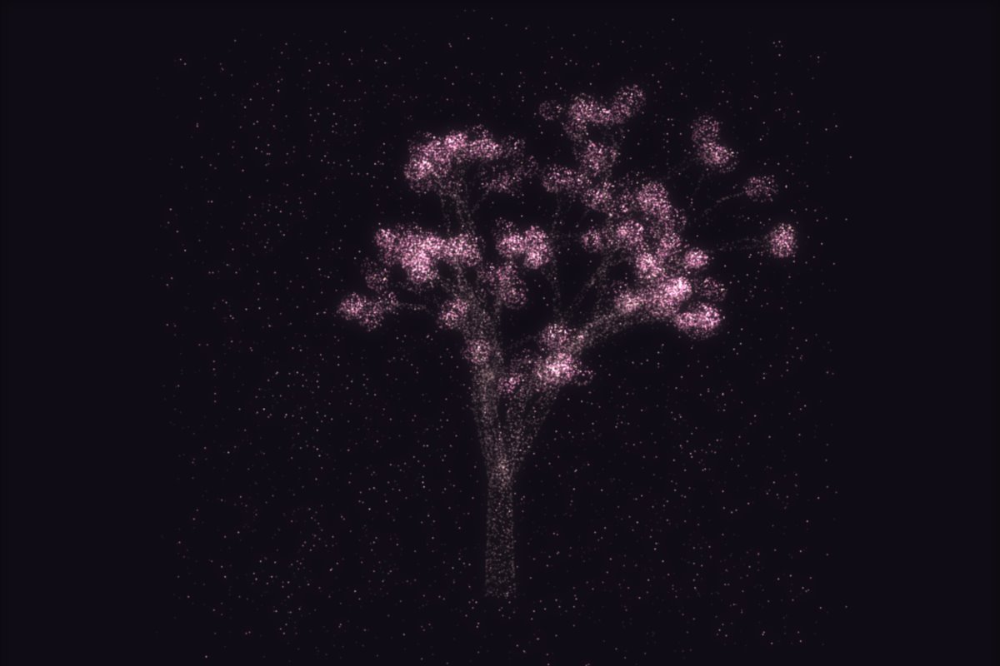

# 让 AI 长出一棵会落花的樱花树

树不是画的，**是长的**：从一段树干出发，每一段分成两三个子枝，长度收一点、粗细收一点、方向偏一点，再对每个子枝重复同样的事。递归到最后一层，在梢头挂一簇花。

整棵树只由四个数决定：**分几层、分几叉、偏多少度、每次收多少**。四个滑块就是它们。

▶ **[直接查看成品](https://view.tybbtech.com/p/pmstxc0clb020/)**

---

## 开始之前

- **要花多久**：一个多小时
- **要装什么**：什么都不用。[打开造物台](https://coder.tybbtech.com)，注册送 50 积分
- **这一篇的价值**：递归分枝是**所有"树状结构"的通用做法**——真树、血管、河网、组织架构图，一套骨架

---

## 第 1 步 · 递归分枝

> **这么说：**
> 从一段树干出发（起点、方向、长度、粗细、第几层），每一段：
> 1. 记下这一段的起点终点和半径
> 2. 到了最后一层就在终点挂一个"梢头"，停止
> 3. 否则分成 2～3 个子枝，对每个子枝：**长度 × 0.80、粗细 × 0.66、方向偏开一个角度**，然后递归
>
> 偏开角度的做法：先找一个和当前方向**垂直**的随机方向（随便取一个向量，减掉它在当前方向上的投影），再按 `tan(角度)` 掺进去。

> **两个让树像树的细节**：
> - **主干那一下多分几叉**（3～4 个），树冠才铺得开；往上就回到两三叉
> - **里层往上冲、外层慢慢平下来**——每深一层就给方向减一点向上的分量。不做这个，树会长成一把直冲天的扫帚

---

## 第 2 步 · 🔴 每段该撒多少点：按侧面积分

> **这么说：**
> 枝干上撒点时，每一段分到的点数按它的**侧面积**（`2πr × 长度`）分配，不是平均分。

**平均分给每一段的话，末梢那几百根细枝会和主干一样密，整棵树看着像一团毛线。**

这条和本仓库的[玫瑰](../08-rose/)、[塔](../41-tower/)是同一个道理——只是这里能直接算出面积，不用像参数曲面那样采样着量。

> **撒点的做法**：沿着枝干方向走 `t`，再找两个垂直于它的方向，围着枝干撒一圈。半径在一段之内也是**越往上越细**。

---

## 第 3 步 · 花：每个梢头一簇

> **这么说：**
> 每个梢头挂一簇球状的点，外壳密一点、中间稀一点。
> **一小撮（6% 左右）染成花蕊色**——比花瓣亮得多的暖黄。

那 6% 的花蕊是"这是花不是粉色毛球"的关键，成本几乎为零。

---

## 第 4 步 · 落花：取模，所以永远飘不完

> **这么说：**
> 花瓣是单独一组点，每片有自己的**下落进度**、**摇摆相位**和**摇摆幅度**。每帧现算位置：
> - 高度 = 树顶 − (下落进度 + 时间×速度) **取模 1** × 树高
> - 左右摇 = 一条正弦，x 和 y 用不同频率，看着才不是在一个平面上晃
> - **法线跟着摇摆转**——一片花瓣转过去会暗一下，这就是"翻面"
>
> 落到底就回到树冠重新落一次（取模的功劳），所以永远飘不完。

**取模这一下是整个落花效果的全部实现。** 不用生成、不用销毁、不用管理生命周期。

---

## 第 5 步 · 自动取景

> **这么说：**
> 建完点云之后量一遍它的实际高度和最大半径，按画布尺寸反算缩放和中心。

**层数从 5 调到 9，树高差一倍多。** 写死缩放的话一拖滑块就顶出画面。这条和[塔](../41-tower/)是同一个处理。

---

## 第 6 步 · 画法（和这一系列共通）

> **这么说：**
> 用像素加法画点（三万多个点改 `fillStyle` 会把帧数吃光），点叠点自然加亮。
> 每个点算法线拿去对光，才有明暗层次。
> 加法混合没有遮挡，**背对眼睛的点要压暗**，否则前后两面一样亮，整棵树是一团雾。

---

## 想改成你自己的

| 你想要 | 就这么说 |
|---|---|
| 秋天 | 配色换成黄红，落花换成落叶，下落速度调快 |
| 一片林子 | 复制几棵，各自换随机种子、错开位置和高度 |
| 光秃的冬树 | 开花比例调到 0，只留枝干 |
| 血管 / 河网 | 同一套递归，换成从粗到细的管道，去掉花 |
| 挂灯 | 梢头那一簇换成会闪的暖光点，就是圣诞树 |

---

## 关键的那些数

| 参数 | 值 | 为什么 |
|---|---|---|
| 点数 | 34000 | 枝干 + 花 + 落瓣三份分 |
| 层数 | 7 层 | 5 层太秃，9 层往上末梢已经看不清 |
| 长度收缩 | 每层 × 0.80 | 收太狠树冠散不开 |
| 粗细收缩 | 每层 × 0.66 | 比长度收得快，末梢才细 |
| 分叉角 | 0.46 弧度 | 大了像扫帚，小了像柱子 |
| 开花占比 | 52% | 花要比枝干多，才是樱花不是树 |
| 落瓣占比 | 10% | 多了满屏花瓣，遮住树 |

---

## 这个作品免费拿走

**这棵树直接送你，拿走就是你的。**

打开下面的链接，页面右下角有「🎨 改造这个作品」，点一下就复制出一份完全属于你的副本。

👉 **[免费拿走这个作品](https://view.tybbtech.com/p/pmstxc0clb020/)**

---

**这篇是怎么写出来的**：方法来自一个真的在线上跑着的成品，源码逐行读过，上面那些数值和坑都是它实际在用的。
