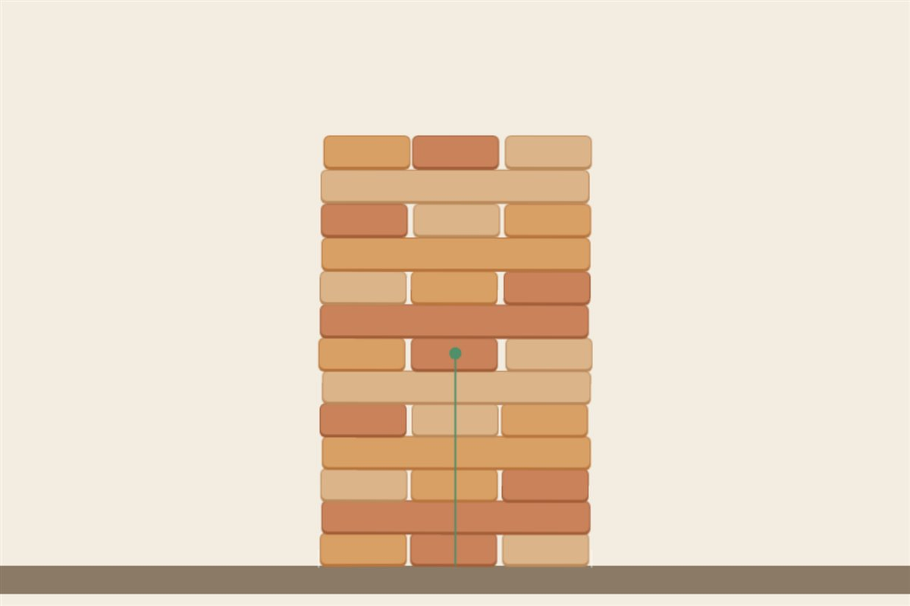

# 让 AI 做出一座会真的塌下来的积木塔



抽一块，摞到顶上，看你能走几步。规则和真积木一样：**每一步都必须把抽出来的那块摞回塔顶**——所以塔只会越来越高、越来越悬，你走得越远，下一步越险。

每块砖都是物理引擎里的**真刚体**：有质量、有摩擦、会转、会互相撞。你拖走一块，上面那些砖往下掉、磕到边上再翻过去——**没有一帧是编排好的**。

▶ **[直接查看成品](https://view.tybbtech.com/p/pmsu4l08yvgdg/)**

---

## 开始之前

- **要花多久**：一两个小时
- **要装什么**：什么都不用。[打开造物台](https://coder.tybbtech.com)，注册送 50 积分
- **难点**：不是把砖堆起来，是**让它安静地站住**。第 3 步那两条是全篇的命门

---

## 第 1 步 · 砌法：交替，而且这不是为了好看

> **这么说：**
> 用 Phaser + Matter 物理引擎。砌法照真积木：**一层三块短的，一层一块长的，交替往上。**

**这不是装饰。** 全部平砌的话，抽走一块只会掉它头顶那一列，一点都不惊险。交替之后，长条是**横跨在三块短砖上**的——抽中间那块它还稳，抽边上那块它就开始翻。

游戏的全部张力来自这个砌法。

> **⚠️ 没有贴图**：平台不允许作品带外部资源，所以每块砖是先用 Graphics 画一个圆角矩形、再 `generateTexture` 变成纹理的。

---

## 第 2 步 · 重心线：这是整个作品的"眼睛"

> **这么说：**
> 页面上画一条竖线，位置是所有砖的**重心 x**：
> ```
> 重心 x = Σ(每块砖的质量 × 它的 x) ÷ Σ质量
> ```
> 底座两端画两个标记。重心线落在底座里就是绿的，出去了就是红的。

**一摞东西倒不倒，不看它有多高，看这条线落在不落在底座里面。**

这条线把一个"凭感觉"的游戏变成了"看得见"的游戏——它是这个作品从玩具变成教具的那一步。

---

## 第 3 步 · 🔴 两个让塔站得住的坑

这两条是本篇最值钱的部分。

### ① 别加随机偏移

直觉是给每块砖加 ±2 像素的随机偏移，模拟"真实积木不会完美对齐"。

**结果是灾难**：砖与砖一开始就微重叠，引擎每帧都在把它们推开，**整座塔会自己慢慢滑**。

> **更麻烦的是它骗过了自检**：当时的检查只看"速度 < 0.6"，慢速蠕动完全通得过——程序说"稳住了"，人眼一看就在动。

> **这么说：**
> 砖要严丝合缝地摆，不要加随机偏移。
> 打开 `enableSleeping`（静止的刚体睡死），位置迭代提到 12。

### ② 但睡眠是把双刃剑

> **⚠️ 睡着的刚体不会因为"脚下的支撑没了"而自己醒过来** —— 引擎只在碰撞时唤醒它。
> 结果就是：你抽走一块，上面几块**直接悬在空中不掉**。

> **这么说：**
> 一开始拖动就把整座塔叫醒，睡眠只在没人碰的时候起作用。

---

## 第 4 步 · 判"塌了"要三条判据，缺一不可

> **这么说：**
> 一块砖算"离位"，满足任一条即可：
> 1. 横着挪出半块砖
> 2. 歪过 20°
> 3. **往下掉了一层多**
>
> 离位的块数超过一层的块数，就算塌了。往上挪不算（那是你把它摞到顶上去了，是合法的一步）。

**第三条是补的。** 塔常常是**直上直下拍扁**下来的，那种情况下每块砖的 x 和角度几乎不变——只看前两条的话，"塌了"永远判不出来，游戏会一直不结束。

> **判"全场安静了"**：开了睡眠之后，直接看刚体是不是 `isSleeping`，**这比看速度可靠**。

---

## 第 5 步 · 三个旋钮都是真的物理参数

> **这么说：**
> 三个滑块：开局层数、摩擦力、重力倍数。改了立刻重开一局。

**摩擦力决定的不是"站不站得住"**——竖直的一摞没有横向力，摩擦调到 0.03 也纹丝不动。它决定的是**"被碰之后收不收得住"**。

> 实测：抽掉同一块砖，摩擦 0.03 塌 12 块，摩擦 0.95 塌 0 块。

这种"参数改了，结果肉眼可见地不同"的设计，比任何说明文字都能让人明白摩擦是什么。

---

## 第 6 步 · 接上共享榜

> **这么说：**
> 用平台的榜单 `AIHEY.board`（免登录）。提交时用**本设备的随机身份当去重键**——一台设备只占一行，刷不出满屏。
> 榜上的名字一律用 `textContent` 渲染，**绝不拼进 HTML 字符串**。

> **⚠️ 一个容易掉进去的坑**：榜单接口的 `limit` 是**排序之后再截**的。想按分数取前八名，得先按时间多取一些回来（比如 200 条），**自己按分数排**，再截前八。直接用 `limit: 8` 拿到的是"最新的八条"，不是"最高的八分"。

> **⚠️ 世界边界的底边要正好落在画出来的那条地面上**，不能用画布高度——否则砖会穿到地面线以下几十像素才停住，看着像陷进地里。

---

## 想改成你自己的

| 你想要 | 就这么说 |
|---|---|
| 双人轮流 | 两个人交替抽，谁弄塌算谁输 |
| 限时 | 每一步给 10 秒，超时算失败 |
| 换材质 | 摩擦调到 0.05，塔面滑得像冰 |
| 教学版 | 把重心线常驻，加一段文字解释为什么它决定倒不倒 |

---

## 关键的那些数

| 参数 | 值 | 为什么 |
|---|---|---|
| 每层 | 3 块 | 交替砌法的基础 |
| 开局层数 | 8 层 | 再高手机上一屏放不下 |
| 摩擦力 | 0.6 | 0.03 一碰就崩，0.95 几乎不塌 |
| 位置迭代 | 12 | 默认值下堆叠会慢慢下沉 |
| 塌了的阈值 | 离位块数 > 每层块数 | 掉一两块不算，成片倒才算 |
| 榜单取数 | 取 200 条自己排 | limit 是排序后才截的 |

---

## 这个作品免费拿走

**这座积木塔直接送你，拿走就是你的。**

打开下面的链接，页面右下角有「🎨 改造这个作品」，点一下就复制出一份完全属于你的副本。

👉 **[免费拿走这个作品](https://view.tybbtech.com/p/pmsu4l08yvgdg/)**

改完就是一个链接，发到群里，看谁能抽得最多。

---

<sub>**这篇是怎么写出来的**：方法来自一个真的在线上跑着的成品，源码逐行读过，上面那些参数和踩过的坑都是它实际在用的。</sub>
