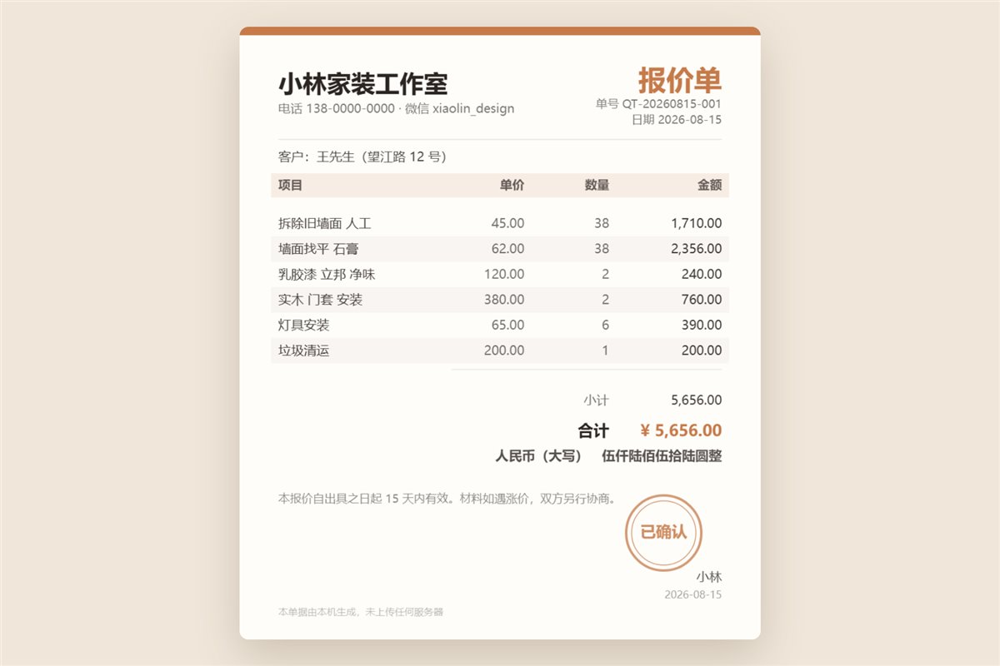

# 让 AI 做一张能直接发给客户的报价单

填几行「名称 单价 数量」，出一张带抬头、单号、斑马纹明细、合计、**人民币大写**和圆章的单据，点一下存成图片发出去。

这是本仓库里**最能直接拿去干活**的一个。个人接单、小工作室、摆摊做生意，需要开单的那一刻它就有用。

▶ **[直接查看成品](https://view.tybbtech.com/p/pmsu2v1kg48on/)**

---

## 开始之前

- **要花多久**：一个多小时
- **要装什么**：什么都不用。[打开造物台](https://coder.tybbtech.com)，注册送 50 积分
- **最难的一段**：人民币大写。看着简单，规则全在"零"上（第 3 步）

---

## 第 1 步 · 单据画在 canvas 上，不要用 HTML 排

这是一个反直觉但很关键的决定。

> **这么说：**
> 单据不要用 HTML 元素排版，**整张画在 canvas 上**：每一行文字的 x/y、每一栏的右对齐、斑马纹的位置，全部算出来。

**三个好处，每一个都很实在**：

| | 用 canvas | 用 HTML |
|---|---|---|
| 存成图片 | `toDataURL()` 一行 | 得引截图库（而平台不许带外部资源） |
| 在别人手机上 | **处处长一样** | 字体和屏宽一变就散架 |
| fork 的人改版式 | 改一个数字挪动整块 | 得懂 CSS |

**"排版"这件事因此变成了看得见的算术**，这正好是这个仓库想教的东西。

---

## 第 2 步 · 明细怎么解析：从右往左取数字

> **这么说：**
> 明细用一个多行文本框，每行「名称 单价 数量」，用空格分隔。
> 解析时**从右往左取两个数字**当单价和数量，剩下的全算名称。

**为什么从右往左**：这样「实木 门套 安装 380 2」也认得——名称里可以有空格。从左往右取的话，用户就得被迫把名称写成一个词，那是把机器的麻烦转嫁给人。

> 只有一个数字时当单价、数量按 1；一个数字都没有就整行当名称。**永远不要因为格式不对就什么都不显示。**

---

## 第 3 步 · 🔴 人民币大写：这一段是本文件最值钱的

看着像"逐位换字"，其实规则全在**零**上。

> **这么说：**
> 实现人民币大写，规则是：
> - **连续的零只写一个「零」**，整节都是零则整节吃掉
> - **每四位一节**（万 / 亿 / 兆），节末的零不写
> - **节与节之间可能要补零**：高位节写完后，如果低位节不足四位（比如「一亿零三百万」），要补一个「零」
> - **角分**：都没有写「整」；有角无分写「X角整」；分不为零才写到分

做法：先把整数部分按四位切成若干节，每节内部从高位往低位写，遇到零就记一个标记、不立刻写；遇到非零时如果前面有过零且已经写了字，才补一个「零」。

> **为什么这一段值钱**：报价单、收据、合同、发票——**凡是要给钱的单据，大写都是"防改"的那一栏**。这段代码抄走可以直接用在任何一张单子上。

---

## 第 4 步 · 纸有多高要算出来

> **这么说：**
> 画布高度**按内容算**：抬头那一块 + 每项一行 + 合计几行（有折扣多一行、有税多一行）+ 落款那一块。

**写死高度的话，六个项目的单子下半张全是空白。** 一张下半截空着的单子发给客户，看着就不专业。

---

## 第 5 步 · 🔴 这张单子不能联网

> **这么说：**
> 这张单子上会有**客户名字和金额**，所以它**不往网址里塞数据、不上传任何地方**。存成图片是本机的事。
> 页脚写明一句：「本单据由本机生成，未上传任何服务器」。

本仓库的[祝福机](../39-blessing/)把内容写进网址 `#` 后面分享出去，那是对的——那是一句祝福。**但同样的做法用在报价单上就是事故**：链接一转发，客户名和报价就跟着走了。

> **一个作品该不该联网，取决于它装的是什么。** 这条判断比任何技术细节都重要。

---

## 第 6 步 · 几个让它像正经单据的细节

> **这么说：**
> - 顶部一条主色色带；表头一条浅色底
> - 明细行**隔行加浅色斑马纹**，三栏（单价/数量/金额）**右对齐**——数字右对齐才好比大小
> - 名称过长就截断加省略号，不要让它撞进单价那一栏
> - 右下角画一个圆章：一个圆 + 一圈内环 + 中间的字，**纯几何，不是图片**
> - 加一个「今天」按钮，一键把日期和单号刷成今天的

---

## 想改成你自己的

这个作品换个抬头就是另一张单子：

| 你想要 | 就这么说 |
|---|---|
| 收据 | 抬头改「收据」，加收款人和收款方式 |
| 送货单 | 加规格、批号、签收栏 |
| 结算单 | 加账期、已付、待付三栏 |
| 课时费单 | 项目换成课程，单价换成课时费 |
| 存历史 | 开过的单子存本地，能翻出来重开 |

---

## 关键的那些数

| 参数 | 值 | 为什么 |
|---|---|---|
| 页边距 | 64 像素 | 打印出来不会顶边 |
| 行高 | 42 像素 | 21px 字号下不挤 |
| 纸高 | 按内容算 | 写死会留半张空白 |
| 明细解析 | 从右往左取两个数 | 名称里才能有空格 |
| 大写 | 每四位一节 | 万 / 亿 / 兆 |
| 分享 | **不做** | 单子上有客户名和金额 |

---

## 这个作品免费拿走

**这张单子直接送你，拿走就是你的**——改成你行业里那张单子，明天就能开。

打开下面的链接，页面右下角有「🎨 改造这个作品」，点一下就复制出一份完全属于你的副本。

👉 **[免费拿走这个作品](https://view.tybbtech.com/p/pmsu2v1kg48on/)**

---

**这篇是怎么写出来的**：方法来自一个真的在线上跑着的成品，源码逐行读过，上面那些规则和坑都是它实际在用的。
