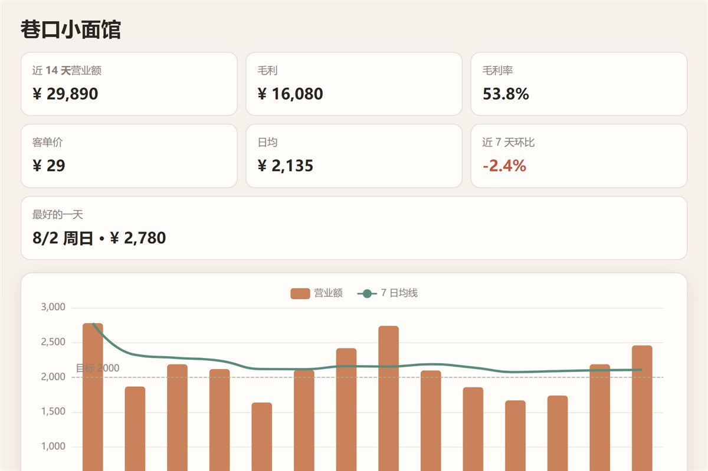

# 让 AI 做一个每天只记三个数的小店日报

你每天只输入三样：**营业额、客单数、成本**。剩下的它全算：客单价、毛利、毛利率、七日均线、环比、**星期几均值**。

那张「星期几」的图是这个作品真正有用的地方——它会告诉你**周几值得多备货、周几可以早点关门**。

▶ **[直接查看成品](https://view.tybbtech.com/p/pmsu2v1kpy207/)**

---

## 开始之前

- **要花多久**：一小时
- **要装什么**：什么都不用。[打开造物台](https://coder.tybbtech.com)，注册送 50 积分
- **适合谁**：开小店的、摆摊的、做副业的。**记三个数，比任何记账软件都省事**

---

## 第 1 步 · 只让人输三个数

> **这么说：**
> 录入区只要三个输入框：营业额、客单数、成本，加一个日期。其余全部算出来：
> - 客单价 = 营业额 ÷ 客单数
> - 毛利 = 营业额 − 成本，毛利率 = 毛利 ÷ 营业额
> - 环比 = 最近七天 ÷ 前七天 − 1

**输入项越少，越有人真的天天记。** 一个要填十栏的记账工具，第三天就没人打开了。

---

## 第 2 步 · 🔴 存哪儿：这一条选错了就是事故

平台给了两种存储，选哪个决定这个作品能不能用。

> **这么说：**
> 用 `AIHEY.data`（作品自带的**私有**存储，免登录、按设备），**不要用 `AIHEY.board`**。

| | `AIHEY.board` | `AIHEY.data` |
|---|---|---|
| 谁能看 | **所有访客共用一份** | 这台设备记自己的 |
| 适合 | 记大家的心情、榜单、共同画布 | **记你自己店里的账** |

**用 board 的话，谁点开你的链接都能写你的账本。** 本仓库的[今天心情](../03-mood/)用 board 是对的（那是大家一起记），这一个用 board 就是事故。

> **顺带**：在平台之外打开时自动退回浏览器本地存储，功能不受影响。

---

## 第 3 步 · 七日均线：比单日曲线诚实

> **这么说：**
> 主图是柱状的每日营业额，叠一条**七日移动平均线**。
> 移动平均只算**有记录的那几天**的均值——**没记的天不要当成 0 拉低平均**。

**为什么要这条线**：单日大起大落多半是天气和周末，看趋势要看均线。这是这个作品能帮人做判断的地方，不是装饰。

> 再加一条虚线标出每日目标，一眼看出哪天达标了。
> ⚠️ **目标线的标签要放在线的左端**——放右端会被图表右边界切掉，第一版就变成了「目…」。

---

## 第 4 步 · 星期几均值：这张图才是它真正的用处

> **这么说：**
> 第二张图：把所有记录按星期分组，每组求平均，**从周一排到周日**（中国人看表的习惯）。
> 周末两根用不同颜色标出来。
> 悬停时显示「均值多少、一共几天」——**几天很重要，两天的平均没有参考价值**。

一个开店的人看完这张图，能立刻做两个决定：周几多备货、周几排班可以少一个人。**这就是这个作品的全部价值。**

---

## 第 5 步 · 🔴 第一次打开必须有东西看

> **这么说：**
> 第一次打开时铺 14 天的示例数据（周末高、工作日低，再加一点随机），页面上标明「这是示例」。
> **用户记下第一笔真数据时，把示例整体清掉。**

**不铺示例的话，第一眼是两张空坐标轴**——看着像坏了。而每一个刚 fork 出去的作品，第一天都长那样。

**而清掉这件事同样重要**：不清的话，用户的账和示例的假账混在一起，那些数字就全是错的。

> 这条经验在本仓库的[今天心情](../03-mood/)里也出现过——**空数据态必须单独设计**，它是新用户看到的第一眼。

---

## 第 6 步 · 两个小地方

> **这么说：**
> - 图例的小圆点颜色要跟着线走。默认情况下图例是蓝的、线是绿的，对不上。
> - 窗口尺寸变化时喊一声让两张图重新计算大小，图表库不会自己做。

---

## 想改成你自己的

这个作品换掉三个字段就是另一个行当的日报：

| 你想要 | 就这么说 |
|---|---|
| 网店版 | 换成订单数、退货数、广告费 |
| 跑腿 / 网约车 | 换成流水、单数、油费 |
| 健身房 | 换成到店人数、私教课时、耗卡 |
| 加导出 | 一键导出成表格，报税时用 |
| 多店 | 顶上加一个店铺切换，各存各的 |

---

## 关键的那些数

| 参数 | 值 | 为什么 |
|---|---|---|
| 每天输入项 | 3 个 | 多了没人天天记 |
| 主图天数 | 14 天 | 手机一屏能看完，也够看出周规律 |
| 均线窗口 | 7 天 | 正好抹平一个周循环 |
| 示例数据 | 14 天 | 两张图打开都有东西 |
| 存储 | `AIHEY.data` | 用 board 等于把账本公开 |
| 星期排序 | 周一到周日 | 中国人看表的习惯 |

---

## 这个作品免费拿走

**这个日报直接送你，拿走就是你的**——改成你那门生意的三个数，今晚打烊就能记第一笔。

打开下面的链接，页面右下角有「🎨 改造这个作品」，点一下就复制出一份完全属于你的副本。

👉 **[免费拿走这个作品](https://view.tybbtech.com/p/pmsu2v1kpy207/)**

---

**这篇是怎么写出来的**：方法来自一个真的在线上跑着的成品，源码逐行读过，上面那些做法和坑都是它实际在用的。
